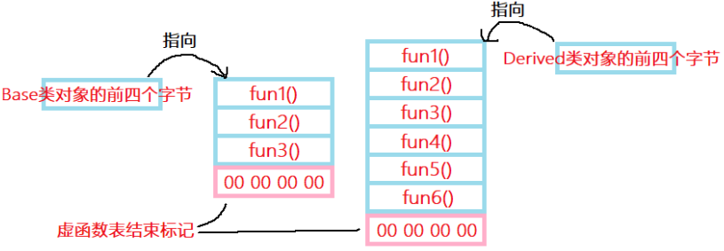
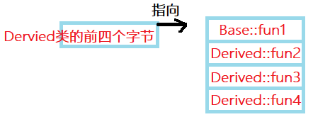
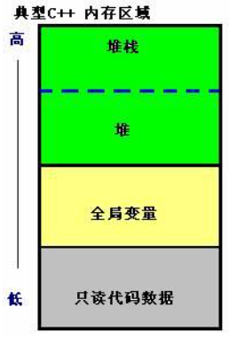
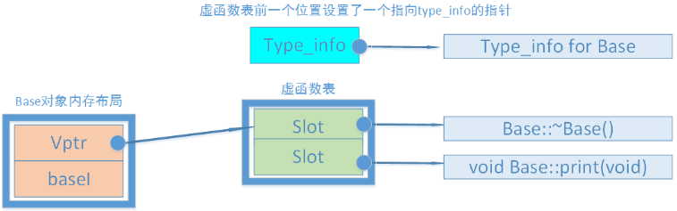
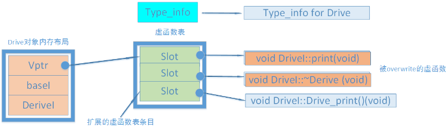
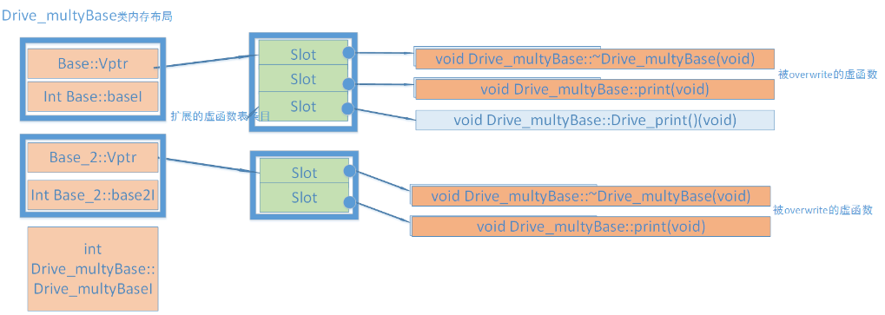
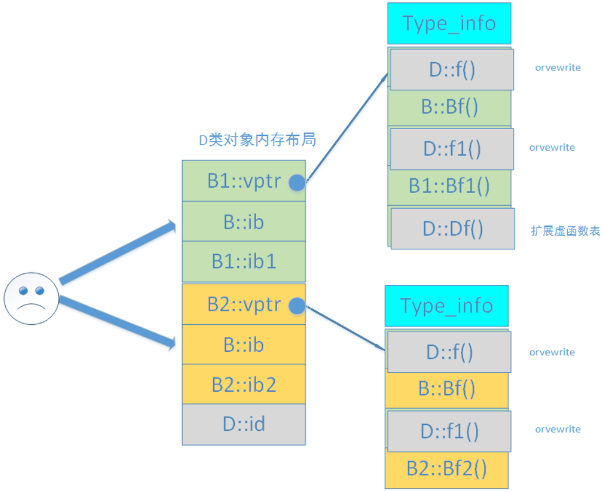
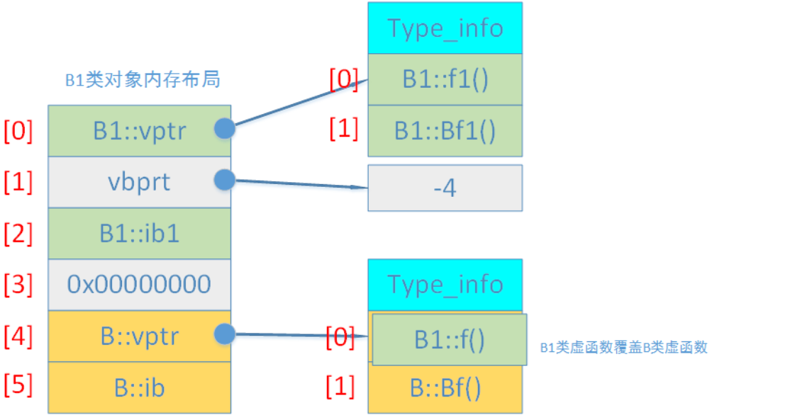
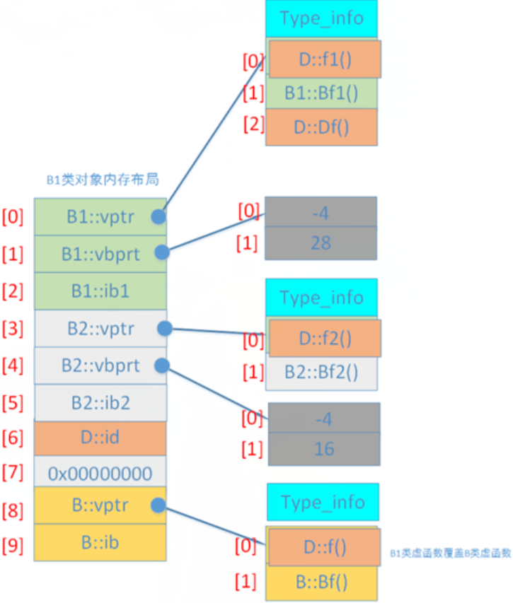

# C++三大特性

## 1 封装

​	目的：隐藏实现细节，实现模块化。

​	特性：① 定义类，定义类成员属性、成员方法。

​	② 通过访问权限(public、protected、private)控制，将合理的属性、成员函数暴露给外部，供对象与外部交互。

​	③ 可通过友元类打破private的限定。

## 2 继承

​	目的：无需修改基类的情况下，通过继承实现对基类功能的扩展。

​	特性：① 权限继承：


​	② 多继承。

​	③ 接口继承。

## 3 多态

​	目的：一个接口多种形态，通过实现接口重用，增强可扩展性。

​	特性：① 静态多态(函数重载、模版)；② 动态多态：虚函数。

# 编译&&链接

## 1 编译&&链接对函数的处理

- 编译阶段

  检查函数调用是否正确，是否有声明。

  若函数有声明，在此阶段，编译器会认为该函数肯定在某位置被定义了。

- 链接阶段

  把所有目标文件合并成一个可执行程序。

  如果一个函数在**所有的目标文件**中，都没有找到实现，链接器就会报错。

- 若一个函数声明了，但没有定义

  - 若该函数没有被使用

    编译、链接都没有问题。

  - 若函数被使用了

    编译没有问题，可以生成.o文件。链接会报错，因为所有.o都找不到它。

  - 若函数被声明为**inline**

    在编译期，函数会被插入到调用处，避免函数调用的开销。因此该情况编译阶段就会报错。

  - 若函数是模版函数

    模版函数会在编译期实例化，根据模版参数**生成具体代码**。因此会在编译期报错。

## 2 头文件引用相关问题

- 循环包含，导致编译出错：

  ```c++
  //A.h
  #include "B.h"
  class A {
      B* b;
  };
  
  //B.h
  #include "A.h"
  class B {
      A* a;
  };
  ```

  解决方案：前置声明。

  当类/结构体被用作类的**指针**、**引用**时，无需包含完整的定义，用前置声明代替头文件包含。

  在cpp中再包含具体头文件。

- 头文件重复包含

  使用#pragma once或头文件保护宏。

- 依赖扩散问题

  下述是依赖扩散的例子，由于b是类对象，导致不得不包含B.h

  ```c++
  #A.h
  #include "B.h"
  class A {
      private:
      B b;
  };
  ```

  解法：**Pimpl**(point to implementation，指向实现的指针)

  将类的**私有实现细节**隐藏到源文件中，减少头文件依赖。

  ```c++
  #A.h
  class A {
      private:
      struct Impl;//前置声明实现类
      Impl* impl_;
  };
  
  //A.cpp
  #include "A.h"
  #include "B.h"
  struct A::Impl {
      B* b; //B的实现细节隐藏在.cpp中
  }
  ```

## 3 单例出现多个实例对象的问题

有下述单例类：

```c++
// Singleton.h
class  __attribute__((visibility("default"))) Singleton// default 默认可见性
{
private:
    Singleton() = default;
public:
    // 声明且定义在.h中，属于弱符号
    static Singleton& GetInstance()
    {
        static Singleton instance;// C++线程安全的局部静态变量
        return instance;
    }
    
    void DoSomething()
    {
        //.......
    }
};
```

示例：在libA、libB中都引入了该单例，在主程序main中动态加载了libA、libB，同时主程序也引入了该单例。

运行主程序，发现单例存在多个实例(打印地址，发现地址不同)。

**问题本质**：同名的单例符号在**多个ELF(Executable and Linkable Format，可执行与可链接格式)中独立存在时**，而**动态链接器**无法或没有把它们解析到同一份定义时，就会出现多个单例对象。

该问题有多个影响因素：

- 若启动编译时链接，链接器会做全局符号合并；

  若libA和libB启用编译时链接，那么最后链接时，lib中依赖的Singleton会被合并。但由于main是dlopen的lib，因此仍然会存在两份实例；

- 符号的可见性

  gcc默认的符号可见性是`default`，即**全局可见**，同时**弱符号**可以合并；

  ```c++
  // default 默认可见性
  class  __attribute__((visibility("default"))) Singleton
  {
  	//........
  };
  ```

- 隐藏符号

  把单例可见性修改为hidden，此时符号**不再导出**，链接器肯定无法跨模块合并。

  这样每个库各自会生成一份实例：

  ```c++
  // Singleton.h
  class  __attribute__((visibility("hidden"))) Singleton
  {
  	//........
  };
  ```

- 最优解

  把Singleton.h编译成一个独立的动态库，其他模块libA、libB、main去链接这个动态库。

# 模板

## 1 可变参数模板

### 1) 参数个数未知，参数类型相同

标准库类型initializer_list：容器类型，容器元素为常量。

### 2) 参数个数未知，参数类型可能不同

#### 2.1) 形式

```c++
template<class... T>      // T是模板参数包
void function(T ... args) // args是函数参数包
{
}
```

…代表一个包含0到n的任意参数包，其中的任意代表任意数目和任意类型。

…在参数右侧代表一组实参，…在参数左侧代表可变参数。

#### 2.2) 可变参数包展开

##### 2.2.1) 查询个数

```c++
template<typename... Args>
unsigned int length(Args... args) { return sizeof...(args); }
```

##### 2.2.2) 递归展开

```c++
// 边界函数
void print() {}

template<typename T, typename... Types> //(1)可变参数
void print(const T& firstArg, const Types&... args) //(2)可变参数
{
	std::cout << firstArg << " " << sizeof...(args) << std::endl; 
	print(args...); //(3)一组实参
}
```

##### 2.2.3) 逗号运算符展开

```c++
template<typename T>
void show_arg(const T& t) {}

template <typename ... Args>
void expand(const Args&... args)
{
	int arr[] = {(show_arg(args), 0)...}; 
}
```

​	解析如下：

```c++
// 函数调用
expand(1, 2, 3, 4);
// expand内部展开后如下
int arr[] = { (show_arg(1), 0), 
              (show_arg(2), 0), 
              (show_arg(3), 0),
              (show_arg(4), 0)};
// 结果代码如下
int arr[] = {0, 0, 0, 0}; 
```

## 2 模板实参推断(Template Argument Deduction)

​	编译器利用调用中的**函数实参来确定模板参数**，这个过程就叫模板实参推断。本小节参考自[模板实参推断](https://blog.csdn.net/qq_41453285/article/details/104447573)。

### 1) 模板实参推导和类型转换

​	将实参传递给带模板函数的函数形参时，能够自动应用的类型转换只有：**const转换**、**数组转换**、**函数到指针转换**。

​	const转换：将非const对象的引用/指针转化为const对象的引用/指针；

​	数组转换：数组实参可转换为一个指向其首元素的指针；

​	函数转换：函数实参可转换为该函数类型的指针。

```c++
template<typename T>
T fobj(T, T);
 
template<typename T>
T fref(const T&, const T&);
 
int main()
{
    string s1("a value");
    const string s2("another value");
    fobj(s1, s2); //OK，调用fobj(string,string); s2的const会忽略
    fref(s1, s2); //OK，调用fref(const string&,const string&); 将s1转换为const是允许的
 
    int a[10], b[42];
    fobj(a, b);  //OK, 调用f(int*,int*)
    fref(a, b);  //Error，数组类型不匹配，数组a和b的大小不同，所以类型不同
 
    return 0;
}
```

### 2) 模板实参推导和引用

#### 2.1) 左值引用函数参数推导

​	当模板函数参数是左值引用(形如T&)，则：

①**只能传递给它一个左值**(变量、返回引用类型的表达式等)；

②实参可以是const，也可以不是。

```c++
template<typename T>
void f1(T&) { }
 
int main()
{
    int i;
    const int ci=10; 
    f1(i);  //OK, T是int
    f1(ci); //OK, T是const int
    f1(5);  //Error, 5为右值
    return 0;
}
```

​	当模板函数参数是const T&，则：

①可以传递给它**任何类型的实参：**对象(const/非const)、临时对象、字面量常量；

②T的类型推断**不会是一个const类型**，因为const已经是函数参数的一部分。

```c++
template<typename T>
void f1(const T&) { }
 
int main()
{
    int i;
    const int ci=10;
 
    f1(i);  //OK, T是int
    f1(ci); //OK, T是int
    f1(5);  //OK, const&可以绑定到右值上, T是int
	return 0;
}
```

#### 2.2) 万能引用函数参数推导

​	万能引用模板中传入**左值实参**，模板参数会被推导为**左值引用**，并发生引用折叠：

```c++
template<typename T>
void f1(T&&){}
 
int main()
{
    int i;
    const int ci = 10;
 
    f1(42); //OK，42为右值，T为int 
    f1(i);  //OK，T是int&
    f1(ci); //OK，T是const int &
    return 0;
}
```

​	上述推导流程如下：

```c++
//f1(i)调用的伪代码形式
void f1<int&>(int& &&);
 
//又int& &&会被折叠为&
void f1<int&>(int&);
```

​	其他万能引用的推导场景，可参考：<a href="#2) 图解万能引用推导规则">图解万能引用推导规则</a>

## 3 逗号运算符

​	C++提供了一种特殊的运算符：逗号运算符(**顺序求值**运算符)，可将两个表达式连接起来。

​	一般形式为：表达式1, 表达式2

​	求解过程为：**先求解表达式1的值，再求解表达式2的值，整个表达式的值是表达式2的值**。

```c++
int main()
{
  int a;
  a=3*5,4*5;     // 不加括号的逗号表达式
  cout<<a<<endl; // 输出15
  a=(3*5,4*5);   // 加括号的逗号表达式
  cout<<a<<endl; // 输出20
  return 0;
}
```

​	不加括号时，赋值运算符的**优先级**高于逗号运算符，因此会先求解a=3 \* 5。

​	程序是自左向右运行的，后面的4 \* 5也会运行，但没有存储结果。

# 多态

## 1 静态多态

​	编译期间的多态，编译器在**编译期间**完成，通过实参类型推断出要调用的函数；

​	静态多态有两种实现方式：1.函数重载；2.模板。

​	**函数重载**的关键是**参数列表**：参数数目、类型和排序，与函数名和返回值无关。

​	**模板**使用泛型来定义函数，泛型可由具体的类型替换。通过将类型作为参数，传递给模板，通过编译器生成该类型的具体函数。

## 2 动态多态-虚函数

​	在程序执行期间判断所引用对象的实际类型，根据其实际类型调用相应的方法。

​	对于有虚函数的类，编译器会维护一张虚函数表(虚表)，对象的前四个字节就是指向虚表的指针(虚表指针)。

### 1) 虚函数表创建原则

- 先拷贝基类的虚函数表；
- 若派生类重写了基类的某个虚函数，就用派生类的虚函数替换虚表同位置的基类虚函数；
- 创建派生类独有的虚函数；

​	无覆盖的情况：

```c++
class Base
{
    virtual void fun1();
    virtual void fun2();
    virtual void fun3();
}
class Derived : public Base
{
    virtual void fun4();
    virtual void fun5();
    virtual void fun6();
}
```



​	有覆盖的情况：

```c++
class Base
{
    virtual void fun1();
    virtual void fun2();
    virtual void fun3();
}
class Derived : public Base
{
    virtual void fun2();
    virtual void fun3();
    virtual void fun4();
}
```



### 2) 虚函数表和虚函数指针构建时机

- 虚函数构建时机

​	类中存在virtual关键字声明的函数时，编译器在**编译时**就会生成虚函数表。

​	虚函数表实际是一个**数组**，数组元素是各虚函数指针。

​	虚函数表存在于编译后生成的.**o文件**中。编译完成后，其所在的内存段就已确定，运行时被加载到进程的**全局数据区只读代码段中**。

- 虚函数指针的赋值时机

​	编译器会为存在虚函数的类**添加一个成员变量**：虚函数指针。

​	类对象在构造时，编译器会在构造器中为类对象的虚函数指针赋值。因此，若类存在虚函数，但没有构造函数，编译器会创建默认构造函数，就是为给虚函数指针赋值。

​	虚函数指针在类对象的**最前端**。

## 3 虚析构函数

​	虚析构函数确保派生类的析构函数被正确调用，有如下示例：

```c++
class Base {
public:
    Base() { cout << "执行基类构造函数" << endl; }
    virtual ~Base() { cout << "执行基类析构函数" << endl; }
};

class Derived : public Base {
public:
    Derived() { cout << "执行派生类构造函数" << endl; }
    ~Derived() { cout << "执行派生类析构函数" << endl; } // 派生类不需要显示声明为virtual
};
```

​	执行下述代码：

```c++
Base *pt = new Derived;
delete pt;

//输出如下
//执行基类构造函数
//执行派生类构造函数
//执行派生类析构函数
//执行基类析构函数
```

# 内存布局

## 1 内存分区

### 1) 区域划分

​	在C++中，内存分成**5个区**，分别是：**堆、栈、自由存储区、全局/静态存储区、常量存储区**。

​	有的书籍也把内存划分为**堆区**、**栈区**和**静态存储区**，其中把自由存储区、全局/静态存储区和常量存储区总结为一块区域。

- **栈**：内存由编译器在需要时自动分配和释放。通常用来存储局部变量和函数参数、返回地址。栈运算分配内置于处理器的指令集中，**效率很高**，但是分配的内存容量有限。

- **堆**：使用new分配的内存，使用delete或delete[]释放。如果未能对内存进行正确的释放，会造成**内存泄漏**。程序结束时，由操作系统自动回收。

  其中，还包含**自由存储区**：使用malloc进行分配，使用free进行回收。

- **全局/静态存储区**：全局变量和静态变量被分配到同一块内存中，C语言中区分初始化和未初始化的，C++中不再区分。

  **虚函数表**存放在全局数据区。

- **常量存储区**：存储常量，不允许被修改。

-  **代码区**：存放代码，不允许修改，但可以执行。编译后的二进制文件存放在这里。



### 2) 区域间的不同

#### 2.1) 静态存储区和栈区

```c++
char* p = “Hello World1”;   //1 指针p在栈区, "Hello World1"是字符串常量, 存储在静态存储区
char a[] = “Hello World2”;  //2 初始化分配的数组，所以a[]和"Hello World2"都在栈上 
p[2] = ‘A’;                 //3 抛出运行时异常, 因为*p指向的区域是常量区
a[2] = ‘A’;                 //4 可以修改，因为a[]在栈上
char* p1 = “Hello World1;”  //5 p1在栈上，且p和p1指向同一块内存
```

#### 2.2) 堆与栈

- 内存分配和释放：对于**栈**来讲，内存由编译器管理，无需手工控制；对于**堆**来说，分配和释放工作由程序员控制，容易产生memory leak。
- 空间大小：在32位系统下，**堆内存**可以达到4G的空间；**栈内存**有空间限制，在VC6.0下面默认的栈空间大小是1M。
- 内存碎片：对于**堆**，频繁的new/delete会造成内存空间的不连续，产生大量碎片，影响性能；对于**栈**，内存按照先进后出的方式管理，不会产生碎片。
- 生长方向：对于**堆**，生长方向是**向上**的，向着内存地址增加的方向；对于**栈**，生长方向是**向下**的，是向着内存地址减小的方向增长。
- 分配效率：对于**堆**，内存分配是C/C++函数库提供的，其机制复杂。为了分配一块内存，库函数会按照一定的算法在堆内存中搜索可用的足够大小的空间，如果没有足够大小的空间(可能是由于内存碎片太多)，就有可能调用系统函数去**增加程序数据段的内存空间**，从而获取到足够大小的内存，然后返回。上述可能会经历用户态和内核态的切换。对于**栈**，其是机器系统提供的数据结构，计算机会在**底层对栈提供支持**：分配专门的寄存器存放栈的地址，压栈出栈都有专门的指令执行，这就决定了栈的效率比堆更高。

## 2 虚函数表

​	若类中存在虚函数，编译器会为该类生成一个虚函数表，虚函数表按照虚函数的声明顺序存放了各个虚函数的地址。

​	虚函数表不存在于类中，虚函数表存放在**全局数据区**。

​	而对于每个类对象，编译器都会为其生成一个不可见的指针，**指向同一个地址**，这个指针就是虚函数表指针。

​	虚函数表指针位于该类对象内存中的开头，指向了虚函数表的位置。

​	因此，在32位机器上，通过类的前4个字节就可找到虚函数表的地址，在64位机器上，通过前8字节找到虚函数表的地址。

​	有如下示例：

```c++
using VoidFunc = void(*)();

class Base
{
public:
	Base(int i = 0) : m_baseI(i) {};
	virtual void func0() { std::cout << "Base::func0" << std::endl; }
	virtual void func1() { std::cout << "Base::func1" << std::endl; }
	virtual ~Base() { std::cout << "Base::Destructor" << std::endl; }
private:
	int m_baseI;
};

Base a{0};
int v_tableAddr = *(int *)(&a);
```

​	上述去虚函数解释如下：

- &a得到对象a的地址；
- (int *)(&a) ：把(&a)强制转换为(int *)，把从(&a)开始的4个字节当作一个整体；
- *(int *)(&a) ：对a的前4个字节解引用，获得虚函数表的地址。

​	获得虚函数func0()的地址：

```c++
int func0Addr = *(int *)*(int *)(&a);
((VoidFunc)func0Addr)();
```

- (*(int *)(&a))是虚函数表的地址，(int \*)\*(int \*)(&a)将其强制转换为(int* *)指针；
- \*(int \*)\*(int \*)(&a)：取int\*第一个4字节上的值，得到func0()的地址；
- 将地址值强制转换为void(*)()，进行调用。

​	获取func1()的地址：

```c++
int func1Addr = *((int *)*(int *)(&a) + 1);
((VoidFunc)func1Addr)();
```

## 3 对象模型

- nonstatic 数据成员被置于每一个类对象中，static数据成员被置于类对象之外；
- static与nonstatic函数被置于类对象之外；
- virtual函数通过虚函数表+虚指针来支持；
- **虚函数表前**设置了一个指向type_info的指针，用以支持**RTTI**。RTTI是为多态而生成的信息，包括对象继承关系，对象本身的描述等。

### 1) 非继承下的对象模型

​	有基类Base：

```c++
class Base
{
public:
    Base(int i) :baseI(i){};
    int getI(){ return baseI; }
    static void countI(){};
 
    virtual ~Base(){}
    virtual void print(void){ cout << "Base::print()"; }
private:
    int baseI;
    static int baseS;
};
```

​	类的静态成员在**全局区**，函数在**代码区**，下述展示了堆栈上的类对象布局：



### 2) 单继承下的对象模型

​	在基类Base下，有派生类如下：

```c++
class Derive : public Base
{
public:
    Derive(int d) :Base(1000), DeriveI(d) {};
    //覆写的虚函数
    virtual void print() override { cout << "Drive::print()" ; }
    //新增的虚函数
    virtual void Drive_print(){ cout << "Drive::Drive_print()" ; }
    virtual ~Derive(){}
private:
    int DeriveI;
};
```



- 对于一般继承（相对于虚拟继承），子类有**独有**的虚函数表；
- 若子类重写了父类的虚函数，子类虚函数将覆盖虚表中对应的父类虚函数；
- 若子类没有覆写父类虚函数，而是声明新的虚函数，则扩充虚函数地址至虚函数表最后；

### 3) 多继承(非菱形继承)

​	有如下多继承的示例：

```c++
class Base
{
public:
    Base(int i) :baseI(i){};
    virtual ~Base(){}
    virtual void print(void){ cout << "Base::print()"; }
    int getI(){ return baseI; }
    static void countI(){};
private:
    int baseI;
    static int baseS;
};

class Base_2
{
public:
    Base_2(int i) :base2I(i){};
    virtual ~Base_2(){}
    virtual void print(void){ cout << "Base_2::print()"; }
    int getI(){ return base2I; }
    static void countI(){};  
private:
    int base2I; 
    static int base2S;
};

class Drive_multyBase :public Base, public Base_2
{
public:
    Drive_multyBase(int d) :Base(1000), Base_2(2000) ,Drive_multyBaseI(d){};
    virtual void print(void){ cout << "Drive_multyBase::print" ; } 
    virtual void Drive_print(){ cout << "Drive_multyBase::Drive_print" ; } 
private:
    int Drive_multyBaseI;
};
```

​	多继承的规则如下：

- 子类的虚函数放在声明的第一个基类的虚函数表中；
- 覆写时，所有基类的相关函数都被子类覆写；
- 内存布局中，父类按照其声明顺序排列；

​	多继承的对象模型如下：



### 4) 菱形继承

​	菱形继承中，基类被某个派生类简单重复继承了多次，导致派生类对象中**拥有多份基类实例**，如下例子所示：

```c++
class B
{
public:
    int ib;
public:
    B(int i=1) : ib(i) {}
    virtual void f() { cout << "B::f()" << endl; }
    virtual void Bf() { cout << "B::Bf()" << endl; }
};

class B1 : public B
{
public:
    int ib1;
public:
    B1(int i = 100 ) :ib1(i) {} 
    virtual void f() { cout << "B1::f()" << endl; } 
    virtual void f1() { cout << "B1::f1()" << endl; } 
    virtual void Bf1() { cout << "B1::Bf1()" << endl; }
 
};

class B2 : public B
{
public:
    int ib2;
public: 
    B2(int i = 1000) :ib2(i) {}
    virtual void f() { cout << "B2::f()" << endl; } 
    virtual void f2() { cout << "B2::f2()" << endl; } 
    virtual void Bf2() { cout << "B2::Bf2()" << endl; } 
};

class D : public B1, public B2
{ 
public: 
    int id;
public: 
    D(int i= 10000) :id(i){} 
    virtual void f() { cout << "D::f()" << endl; } 
    virtual void f1() { cout << "D::f1()" << endl; } 
    virtual void f2() { cout << "D::f2()" << endl; }
    virtual void Df() { cout << "D::Df()" << endl; } 
};
```

​	此时D的内存布局如下：



​	D间接继承了B两次，导致D内部会有两个B的成员ib。这不仅增大了内存空间，也会引起程序歧义：

```c++
D d;
d.ib =1;       //二义性错误
d.B1::ib = 1;  //正确
d.B2::ib = 1;  //正确
```

### 5) 虚继承

​	虚继承解决了菱形继承中派生类拥有多个间接父类实例的情况。

​	虚基表：

- 虚基类表指针总在虚函数表指针之后；
- 对某个类实例来说，虚基类指针可能在实例的0字节偏移处，也可能在4字节偏移处；
- 虚基表由多个条目组成，每个条目存放的是偏移值。其中第一个条目存放的是虚基表指针到该类内存首地址偏移值，该值为0或-4。
- 虚基类表的第二、第三...个条目依次为该类的最左虚继承父类、次左虚继承父类...的内存地址相对于虚基类表指针的偏移值。

​	包含虚基表的情况：


​	不含虚基表的情况：


#### 5.1) 简单虚继承

```c++
class B{...}
class B1 : virtual public B {...}
```

​	B1的对象模型如下：

​	下图中虚基表中实际有两个条目，其中第二个条目没有画出来，即为最左边虚基类地址到虚基表地址的偏移值：[4]-[1]。

​	因此，可通过虚基表的条目一和条目二，得到虚基类Base的地址。

​	下述代码得到第二个条目地址：

```c++
*(int *)((int *)*((int *)(&a) + 1) + 1);
```



#### 5.2) 菱形虚拟继承

```c++
class B {...}
class B1: virtual public B {...}
class B2: virtual public B {...}
class D : public B1, public B2 {...}
```

​	其中D的对象模型如下：



### 6) 空壳类

​	有如下例子的空壳类：

```c++
class B {};
class B1 : public virtual B{};
class B2 : public virtual B{};
class D : public B1, public B2{};
```

​	每个类对象的大小如下：

```c++
B b;    //1
B1 b1;  //4
B2 b2;  //4
D d;    //8
```

​	编译器为空壳类分安插了1一个字节，得以分配地址。

### 7) 空类默认生成的六个函数

​	C++类的六个默认生成函数：

① 默认缺省构造函数 ② 默认缺省析构函数 ③ 默认拷贝构造函数 ④ 默认赋值运算符重载

⑤ 默认取地址运算符重载函数 ⑥ 默认const修饰的取地址运算符重载函数

​	如下所示：

```c++
//声明一个什么都没有的空类
class Empty{};
//c++默认会为该类生成以下六个成员
class Empty{
    Empty();
    ~Empty();
    Empty(const Empty&);
    Empty operator=(const Empty&);
 
    Empty* operator&();
    const Empty* operator&()const;
};
```

### 8) 默认移动构造函数

- 默认移动构造生成时机

​	在没有自定义移动构造函数/移动赋值函数的情况下，如果该类自定义了**拷贝构造函数**/**赋值运算符**或**析构函数**之一，都只会调用拷贝构造函数/赋值运算符。且此时，**不会**生成默认的移动构造。

​	注意，即使没有自定义拷贝构造函数/赋值运算符，**只自定义了析构函数**，也**不会**生成默认移动构造。这是因为自定义析构函数表明该类在析构时**可能需要回收内存**，如果生成了默认移动构造，可能会出错。

- 默认移动构造的实现

```c++
class A
{
public:
	int *p = new int;
	string str = "Hello";//成员存在移动构造函数
};
 
int main()
{
	A a;
	A b(std::move(a));  //使用默认移动构造函数构造
	cout << a.p << " " << a.str << " "<<endl; //0xfb2650
	cout << b.p << " "<< b.str << " "<<endl;  //0xfb2650 Hello
}
```

​	如上所示，在a的资源转移给b后，a.p没有变成null_ptr，a.str变成了空串。

​	因为默认移动构造函数对int*类型成员只进行简单复制，对于string类型成员调用了其默认移动构造函数进行真正的移动。

## 4 字节对齐

### 1) 自然对界alignment

- 对界的定义：

  ​	在struct中，编译器为其每个成员按其自然对界(alignment)条件分配空间；

  ​	各个成员按照它们被声明的顺序在内存中顺序存储(成员之间可能插入空字节)；

  ​	第一个成员的地址和整个结构的地址相同。

- 结构体内成员字节补齐方式：

  编译器缺省的结构成员自然对界条件为“N字节对齐”，N即该成员数据类型的长度。

  如int型成员的自然对界条件为4字节，double类型的结构成员的自然对界条件为8字节。

  若该成员的**起始偏移**不位于该成员的“默认自然对界条件”上，则在前一个成员后添加适当空字节。

- 结构体的自然对界：

  编译器缺省的结构整体的自然对界条件为：该结构所有成员中要求的**最大自然对界条件**。

  若结构体各成员长度之和不为“结构整体自然对界条件的整数倍”，则在最后一个成员后填充空字节。

- 示例：

  ```c++
  struct testlength1 
  {
    int aa1;   // offset 0
    char bb1;  // offset 4
    short cc1; // offset 6
    char dd1;  // offset 9
  };
  //内存布局 1111 1011 1000
  struct testlength2
  {
    char bb2;  // offset 0
    int aa2;   // offset 4
    short cc2; // offset 8
    char dd2;  // offset 10
  };
  //内存布局 1000 1111 1110
  ```

### 2) 改变缺省的对界

​	使用伪指令#pragma pack (n)，编译器将按照n个字节对齐。

​	使用伪指令#pragma pack ()，取消自定义字节对齐方式。

​	此时对齐规则如下：

- struct/union内数据成员规则：

  第一个数据成员offset为0，以后每个数据成员的对齐按照#pragma pack指定的数值和这个数据成员自身长度中，比较小的那个进行。

- 整个struct/union规则：

  在数据成员完成各自对齐之后，结构(或联合)本身也要进行对齐；

  对齐将按照#pragma pack指定的数值和结构(或联合)最大数据成员长度中，比较小的那个进行。

- 无效的情况：

  根据上述两点，当#pragma pack的n值等于或超过所有数据成员长度的时候，这个n值的大小将不产生任何效果。

- 内嵌子结构体：

  子结构中的成员按照#pragma pack指定的数值和子结构最大数据成员长度中，比较小的那个进行对齐。

### 3) struct和union

#### 3.1) 定义区别

- 编译器会为struct的每个成员分配存储空间；
- union的所有成员共用一块存储空间。对union成员赋值，会重写其他成员。此时使用其他成员会出现未定义行为。
- union中占用内存最多的成员定义了整个union的内存大小。

#### 3.2) 对齐方式

​	union，struct，class按成员中最大自然对界执行。

```c++
union u
{
　double a;
　int b;
};
union u2
{
　char a[13];
　int b;
};
union u3
{
　char a[13];
　char b;
};
cout<<sizeof(u)<<endl;  // 8,  按照double对齐
cout<<sizeof(u2)<<endl; // 16, 按照int对齐
cout<<sizeof(u3)<<endl; // 13
```

```c++
struct s1
{
　char a;   // offset 0
　double b; // offset 8
　int c;    // offset 16
　char d;   // offset 20
};
//内存布局 1000 0000 1111 1111 1111 1000 
struct s2
{
　char a;   // offset 0
　char b;   // offset 1
　int c;    // offset 4
　double d; // offset 8
};
//内存布局 1100 1111 1111 1111
cout<<sizeof(s1)<<endl; // 24
cout<<sizeof(s2)<<endl; // 16
```

# 多态和内存分布

## 1 多态和内存对齐

```c++
class Base {
    public:
    	int a = 1;
    	virtual void print(int n = 2) {
            std::cout << "Base: " << a + n << std::endl;
        }
}

class Derived : public Base {
    public:
    	int b = 3;
    	virtual void print(int n = 10) override {
            std::cout << "Derived: " << b + n << std::endl;
        }
}

int main() {
    Base* ptr = new Derived();
    ptr->print(); //(1)
    delete ptr;
    
    Base* arr = new Derive[10];
    arr[7].print();//(2)
    delete][] arr;
}
```

- 解析(1)

  典型的**多态**应用，输出结果为`"Derived:  5"`。需要注意的是，默认参数是**静态绑定**的，即编译期时确定n为2。 

- 解析(2)

  ```c++
  arr[7] <=> *(arr + 7 * sizeof(Base));
  ```

  即先对首地址arr进行7倍Base大小的偏移，然后对偏移位置解引用。

  ```c++
  int sizeA = sizeof(Base); 
  // sizeA = 16 = 8 + 4 + 4
  //8是虚函数指针, 4是成员a的大小, 4是内存对齐(对齐至8)填充的字节
  
  int sizeB = sizeof(Derived);
  // sizeB = 8 + 4 + 4;
  //8是虚函数指针, 4是成员a的大小, 4是成员b的大小, 刚好对齐至8字节(gcc平台下, 父类Base不含填充值)
  ```

  由于Base和Derived的大小都是16，因此此时`arr[7].print()`实际调用的是Derived的print()，输出为`Derived: 5`。

- 其他情况

  在其他平台下(非gcc)，上述Derived和Base的大小可能不同，因此会出现未定义行为，导致程序崩溃。

## 2 多态和内存布局

- A和B类大小相同，且没有继承的情况下

  ```c++
  class A {
  public:
      void f1() {
          printf("A::f1\n");
      }
      virtual void f2() {
          printf("A::f2\n");
      }
  };
  
  class B {
  public:
      virtual void f1() {
          printf("B::f1\n");
      }
      virtual void f2() {
          printf("B::f2\n");
      }
  }
  
  int main() {
      B b;
      A* p = (A*)&b;
      p->f1();
      p->f2();
  }
  ```

  | 类B内存布局     | 类B虚函数表结构     |
  | :-------------- | ------------------- |
  | vptr            | [0] -> B::f1        |
  |                 | [1] -> B::f2        |
  |                 |                     |
  | **类A内存布局** | **类A虚函数表结构** |
  | vptr            | [0] -> A::f2        |

  `A* p = (A*)&b`实际执行了reinterpret_cast，对内存进行重解释，且A和B的类内存分布相同。

  `p->f1`()输出为`A::f1`，在编译期确定。

  `p->f2()`，在编译期确定虚函数表**索引为0**，在运行期将索引0放入虚函数表，得到B::f1，因此`p->f2()`输出为`B::f1`。

- A和B类大小相同，存在继承的情况

  ```c++
  class A {
  public:
      void f1() {
          printf("A::f1\n");
      }
      virtual void f2() {
          printf("A::f2\n");
      }
  };
  
  class B : public A {
  public:
      virtual void f1() {
          printf("B::f1\n");
      }
      virtual void f2() {
          printf("B::f2\n");
      }
  }
  
  int main() {
      B b;
      A* p = (A*)&b;
      p->f1();
      p->f2();
  }
  ```

  | 类B内存布局     | 类B虚函数表结构     |
  | :-------------- | ------------------- |
  | vptr            | [0] -> B::f2        |
  |                 | [1] -> B::f1        |
  |                 |                     |
  | **类A内存布局** | **类A虚函数表结构** |
  | vptr            | [0] -> A::f2        |

  B的虚函数表分布发生了变化，因为B继承自A，因此虚函数表以A的虚函数表开始，进行覆盖和追加。

  因此，这里打印依次是`A::f1`和`B::f2`。

# 基础语法&&特性

## 1 extern "C"

​	头文件中一般存在如下结构，主要分析extern "C"的作用：

```c++
//incvxworks.h
#ifndef __INCvxWorksh
#define __INCvxWorksh

#ifdef __cplusplus
extern "C" {
#endif
    /*...*/
#ifdef __cplusplus
}
#endif

#endif /* __INCvxWorksh */
```

​	extern "C" 包含双重含义：1) 被它修饰的目标是**extern**的；2) 被它修饰的目标是**C**的。

### 1) extern

​	`extern`是`C/C++`语言中表明函数和全局变量作用范围（可见性）的关键字，该关键字告诉编译器，其声明的函数和变量可以在本模块或**其它模块**中使用。

- 语句 `extern int a;` 仅是对变量的声明，并未为 `a` 分配内存空间。
- 引用全局变量/函数前，必须有变量/函数的声明(或者定义)。例如，模块`B`欲引用模块`A`中定义的全局变量/函数，需包含模块`A`的头文件。
- 编译阶段，模块`B`虽然找不到变量/函数，但不会报错；**链接阶段**`B`会从模块`A`编译生成的**目标代码**中找到变量/函数。
- 与`extern`对应的关键字是`static`，被它修饰的全局变量和函数只能在**本模块**中使用。

### 2) extern "C"修饰的变量/函数是按照C的方式编译和链接的

​	作为一种面向对象的语言，`C++`支持函数重载，过程式语言`C`不支持。

​	所以，函数被`C++`编译后在符号库中的名字与`C`语言的有所不同。有如下函数：

```c++
void foo( int x, int y );
```

- `C++`编译器则会产生像`_foo_int_int`之类的名字(不同的编译器生成的名字不同，但采用了相同机制，生成的新名字称为`mangled name`)。
- `C++`类成员变量/函数以`.`来区分，其可能与全局变量/函数重名。本质上，编译器编译时，也为类中的变量/函数取了一个独一无二的名字，与全局变量的名字不同。
- `C`由于没有实现重载，会产生`_foo`之类的名字。

### 3) extern "C"是实现C++和C程序混合编程所使用

#### 3.1) C++中引用C

```c++
/* c语言头文件：cExample.h */
#ifndef C_EXAMPLE_H
#define C_EXAMPLE_H
extern int add(int x,int y);
#endif

/* c语言实现文件：cExample.c */
#include "cExample.h"
int add( int x, int y )
{
    return x + y;
}

// c++实现文件，调用add：cppFile.cpp
extern "C" {
    #include "cExample.h"
}
int main(int argc, char* argv[])
{
    add(2,3);
    return 0;
}
```

#### 3.2) C中引用C++

```c++
//C++头文件 cppExample.h
#ifndef CPP_EXAMPLE_H
#define CPP_EXAMPLE_H
extern "C" int add( int x, int y );
#endif

//C++实现文件 cppExample.cpp
#include "cppExample.h"
int add( int x, int y ) { return x + y; }

/* C实现文件 cFile.c */
/* 这样会编译出错：#include "cExample.h" */
extern int add( int x, int y );

int main( int argc, char* argv[] )
{
    add( 2, 3 );   
    return 0;
}
```

​	注意extern "C"是C++中的符号，不能在C中使用，否则会编译报错。

## 2 const相关

### 1) 指针常量和常量指针

**判断指针常量和常量指针**：遵循指针的定义技巧，从指针标识符开始，由右往左读，const修饰最靠近它的那个。

**指针常量(constant pointer)**：指针修饰的常量，指针指向的**地址不能被修改**，但地址里的内容可以被修改；

```c++
int a = 8;
int* const p = &a; //指针常量, const靠近变量
*p=9; //OK
p=&b; //Error
```

**常量指针(pointer to const)**：定义指针变量的时，数据类型前用const修饰，该指针即指向常量的指针。指针的地址可以被修改，但**地址的内容不能被修改**。

```c++
int a，b;
const int *p = &a; //常量指针, const靠近被修饰的类型
*p=9; //Error
p=&b; //OK
// ---------------------------------------------
int const *q = &a; //同p
```

### 2) 顶层const和底层const

#### 2.1) 定义

​	顶层const：指针常量，指针的指向不能被改变，称其为顶层const属性；

​	底层const：常量指针，指针指向的地址内容是个常量，称其为底层const属性。

```c++
int* const p1 = &a;//p1是顶层const
const int* p2 = &a;//p2是底层const
```

#### 2.2) 赋值规律

- 顶层const在赋值给其他变量时，**可以忽略**顶层属性；
- 底层const在赋值给其他变量时，**不能忽略**底层属性；
- int*类型可以转换为顶层和底层const，所以它可以给顶层和底层的const赋值；
- 底层const**无法转换**为顶层const。

#### 2.3) 示例

```c++
int a = 2,
int *p = &a;

const int *p1 = p; // (1) OK, int*可以转换为底层const
int* const p2 = p; // (2) OK, int*可以转换为顶层const

int* const p3 = p1; // (3) Error, p1为底层const, 赋值时不能忽略
const int* p4 = p2; // (4) OK, p2为顶层const, 赋值时可以忽略

int* p5 = p1; // (5) Error, 原因同(3)
int* p6 = p2; // (6) OK, 原因同(4)

const int* const p7 = p1; // (7) OK, p7具有底层属性, 且p1有底层属性
const int* const p8 = p2; // (8) OK, p2具有顶层属性, 可被忽略

const int* p10 = p7; // (9) OK, p10具备底层属性
int* const p11 = p7; // (10) Error, p11没有底层属性, 但p7有, 不能忽略
```

## 3 隐式类型转换操作符

​	隐式类型转换操作符形式如下：

```c++
operator type() const;
```

​	有如下注意事项：

- 不允许转换成数组或者函数类型，但**允许**转换为指针（包括数组指针以及函数指针）或者引用类型
- 类型转换运算符**没有显式的返回类型**，也**没有形参**
- 必须定义成类的**成员函数**
- 类型转换函数通常应该为const类型
- 并且转换的类型要与return结果类型相同
- 类类型转换函数不能调用

​	正确使用示例如下：

```c++
class SmallInt {
private:
    std::size_t val;
public:
    SmallInt(int i = 0) :val(i) { if (i < 0 || i>255) { throw std::out_of_range("Bad SmallInt value");} }
    operator int() const { return val; } //隐式类型转换
    explicit operator float() const { return static_cast<float(val)>; }//显示类型转换, 编译器不会自动执行
};
// ------------- 示例 ---------------
SmallInt si;
si = 4; //首先将4隐式转换为SmallInt，然后调用SmallInt::operator=()
std::cout << si + 3 << endl; //调用SmallInt::operator int(); 首先将si隐式地转换为int，然后执行整数的加法。
```

## 4 volatile关键字

### 1) volatile的特性

#### 1.1) 易变性

​	`volatile`提醒编译器它后面所定义的变量随时都有可能改变，因此编译后的程序每次必须从内存中读取变量的数据。

​	假设有写、读两条语句，依次对同一个 `volatile` 变量进行操作，那么后一条的读操作不会直接使用前一条的写操作对应的的**寄存器**里的内容，而是重新**从内存中读取**该 `volatile` 变量的值。

​	编译器有时候会从寄存器处取变量的值，而**不是每次都从内存中取**。因为① 编译器认为变量并没有变化，所以认为寄存器里的值是最新的。② 访问寄存器比访问内存要快很多，编译器通常为了效率，可能会读取寄存器中的变量。

​	但是，**变量在内存中的值可能会被其它元素修改**，比如：硬件或其它线程等。

#### 1.2) 不可优化

​	编译器不会对 `volatile` 声明的变量进行各种激进的优化(甚至将变量直接消除)，保证代码中的指令一定会被执行。

```c++
volatile int nNum;  // 将nNum声明为volatile
nNum = 1;
printf("nNum is: %d", nNum);
```

​	上述代码中，如果变量 `nNum` 没有声明为 `volatile` 类型，则编译器在编译过程中中就会对其进行优化，直接使用常量“1”进行替换，这样优化之后，生成的汇编代码很简介，执行时效率很高。

​	当使用 `volatile` 进行声明后，编译器则不会对其进行优化，nNum 变量仍旧存在，编译器会将该变量从内存中取出，放入寄存器之中，然后再调用 printf() 函数进行打印。

#### 1.3) 顺序性

​	`volatile` 变量之间的顺序性不会被**编译器**进行乱序优化。

### 2) volatile不能保证原子性

​	`volatile`不保证原子性。它只是保证每次都做内存访问、编译器不做优化。要实现原子性需要加锁完成。

​	有下述伪代码：

```c++
// global shared data
bool flag = false; // (1)

thread2(Type* value) 
{
    value->update(/* parameters */);
    flag = true;
    return;
}

thread1() 
{
    flag = false; // (2)
    Type* value = new Type;
    thread2(value);
    while (true)
    {
        if (flag == true) // (3)
        {
            apply(value);
            break;
        }
    }
    thread2.join();
    if (nullptr != value) { delete value; }
    return;
}
```

​	上述代码的语义是：thread1等待thread2将value更新后，再继续执行。

​	对于多线程编程，上述代码有两个问题：

① 在thread1中，从(2)到(3)，代码没有对flag修改，因此编译器可能将`if(flag == true)`优化掉；

② 在thread2中，尽管逻辑上`update()`在`flag = true`前执行，但编译器和CPU并不知道。因此实际执行时，二者顺序可能发生变化。

​	假如在(1)，将flag声明为`volatile`的，由于`if(flag == true)`是对volatile变量的访问，因此编译器不会优化它，从而肯定能保留该条件的判断，问题①得到了解决。但是问题②仍然存在。

​	若把`value`也声明为volatile，如`volatile Type *value = new Type;`，那么问题②能解决吗？

​	`volatile` 只作用在编译器上。代码最终是要运行在 CPU 上的。尽管编译器不会将(3)处换序，但CPU的乱序执行仍然可能交换`value` 和 `flag` 的赋值顺序。且new操作符不是原子的，它要执行分配空间、构造调用、指针赋值这三个操作。

​	最终，只能通过**atomic**或**加锁**来修改上述程序。

## 5 inline关键字

### 1) inline关键字的作用

​	允许一个函数在**多个编译单元中重复存在**(**每个源文件**即一个编译单元)。

### 2) 内联函数

​	内联函数以**代码膨胀为代价**，省去了**函数调用的开销**，从而提高执行效率。

​	**每一处**内联展开都要复制代码，将使程序的总代码量增大，消耗更多的内存空间。下述函数默认是内联函数：

① 模板函数默认是内联函数；

② 类定义中直接定义的成员函数，默认是内联函数。

### 3) inline关键字和内联函数没有关系

​	本小节主要参考自[C++ inline有什么用？](https://www.zhihu.com/question/24185638)。

​	现代的编译器在决定是否将函数执行内联展开时，**不参考**函数声明中inline修饰符。

​	inline关键字不仅能修饰函数，也可修饰命名空间(C++11以后)，修饰变量(C++17以后)。

​	inline主要作用是允许**同一个函数或变量的定义出现在多个编译单元之中**。

#### 3.1) inline修饰函数

##### (1) 函数在头文件中

```c++
/* foo.h */
inline int foo(int x) {
    static int factor = 1;
    return x * (factor++);
}

/* bar1.cc */
#include "foo.h"
int bar1() {
    return foo(1);
}

/* bar2.cc */
#include "foo.h"
int bar2() {
    return foo(2);
}

/* main.cc */
int Bar1(), Bar2();
int main() {
    return Bar1() + Bar2();
}
```

​	编译源文件，并链接生成可执行程序，有：

```c++
g++ -c main.cc bar1.cc bar2.cc -fno-gnu-unique  # ok
g++ -o main main.o bar1.o bar2.o                # ok
./main; echo $? # 5
```

​	上述没有发生multiple definition错误，并且main的输出表明两次调用使用了同一个局部静态变量factor。

​	使用**readelf**查看输出的可执行main文件的**符号表**，

```c++
readelf -s main
// --------------------------
Num:    Value          Size Type    Bind   Vis      Ndx Name
...
49: 0000000000004010    4 OBJECT  WEAK   DEFAULT   23 _ZZ3FooiE6factor
...
53: 000000000000115f    32 FUNC    WEAK   DEFAULT   14 _Z3Fooi
...
```

​	可以发现main中Foo和静态变量factor的定义只有一份，且Foo和factor都是**WEAK**符号。

##### (2) 函数在源文件中

```c++
/* bar1.cc */
inline int Foo(int x) {
    static int factor = 1;
    return x * (factor++);
}
int Bar1() {
    return Foo(1);
}

/* bar2.cc */
inline int Foo(int x) {
    static int factor = 2;
    return x * (factor++);
}
int Bar2() {
    return Foo(2);
}

/* main.cc */
int Bar1(), Bar2();
int main() {
    return Bar1() + Bar2();
}
```

​	对于上述例子，编译器很可能根据**源文件的编译顺序**从而决定使用哪个Foo：

```c++
g++ -o main main.cc bar1.cc bar2.cc -fno-gnu-unique # ok
./main; echo $? # 5
g++ -o main main.cc bar2.cc bar1.cc -fno-gnu-unique # ok
./main; echo $? # 8
```

​	故应该尽量避免上述情况发生：既无法保证对方的定义与你相同，也无法保证链接器最终选择的定义。

​	如果此时有个编译单元中的Foo没有声明为inline，该单元对应的版本的符号是**全局的强符号**，链接器在面对多个弱符号和一个强符号时一定会采用强符号对应的定义。因此该版本的定义会覆盖其它单元所定义的inline版本。

​	如果一定要在多个编译单元中定义同名函数，要么将其声明为**static**，要么将其声明在**不同的命名空间中**。

#### 3.2) inline修饰命名空间(C++11)

#### 3.3) inline修饰变量(C++17)

## 6 类型转换

### 1) 内存的本质

编程的本质就是操控数据，而数据放在内存中。

内存是计算机的**存储空间**，它被组织成一系列**字节**，每个字节都有唯一的**地址**。程序中的变量和数据结构都存储在这些字节中。

```c++
int a = 42;
```

声明变量a时，计算机会做：

- 首先找到一块连续、空闲的字节块，把数字`42`的二进制`101010`放入4个字节(int)中；
- 在“管理手册”(**编译期符号表**)上记录，变量a的起始地址为`xxxxxx`；这不是物理地址，是相对于栈帧或数据段的偏移量；

读取变量a的值时，计算机会：

- 首先根据符号表找到a的地址；
- 类型会决定如何翻译字节块的内容：由于a是int，编译期会把起始地址上的4个字节里的二进制解释为一个整数。

综上，要读取变量，有如下几个关键：

- 编译期**符号表**，根据变量名找到变量的起始地址；
- **起始地址**，数据的存储位置/栈帧上的偏移量；
- **类型**，解释内存的“说明书”，告诉编译期如何解读内存里的数据。

### 2) 各阶段内存操作

| 阶段   | 核心参与者     | 关键动作                                                     |
| :----- | -------------- | ------------------------------------------------------------ |
| 编译期 | 编译器         | **建立符号表**：将代码中的变量名记录在一张表(符号表)中，为其分配一个**逻辑上的地址偏移量**。此时变量还没有真正的物理内存地址。 |
| 链接期 | 链接器         | 1. **合并与重定位**：将多个编译后的目标文件合并成一个可执行文件。2. **确定最终布局**：为程序的不同部分代码、全局数据分配最终的虚拟内存地址范围。对于**全局变量**和**静态变量**，此时它们会在可执行文件中获得一个确定的“候选”地址。 |
| 运行时 | 操作系统 & CPU | 1. **创建进程与内存映射**：当程序运行时，操作系统会为其创建一个进程，分配独立的虚拟内存空间。它将可执行文件中规划好的代码段加载到物理内存中。2. **维护栈帧**：当函数被调用时，CPU的栈指针 (`esp`/`rsp`) 和帧指针 (`ebp`/`rbp`) 会动态地划定当前函数所用栈空间的范围。局部变量的实际物理地址就是在此时通过**`基址（帧指针） + 偏移量（编译时确定）`**实时计算出来的。 |

### 3) reinterpret_cast

本质是**强行、直接地更换内存的“说明书”(类型)，而不对内存中的二进制数据(位模式)做任何改变**。

```c++
int a = 42;
float b = reinterpret_cast<float>(a);
```

a的内存中为`101010`，b的内存中数据也为`101010`(实际为**同一块内存区域**)，但是按float的方式解读，得到的结果可能在意料之外。

reinterpret_cast有以下几个**特点**：

- 零成本，它只是一个编译时的指令，纯粹改变了编译器看待这片内存数据的“视角”，数据本身不变。
- 简单粗暴，不关心逻辑是否正确。
- 危险之源，把内存里的数据用完全不相干的方式解读，容易发生未定义行为。

reinterpret_cast应用场景很少，主要是**底层应用**：

- 把对象拆解为字节，然后就可以**序列化**/**反序列化**和**拷贝**；

- ```c++
  struct Data { int a; float b; };
  
  Data d {42, 3.14f};
  char buffer[sizeof(Data)];
  
  // 将对象转换为字节流
  std::memcpy(buffer, reinterpret_cast<const char*>(&d), sizeof(Data));
  
  // 从字节流转换回对象, 反序列化
  Data* restoredData = reinterpret_cast<Data*>(buffer);
  ```

### 4) static_cast

static_cast的本质是**在有逻辑关联的类型之间进行有意义的转换**。

编译器在**编译期**根据转换所涉及的具体类型，生成不同的**底层指令**或执行不同的操作。

与reinterpret_cast相比，static_cast增加了一点开销。

- 基本数据类型转换

  ```c++
  int i = 42;
  double d = static_cast<double>(i); //将整数位模式转换为IEEE 754浮点位模式
  ```

  因为整数和浮点数在内存中的表示规则完全不同，编译器会插入指令，将整数值 `42`计算并转换为对应的浮点数表示`42.0`。

  转换后，系统会为d分配内存，并写入数据，因此`&d`肯定不等于`&i`。

- 类层次结构指针转换

  在涉及类继承，特别是**多重继承**时，**派生类指针**和**基类指针**所指向的内存地址可能并不相同。

  类的上行转换总是安全的，但下行转换不一定安全。

  ```c++
  class Base { int a; };
  class Derived : public Base { int b; };
  
  Derived d;
  Base* bPtr = &d;                             // 向上转换, 隐式发生, 总是安全
  Derived* dPtr = static_cast<Derived*>(bPtr); // 向下转换
  ```

  在这个简单的单继承例子中，`bPtr`和 `&d`的值(内存地址)通常是相同的。

- 多继承的指针转换

  ```c++
  class Base1 { int a; };
  class Base2 { int b; };
  class Derived : public Base1, public Base2 { int c; };
  
  Derived d;
  Base2* b2Ptr = &d;                            // 编译器需要将指针调整到Base2在Derived对象中的子对象位置
  Derived* dPtr = static_cast<Derived*>(b2Ptr); // 编译器需要将指针反向调整回来
  ```

- static_cast在编译期执行，无运行时开销。

### 5) dynamic_cast

基于RTTI(run time type identification)：在**虚函数表的最前方**，会存储**type_info**结构体，用于记录类型信息。

使用dynamic_cast是有**前置条件**：存在虚函数。

RTTI通过比较type_info中的name来实现的。因此，dynamic_cast存在**运行时开销**。

## 7 指针和引用的区别

- 指针和引用的对比

  |          | 引用                                       | 指针                  |
  | -------- | ------------------------------------------ | --------------------- |
  | 初始化   | 声明时必须被**初始化**                     | 声明时可以为空nullptr |
  | 指向     | 一旦绑定，无法去绑定其他对象               | 可以修改指向          |
  | 函数传参 | 引用声明时必须被绑定，所以函数参数不用判空 | 函数参数需要判空      |
  | 本质     | 汇编中，引用实际为指针常量                 | 保存内存地址          |

- 拷贝构造函数必须是引用？必须是const吗？

  ```c++
  class MyString
  {
  public:
      MyString() = default;
      MyString(const char* str) {......}
      MyString(const MyString& rhs) { ........ }
      //........
  };
  ```

  - 拷贝构造函数必须使用引用

    这是语法层面的限定，若不使用引用，会**编译报错**，为什么编译要报错？如下：

    ```
    MyString a;
    MyString b(a);
    ```

    若不使用引用，赋值时会构造临时变量，然后进入**无限的递归**。

  - 拷贝构造函数的**const不是必须**，但推荐使用

    若不加const，那么const对象、右值则无法进行拷贝构造：

    ```c++
    // 若拷贝构造不加const
    const MyString a("AAA");
    MyString b(a);                // if no const, compile error
    MyString c = MyString("BBB"); // if no const, compile error
    ```

# C++11常用特性

## 1 右值引用

### 1) 区分左值、右值

​	左值**可以取地址、位于等号左边**；而右值**没法取地址，位于等号右边**。

```c++
//a可以通过&取地址，位于等号左边，所以a是左值
//5位于等号右边，5没法通过&取地址，所以5是纯右值。
int a = 5;
```

​	右值能被细分为**纯右值**和**将亡值**：

​	纯右值： 就是指等号右边的常数；

​	将亡值：中间变量的过渡，过渡之后就消亡，可以细分两种：① 函数的临时返回值；② 表达式；

```c++
int main() {
    int x,y=10;
    x+y;               //将亡值:表达式
    int c = func(x,y); //将亡值:函数临时返回右值，拷贝给c后，消失
}
```

### 2) 左值引用、右值引用

​	引用本质是别名，可以通过引用修改变量的值，传参时传引用可以避免拷贝，其**实现原理和指针类似**。

#### 2.1) 左值引用

​	左值引用就是对左值的引用，给左值取别名，通过“&”来声明：

```c++
int a = 5;
int &ref_a = a; // 编译通过，左值引用指向左值
int &ref_a = 5; // 编译失败，左值引用指向了右值
```

​	**由于右值没有地址，没法被修改，所以左值引用无法指向右值。**

​	但是，**const左值引用**可以指向右值的，const左值引用不会修改指向值，因此可以指向右值：

```c++
const int &ref_a = 5;  // 编译通过
```

#### 2.2) 右值引用

​	右值引用的标志是`&&`，专门为右值而生，**可以指向右值，不能指向左值**。

```c++
int &&ref_a_right = 5; //OK
ref_a_right = 6; //OK, 右值引用的用途：可以修改右值

int a = 5;
int &&ref_a_left = a; // 编译失败，右值引用不可以指向左值

int x, y;
x = 2; y = 3;
int &&r = x + y; //OK
int &&rr = func(x, y); //OK
const int &&crr = func(x, y); //OK
```

### 3) 引用的本质

​	在编译器中内部，即汇编的时候，引用实际是**指针常量**(T* const，左定值，右定向)，指针的指向不能改变。

### 4) std::move源码剖析

​	下述代码来自gcc-13.2.0：

```c++
template<typename _Tp>
constexpr typename std::remove_reference<_Tp>::type&& move(_Tp&& __t) noexcept
{ 
    return static_cast<typename std::remove_reference<_Tp>::type&&>(__t); 
}
```

① 利用引用折叠原理，经过万能引用传递，若实参是右值，即T推导为T；

​	若实参是左值，则变为普通的左值引用，即T推导为T&。综上，保证模板可以传递任意实参，且保持类型不变。

② 通过std::remove_reference移除引用，得到具体的类型T。

③ 最后通过static_cast<>进行强制类型转换，返回T&&右值引用。

### 5) 右值引用本质讨论

#### 5.1) std::move使右值引用指向左值

​	使用std::move让右值引用指向左值：

```c++
int a = 5; // a是个左值
int &ref_a_left = a; // 左值引用指向左值
int &&ref_a_right = std::move(a); // 通过std::move将左值转化为右值，可以被右值引用指向
std::cout << "a = " << a << ", ref_a_right = " << ref_a_right << std::endl; // 打印 a = 5, ref_a_right = 5

ref_a_right = 7;
std::cout << "a = " << a << ", ref_a_right = " << ref_a_right << std::endl; // 打印 a = 7, ref_a_right = 7
```

​	上述代码中，左值a通过std::move移动到了右值ref_a_right中，且**a的值仍然是5**(不会丢失)。

​	**std::move本质不移动任何数据，其唯一的功能是把左值强制转化为右值**，其实现等同于类型转换：`static_cast<T&&>(lvalue)`，从而让右值引用可以指向左值。

​	**单纯的std::move(xxx)不会有性能提升**。

#### 5.2) 右值引用能指向右值

```c++
int &&ref_a = 5;
ref_a = 6;  

// 等价于下述代码 
int temp = 5;
int &&ref_a = std::move(temp);
ref_a = 6;
```

​	右值引用能指向右值，本质上也是把右值**提升**为一个左值，并定义一个右值引用通过std::move指向该左值。

## 2 完美转发

### 1) 万能引用

```c++
template<typename T>
void PerfectForward(T&& t)//万能引用
{
	//……
}
```

​	右值引用和万能引用的区别：右值引用需要`确定类型`，万能引用是根据传入实参的类型进行`推导`。

​	如果传入的实参是一个左值，那形参t就是左值引用；如果传入的实参是一个右值，那形参t就是右值引用。	

​	万能引用也叫做**引用折叠**，若传入的是个左值，那&&折叠成一个&；若传入的是一个右值，那还是&&。

### 2) 图解万能引用推导规则


### 3) std::forward

```c++
void Fun(int& x) { cout << "左值引用" << endl; }
void Fun(const int& x) { cout << "const 左值引用" << endl; }
void Fun(int&& x) { cout << "右值引用" << endl; }
void Fun(const int&& x) { cout << "const 右值引用" << endl; }

template<typename T>
void PerfectForward(T&& t) { Fun(t); }

int main()
{
	PerfectForward(10);//右值, 输出左值引用
	int a;
	PerfectForward(a);//左值, 输出左值引用
	PerfectForward(std::move(a));//右值, 输出左值引用
	const int b = 8;
	PerfectForward(b);//const左值, 输出const 左值引用
	PerfectForward(std::move(b));//const右值, 输出const 左值引用
	return 0;
}
```

​	实际条用Fun()时，通过参数t进行引用，已经退化为左值。

```c++
template<class T>
void PerfectForward(T&& t)
{
	Func(std::forward<T>(t));
}
```

​	通过std::forward进行转发，就能达到想要的效果。

## 3 std::move和std::forward的区别

- 相同点
  std::move和std::forward都是转换(cast)的函数(函数模版)，不产生任何可执行的代码。

- std::move：

  ```c++
  template<typename _Tp>
  constexpr typename std::remove_reference<_Tp>::type&& move(_Tp&& __t) noexcept
  { 
      return static_cast<typename std::remove_reference<_Tp>::type&&>(__t); 
  }
  ```

  remove_reference去除引用，通过::type得到模版的真实类型。

  最终，通过static_cast进行类型转换，转换为真实类型的右值引用。

- std::forward：

  ```c++
  //Forward an lvalue
  template <class _Tp>
  inline _Tp&& forward(typename std::remove_reference_t<_Tp>::type& __t) noexcept 
  {
    return static_cast<_Tp&&>(__t);
  }
  
  //Forward an rvalue
  template <class _Tp>
  inline _Tp&& forward(typename std::remove_reference_t<_Tp>::type&& __t) noexcept 
  {
    static_assert(!is_lvalue_reference<_Tp>::value, "cannot forward an rvalue as an lvalue");
    return static_cast<_Tp&&>(__t);
  }
  ```

  std::forward通过重载实现：若\_Tp是左值或左值引用，\_Tp&&会**坍缩**为左值引用；若\_Tp是右值或右值引用，\_Tp还是右值引用。

- std::remove_reference：

  ```c++
  template <class _Tp>
  struct remove_reference 
  {
    typedef _Tp type;
  };
  
  template <class _Tp>
  struct remove_reference<_Tp&>
  {
    typedef _Tp type;
  };
  
  template <class _Tp>
  struct remove_reference<_Tp&&>
  {
    typedef _Tp type;
  };
  ```

  std::remove_reference通过**模版偏特化**分别处理左值引用和右值引用，实现了**移除引用**的功能。

- 不同点：
  ① std::move用于**移动语义**，实现资源转移。
  ② std::forward用于**完美转发**，使目标函数接收到的实参和被传递给转发函数的实参保持一致(值类别)。转发函数的形参通常为万能引用，即如下：

  ```c++
  template<typename T>
  void wrapper(T&& arg) {//万能引用, 进行类型推导, 发生引用折叠
      process(std::forward<T>(arg));//完美转发
  }
  ```

  ③ std::move无条件将变量转换为右值引用，**除const变量外**。
  ④ std::forward有条件的(**变量初始化时**)将变量转换为右值引用。

- 引用折叠：
  编译器**不允许出现引用的引用**。若出现，则使用**引用折叠规则**，使其变为单个引用。
  引用折叠通常发生在模版实例化时进行模版类型推导和auto变量的类型推导。

## 4 auto

### 1) auto推导规则

- 规则1：声明为**auto**的变量，**忽视**掉初始化表达式的**顶层const**。

  对有const的普通类型(int 、double等)，忽略const；

  对指针常量(顶层const)变为普通指针；

  对常量指针(底层const)变为指向常量指针(保持底层const属性)。

- 规则2：声明为**auto&**的变量，**保持**初始化表达式的顶层**const**或**volatile**属性。

- 规则3：若希望auto推导的是顶层const，加上const，即**const auto**。

### 2) 示例

#### 2.1) auto示例

```c++
int i = 0, &ri = i;

auto a = i;   //a为int型变量
auto a1 = ri; //a1为int型变量

auto p = &i;   //&i是int*, p是int*
auto p1 = &ri; //同上
// ----------------------------------------------------
const int ci = 2, &rci = ci , ci2 = 9;

auto b = ci;   //b为int型变量: 规则1忽略顶层const
auto b1 = rci; //同上
b = 4; b1 = 5; //b和b1的值可以改变

auto cp = &ci; //cp是常量指针const int*，保持底层const
cp = &ci2;     //cp的指向可以改变

// ----------------------------------------------------
int z = 9, z1 = 10;

int* const pz1 = &z;       //指针常量(顶层const)
const int* pz2 = &z;       //常量指针(底层const)
const int* const pz3 = &z; //同时包含底层和顶层const

auto apz1 = pz1;//apz1为int*, 忽略顶层const
auto apz2 = pz2;//apz2为const int*, 保持底层const
auto apz3 = pz3;//apz3为const int*, 保持底层const
```

#### 2.2) auto&示例

```c++
int i = 0, &ri = i;
const int ci = 2, &rci = ci;
	
auto& j = i;  //j为int &
auto& k = ci; //k为const int&
auto& h = 42; //Error, 不能将非常量引用绑定字面值, 这是引用&规则决定的

const auto& j2 = i;  //j2为const int&，因为规则3, j2被提升为顶层const
const auto& k2 = ci; //k2为const int&
const auto& h2 = 42; //正确，可以为常量绑定字面值 

auto& m = &i;        //Error，无法从“int *”转换为“int *&”
auto& m1 = &ci;      //Error，无法从“const int *”转换为“const int *&”, 这是引用&规则决定的
const auto& m2 = &i; //m2为int* const&
const auto& m3 = &ci;//m3为const int* const&
```

#### 2.3) const auto示例

```c++
int i = 0, &ri = i;
const int ci = 2, &rci = ci ;

const auto cb = i;   //cb为const int型。规则3, cb被提升为const
const auto cb1 = ci; //同上

const auto ca1 = &i; //cal为指针常量。&i本是int*，因为规则3，强行将cal提升为指针常量int *const
const auto ccp = &ci;//本来&ci为const int *，因为规则3，加了const后，提升为const int* const
```

### 3) auto的作用

- 代替冗长复杂的变量声明；

- 定义模板参数时，用于声明依赖模板参数的变量：

  ```c++
  template <typename _Tx,typename _Ty>
  void Multiply(_Tx x, _Ty y)
  {
      auto v = x+y;
      std::cout << v;
  }
  ```

- 定义模板函数依赖于模板参数的返回值类型：

  ```c++
  template <typename _Tx, typename _Ty>
  auto multiply(_Tx x, _Ty y)->decltype(x*y)
  {
      return x*y;
  }
  ```

### 4) auto推断的原理

​	本小节内容参考自[https://www.zhihu.com/question/294048058](https://www.zhihu.com/question/294048058)。

#### 4.1) auto使用模板实参推断机制

​	auto使用的是**模板实参推断(*Template Argument Deduction*)**的机制；

​	编译器产生一个函数模板，auto被模板类型参数T替代，把待推导的变量作为函数**实参**。

```c++
template<typename Container>
void useContainer(const Container& container)
{
    auto pos = container.begin();  //(1)第一处推导
    while (pos != container.end())
    { 
        auto& element = *pos++;    //(2)第二处推导
        … // 对元素进行操作
    }
}
```

​	第一处推导等价如下：

```c++
// auto pos = container.begin();
----------------------------------
template<typename T>
void deducePos(T pos);

deducePos(container.begin());
```

​	此时T的推导类型就是auto。

​	第二处推导等价如下：

```c++
// auto& element = *pos++;
-------------------------------
template<typename T>
void deduceElement(T& element);

deduceElement(*pos++);
```

#### 4.2) auto和初始化列表

​	对于初始化列表，auto会将其视为**std::initializer_list**，但模板不能对其进行推断。

```c++
auto x = { 1, 2 }; // C++14禁止了对auto用initializer_list直接初始化，必须用=
auto x2 { 1 };    // 保留了单元素列表的直接初始化，但不会将其视为initializer_list
std::cout << typeid(x).name();  // class std::initializer_list<int>
std::cout << typeid(x2).name(); // C++14中为int

--------------------------------
template<typename T>
void deduceX(T x);
deduceX(x); // 错误：不能推断T
```

## 5 decltype

### 1) decltype和auto的区别

​	C++ Primer中写道：`有时希望从表达式的类型推断出要定义的变量的类型`，`同时不想用该表达式的值初始化变量`。

​	auto推导变量依赖于初始化它的表达式，且auto声明的变量**必须被初始化**；

​	decltype是直接通过某一个表达式来获取数据类型，**不用使用表达式的值**。

```c++
int a = 10, b = 11;
auto c = a + b;    //c为int型
decltype(a + b) d; //d为int型
```

### 2) decltype用法

#### 2.1) decltype变量

```c++
decltype(var)
```

​	与auto不同，decltype会**保留**const属性和引用属性：

```c++
const int ci = 0, &cj = ci;
--------------------- decltype --------------------
decltype(ci) x = 0; //x的类型为const int
decltype(cj) y = x; //y的类型为const int&
decltype(cj) z;     //Error，z的类型为const int&，必须初始化
----------------------- auto ----------------------
auto w = ci;//w的类型是int， 忽略顶层const
w = 9;
auto n = cj;//n的类型是int
```

#### 2.2) decltype表达式

```c++
decltype(expr)
```

​	表达式作右值，推导为该数据类型：

```c++
int i = 42, &r = i;
decltype(r + 0) b; //b类型是int，而不是int&
```

​	表达式作左值，推导为该类型的引用：

```c++
int ii = 42, *p = &ii;
decltype(*p) c;   //Error, c是int&，必须初始化
decltype((ii)) d; //Error, ii是变量, (ii)是表达式, 且ii可以被赋值, 所以d是int&，必须初始化
```

#### 2.3) decltype函数

##### 2.3.1) decltype(f())

```c++
decltype(f()) sum = x; 
```

​	sum的类型就是假如函数f被调用，其返回的类型。**注意**：若函数的返回值为**void**，编译报错。

```c++
template <typename T>
T add(T a, T b) {	return a+b; }

decltype(add(1,2)) m = 10;      //m的类型是int
decltype(add(1.0,2.0)) m2 = 20; //m2的类型是double
```

##### 2.3.2) decltype(f)

​	下述例子中，`decltype(add_to)`直接返回函数类型，所以pf是一个函数指针。

```c++
int add_to(int a, int b) { return a + b; }

decltype(add_to) *pf = add_to; //pf就是一个函数指针，类型为int(int,int)
pf(1,2);
```

​	如果函数是**模板的**、**重载的**，无法通过函数名来推导函数指针的类型。

### 3) decltype主要作用

​	用于申明返回值类型依赖于其参数类型的模板函数：

```c++
template <typename _Tx, typename _Ty>
auto multiply(_Tx x, _Ty y)->decltype(x*y)
{
    return x*y;
}
```

​	注意这里的auto没有做任何类型推断，只是用来表明这里使用的是C++11的**拖尾返回类型**`(trailing return type)`语法：函数返回类型在参数列表之后进行声明(在"->"之后)。

​	拖尾返回类型的优点：可以使用函数参数来声明函数返回类型。

## 6 智能指针

​	本小节参考自[https://blog.csdn.net/ithiker/article/details/51532484](https://blog.csdn.net/ithiker/article/details/51532484)。

### 1) 简介

​	std::unique_ptr：**独享**被管理对象，同一时刻只能有一个unique_ptr拥有对象的所有权，当其被赋值时对象的所有权也发生**转移**，当其被销毁时被管理对象也自动被销毁。

​	std::shared_ptr：**共享**被管理对象，同一时刻可以有多个std::shared_ptr拥有对象的所有权，当最后一个shared_ptr对象销毁时，被管理对象自动销毁。

​	std::weak_ptr：**不拥有**对象的所有权，但是它可以判断对象是否存在和返回指向对象的shared_ptr类型指针；它的用途之一是解决多个对象内部含有**std::shared_ptr循环指向**，导致对象无法释放的问题。

### 2) 类结构及其作用


- std::shared_ptr类结构

​	shared_ptr内部含有一个指向**被管理对象(managed object)**T的指针以及一个\__shared_count类对象。

​	\__shared_count类对象包含一个指向**管理对象(manager object)**的基类指针；

​	管理对象由具有原子属性的\_M_use_count、\_M_weak_count、被管理对象T的指针、以及用来销毁被管理对象的deleter组成。

​	\__M_use_count主要用来标记**被管理对象**的生命周期；

​	\__M_weak_count主要用来标记**管理对象**的生命周期。


- std::weak_ptr类结构

​	weak_ptr类结构和shared_ptr相似，不过管理对象的变为了\__weak_count(子类)。


- **两个被管理对象指针**

​	在shared_ptr中，被管理对象的指针有**两个**。

​	① shared_ptr直接包含的裸指针是为了实现一般指针的->,\*等操作；

​	② \__shared_count间接包含的指针是为了管理对象的生命周期，回收相关资源。

- **__weak_count**

​	\__weak_count类相关的赋值、拷贝、析构只会影响到\_M_weak_count的值，对\_M_use_count没有影响；

​	当\_M_weak_count为0时，释放管理对象，也就是说weak_ptr不影响被管理对象的生命周期。

- 分享管理对象指针

​	当weak_ptr、shared_ptr自身或相互赋值时，它们共享同一个管理对象指针。

### 3) weak_ptr的几个应用场景

- 解决循环引用

​	如下所示，A中有B，B中有A时，使用weak_ptr：

```c++
class B; // 前置声明类B
class A
{
public:
	A() { cout << "A()" << endl; }
	~A() { cout << "~A()" << endl; }
	weak_ptr<B> _ptrb;
};
class B
{
public:
	B() { cout << "B()" << endl; }
	~B() { cout << "~B()" << endl; }
	weak_ptr<A> _ptra;
};
```

- 弱回调——线程安全的对象

```c++
// 通过弱智能指针观察强智能指针
void threadProc(weak_ptr<Test> pw)
{
	std::this_thread::sleep_for(std::chrono::seconds(2));
	shared_ptr<Test> ps = pw.lock();
	if (ps != nullptr)
	{
		ps->show();
	}
}

int main()
{
	// 在堆上定义共享对象
	shared_ptr<Test> p(new Test);
	// 使用C++11的线程，开启一个新线程，并传入共享对象的弱智能指针
	std::thread t1(threadProc, weak_ptr<Test>(p));
	//t1.join();
    t1.detach();
	return 0;
}
```

## 7 NULL和nullptr区别

### 1) C语言中的NULL

​	C语言中，NULL被定义为：**#define NULL ((void \*)0)**，NULL实际是个空指针。

```c
int  *pi = NULL;//OK, C语言中发声隐式类型转换
char *pc = NULL;//OK, C语言中发声隐式类型转换
```

### 2) C++中的NULL

​	C++是**强类型语言**，void***不能隐式转换**为其他类型的指针。

```c++
#ifdef __cplusplus
#define NULL 0
#else
#define NULL ((void *)0)
#endif
```

​	**可以看到NULL在C++中是0**，有如下例子：

```c++
void func(void* i) { cout << "func1" << endl; }
 
void func(int i) { cout << "func2" << endl; }
 
void main(int argc,char* argv[])
{
	func(NULL);
	func(nullptr);
}
// ------------ 输出 ------------
func2
func1
```

​	使用NULL，重载了形参为int的函数。

​	因此，在C++程序中用**NULL代替空指针存在二义性**。

### 3) C++中的nullptr

​	**为解决NULL代指空指针存在的二义性问题**，在C++11中引入了nullptr这一新的关键字来代指空指针。

​	C++11引入的nullptr，保证在**任何情况下都代表空指针**。建议，**NULL只作为0来使用**。

​	**[NOTE]**在没引入C++11的nullptr时，可通过下述方法来解决二义性问题：

```c++
const class nullptr_t
{
public:
    template<class T>
    inline operator T*() const { return 0; } // 类型转换运算符， 转换为指针
 
    template<class C, class T>
    inline operator T C::*() const { return 0; } // 类型转换运算符，转换为数据成员指针
    
private:
void operator&() const;
};
```

## 8 lambda表达式及原理

- 对函数指针进行对象化管理

​	智能指针：对**指针**进行**对象化管理**，通过对象的生命周期来管理指针的生命周期。

​	lambda表达式：对**函数指针**进行**对象化管理**，通过对象可以使函数指针访问函数的外部变量，具体格式如下：

```c++
[捕获列表](形参列表) mutable 异常列表 -> 返回类型
{
    函数体
}

mutable表示能修改被捕获的值，只在按值捕获时生效
```

- lambda表达式的约定

​	禁用默认构造函数，禁用赋值操作符；

​	开放拷贝构造函数，不能有默认参数，不支持可变参数；

​	如果没有捕获外部变量，lambda表达式可转换为函数指针。

- Cpp Insights展示lambda对应的匿名类

​	按值捕获：

```c++
int main()
{
    int val = 10;
  	int a = 1;
  	auto lambda = [val](int x, int y) -> bool
    {
      return val > x + y;
    };
  	bool ret = lambda(3, 4);
  	return 0;
}

//编译后的代码
int main()
{
  int val = 10;
  int a = 1;
    
  class __lambda_7_18
  {
    public: 
    inline /*constexpr */ bool operator()(int x, int y) const
    {
      return val > (x + y);
    }
    
    private: 
    int val;
    
    public:
    __lambda_7_18(int & _val)
    : val{_val}
    {}
    
  };
  
  __lambda_7_18 lambda = __lambda_7_18{val};
  bool ret = lambda.operator()(3, 4);
  return 0;
}
```

​	编译器为lambda生成了一个类，其包含被捕获的**私有成员对象**、**可执行函数**以及构造函数。

​	按引用捕获：

```c++
int main()
{
    int val = 10;
  	int a = 1;
  	auto lambda = [&val](int x, int y) -> bool
    {
      return val > x + y;
    };
  	bool ret = lambda(3, 4);
  	return 0;
}

//编译后的代码
int main()
{
  int val = 10;
  int a = 1;
    
  class __lambda_7_18
  {
    public: 
    inline /*constexpr */ bool operator()(int x, int y) const
    {
      return val > (x + y);
    }
    
    private: 
    int & val;
    
    public:
    __lambda_7_18(int & _val)
    : val{_val}
    {}
    
  };
  
  __lambda_7_18 lambda = __lambda_7_18{val};
  bool ret = lambda.operator()(3, 4);
  return 0;
}
```

​	私有成员对象是一个引用。

- lambda原理

① 编译器实现lambda匿名类，实现构造函数，私有成员变量，重载operator()。

② 根据匿名类创建对象，传入捕获的值或引用。

③ 调用operator()。

④ mutable决定**operator()**是否被const修饰。

​	若存在mutable，则不用const修饰；若没有mutable，则用const修饰成员函数。

​	**在类当中**，**this**指针是**指针常量**，不能修改指针的指向。若函数被const修饰，那么this指针为const A const* this，因此不能修改成员变量。

⑤ 若lambda不捕获外部变量，可转化为函数指针。

​	不捕获外部变量，不会使用this指针，则编译器会生成**静态成员函数**，从而转化为函数指针。如下所示：

```c++
auto lambda = [](int x, int y) -> bool
{
    return 10 > x + y;
};

//编译后的匿名函数
class __lambda_7_18
{
public: 
inline /*constexpr */ bool operator()(int x, int y) const
{
    return 10 > (x + y);
}

using retType_7_18 = auto (*)(int, int) -> bool;
inline constexpr operator retType_7_18 () const noexcept
{
    return __invoke;
};
    
private: 
static inline /*constexpr */ bool __invoke(int x, int y)
{
	return __lambda_7_18{}.operator()(x, y);
}
    
};
```

## 9 constexpr

​	constexpr表达式是指**值不会改变**且在**编译过程**就能得到结果的表达式。

​	最基础的常量表达式就是字面值或全局变量/函数的地址或sizeof等关键字返回的结果。

​	其它常量表达式都是由基础表达式通过各种确定的运算得到的，constexpr值可用于enum、switch、数组长度等场合。

```c++
constexpr int mf = 20;  //OK, 20是常量表达式
constexpr int limit = mf + 1; //OK, mf + 1是常量表达式
constexpr int sz = size(); //Error, 除非size()是constexpr函数

constexpr int Inc( int  i) { return  i + 1; }
constexpr int a = Inc(1); // OK
```

​	constexpr的好处：

- 是一种很强的约束，更好地保证程序的正确语义不被破坏；
- 编译器可以在编译期对constexpr的代码进行优化，比如将用到的constexpr表达式都直接替换成最终结果等；
- 相比宏来说，没有额外的开销，但更安全可靠

​	constexpr还有很多用法，下面只调了部分进行说明，参考自[https://blog.csdn.net/janeqi1987/article/details/103542802](https://blog.csdn.net/janeqi1987/article/details/103542802)。

### 1) constexpr赋予变量顶层const属性

```c++
const int*p = nullptr;        //p是一个指向整形常量的指针
constexpr int* q = nullptr;   //q是一个指向整数的常量指针

int i = 100;
int j = 200;
constexpr int* k = &i;
*k = 8; //OK
k = &j; //Error
```

### 2) if constexpr

​	if constexpr必须是编译期能确定结果的常量表达式。条件结果一旦确定，编译器将只编译符合条件的代码块。

### 3) constexpr函数

​	constexpr能定义常量表达式函数，即constexpr函数。

​	常量表达式函数的返回值可以在编译阶段就计算出来。不过在定义常量表示函数的时候，我们会遇到更多的约束规则。

# C++17常用特性

## 1 std::shared_ptr支持数组

## 2 结构化绑定(语言特性)

- 作用：将元组、结构体或数组的成员直接**解包**到变量中。

- 语法：

  ```c++
  auto [var1, var2, ...] = expression;
  ```

- 简化多返回值处理，或遍历关联容器。

- 底层实现：**编译器**自动生成代码，将成员绑定到变量。

  ```c++
  std::map<int, std::string> m;
  auto [itr, success] = m.insert({1, "hello"});
  
  //struct 
  struct Point { int x; int y; };
  Point p(1, 2);
  auto [x, y] = p;// x = 1, y = 2
  //底层实现
  /*
  auto __tmp = p; //生成一个临时对象
  int& x = __tmp.x;
  int& y = __tmp.y;
  */
  
  //数组
  int arr[] = {3, 4};
  auto [a, b] = arr;
  ```

- 注意事项

  - **绑定顺序**必须和结构体/元组成员**一致**；
  - 必须**解包所有成员**，不能跳过某个成员。
  - 仅支持绑定到**public**成员。

## 3 if/switch语句中的初始化器(带初始化的条件语句)

- 作用：在条件语句中声明变量，限制作用域。

- 注意事项：

  - if语句：变量在if、else中都可见。
  - switch语句：变量在整个switch块(所有case分支)中都可见。

- 应用场景：资源管理器(如文件句柄、锁)、临时变量作用域控制。

  ```c++
  if(auto it = m.find(key); it != m.end()) {
      //使用it
  }
  ```

## 4 内联变量

- 作用：允许**头文件**中定义并**初始化**全局变量或静态成员变量，避免重复定义。

- 底层实现：**链接器合并**，所有编译单元中的**同名内联变量**会被链接器合并为一个实体。

- 注意：

  - 内联变量必须显示初始化。
  - 只能作用于全局变量或静态类成员变量。

- 示例：

  ```c++
  //c++17之前的单例
  //Singleton.h
  class Singleton {
  private:
      static Singleton* instance;	
  };
  
  //Singleton.cpp
  Singleton* Singleton::instance = nullptr;
  
  //c++17
  //Singleton.h
  class Singleton {
  private:
      inline static Singleton* instance = nullptr;	
  };
  ```

## 5 std::optional

`std::optional`是 C++17 引入的一个模板类，用于优雅地表示一个**可能存在也可能不存在的值**。

`std::optional`的核心设计目标是提供一种类型安全、语义清晰的方式来处理”可选值“，避免使用特殊标记值（如 `-1`、`nullptr`）或输出参数等传统方式带来的问题。

- 类结构

  `std::optional`的底层实现可以概括为 **“存储空间 + 状态标志”的组合**；

  - 存储空间：容纳类型 `T` 对象的内存空间；
  - 状态标志：一个布尔成员（如`bool has_value_`），用于指示当前`optional`对象是否包含一个有效值；

  ```c++
  template <typename T>
  class optional {
  private:
      alignas(T) char storage_[sizeof(T)]; // 用于存储值的内存空间
      bool has_value_;
      // ........
  };
  ```

- 构造与析构

  - **默认构造**或使用 `std::nullopt` 构造时，`has_value_` 被设为 `false`，不会构造 `T` 类型的对象；
  - **有值构造**时，通过placement new在内部存储空间上构造`T`类型的对象，并将`has_value_`设为`true`；
  - **析构**时，如果 `has_value_` 为 `true`，则会手动调用 `T` 类型的析构函数；

  ```c++
  public:
  	optional() : has_value_(false) {} // 默认构造，值不存在
  
      optional(const T& value) : has_value_(true) {
          new (storage_) T(value); // 在 storage_ 中构造 T
      }
  
      optional(T&& value) : has_value_(true) {
          new (storage_) T(std::move(value)); // 移动构造
      }
  
      ~optional() {
          if (has_value_) {
              reinterpret_cast<T*>(storage_)->~T(); // 手动调用析构函数
          }
      }
  ```

- 值访问

  - 使用`value()`会**首先检查 `has_value_` 标志**，如果为`false`，则抛出 `std::bad_optional_access` 异常。这是类型安全的重要保障。

    ```c++
    T& value() 
    {
        if (!has_value_) 
        {
            throw std::runtime_error("No value present");
        }
        return *reinterpret_cast<T*>(storage_);
    }
    ```

  - 运算符 `*` 和 `->` 也用于访问值，但**不进行状态检查**。因此，仅在确定有值时使用它们才是安全的，否则是未定义行为。

- 示例：

  ```c++
  std::optional<User> findUser(const std::string& key)
  {
  	if(auto it = db.find(key); it != db.end())
  	{
  		return it->second;
  	}
  	return std::nullopt;
  }
  
  // case
  if(auto user = findUser("Alice")) 
  {
      user->print();
  }
  else
  {
      //user not found
  }
  ```

## 6 std::string_view

- 理解：std::string_view是一种轻量级、**非拥有的(non-owning)**、字符串视图类，用于高效表示只读的字符序列。旨在避免不必要的字符串拷贝，提升字符串操作性能。同时兼容多种字符串类型(std::string、C风格字符串、字符数组等)。

- 作用：非拥有字符串视图，避免拷贝；

- 底层实现：指针 + 长度的组合，仅包含两个私有成员变量：

  const char* data_：指向字符串数据起始地址的常量指针；

  size_t size_：明确记录字符串的长度；

- 零拷贝思想：创建`string_view`或对其进行拷贝时，**不会复制底层字符串内容**，而仅仅是复制内部的 `data_` 指针和 `size_` 值，这是一种典型的**浅拷贝**。

- 不依赖空终止符：与C风格字符串不同，`string_view` 明确存储字符串长度。这意味着它**不依赖尾部的空字符 `\0` 来确定字符串的结束**，即使该段内部或末尾包含 `\0` 也能正确处理。

- 注意：

  - 悬挂引用风险：底层字符串效果，string_view指向无效内存。
  - string_view只读，无法修改底层数据。

- 示例：

  ```c++
  void processString(const std::string& msg) { ... }
  void processView(std::string_view msg) { ... }
  
  //case
  processString("Hello");//传入字符串字面量, 发生隐式构造,生成std::string对象, 会进行一次拷贝
  processView("Hello");  //直接生成视图, 零拷贝
  ```

# 标准库数据结构

## 1 map和unordered_map

### 1) map

​	map内部实现了一个**红黑树**。红黑树有**自动排序**的功能，因此map内所有元素是有序的。

​	map中的元素是按照二叉树(二叉查找树)存储的：**左子树**上所有节点的键值都小于根节点的键值，**右子树**所有节点的键值都大于根节点的键值。使用**中序遍历**可将键值按照从小到大遍历出来。

​	红黑树的每一个节点都代表着map的一个元素。因此，对于map进行的查找，删除，添加等一系列的操作都相当于是对红黑树进行的操作。

​	pros：① 有序；② 基于红黑树实现，查找的时间复杂度是O(nlogn)

​	cons：① 空间占用率高。

### 2) unordered_map

​	unordered_map内部实现了一个**哈希表**，查找的时间复杂度可达到O(1)，其在海量数据处理中有着广泛应用。

​	因此，其元素的排列顺序是**无序的**。

## 2 vector

​	vector是**线性的连续空间**，底层存储是一个**数组**，可变大小的数组，支持随机访问 O(1) 。

​	在**尾部位置**插入/删除是O(1)，在其他位置插入/删除 O(N)。

```c++
struct _Vector_impl : public _Tp_alloc_type {
	pointer 	_M_start;
	pointer 	_M_finish;
	pointer		_M_end_of_storage;
};
```

​	`start` 和 `finish` 之间是已经被使用的空间范围，即 `vector.size()` 的大小。

​	`start` 和 `end_of_stroage` 之间是vector底层数组的整个空间，即 `vector.capacity()` 的大小。

### 1) vector扩容&迭代器问题

​	vector在增加元素时，如果超过自身最大的容量，vector则将自身的容量扩充为**原来的两倍**。

​	扩充空间需要经过的步骤：①完全弃用现有的内存空间，重新申请更大的内存空间；②将旧内存空间中的数据，按原有顺序移动到新的内存空间中；③释放旧的内存空间。

​	完成扩容后，再插入新增的元素。

​	一旦vector空间重新配置，则指向原来vector的**所有迭代器**都失效了，因为**vector的地址改变了**。

### 2) 深入vector扩容机制

​	先上结论：

- vector在push_back以成倍增长可以在均摊后达到**O(1)**的时间复杂度，相对于增长指定大小的**O(n)**时间复杂度更好。
- 为了防止申请内存的浪费，现在使用较多的有2倍与1.5倍的增长方式，而1.5倍的增长方式可以更好的实现对**内存的重复利用**。

#### 2.1) 以倍数的方式扩容

​	本小节参考自：[面试题：C++vector的动态扩容，为何是1.5倍或者是2倍](https://blog.csdn.net/qq_44918090/article/details/120583540)。

​	假如以**等长个数**扩容：即每次扩容时，容量增加相同个数k。现要扩容至n，操作的时间复杂度约为O(n)：


​	假如以倍数扩容，现要扩容至n，时间复杂度约为O(1)：


​	综上，以倍数扩容的效率更高。

#### 2.2) 选择1.5、2倍的方式扩容

​	扩容原理为：申请新空间，拷贝元素，释放旧空间，**理想的分配方案是在第N次扩容时，复用之前N-1次释放的空间。**

​	若按照2倍方式扩容，第i次扩容空间大小如下：1、2、4、8、16、32........2^i。

​	比如，第4次扩容时，所需空间是16，前述空间是1+2+4+8=15，小于16。每次需要的新空间都大于之前分配的空间，**内存肯定得不到复用**。

​	若按照1.5倍方式扩容，第i次扩容空间大小如下：1、2、3、4、6、9、13、19、28........。

​	可以看到$c(n-2) + c(n-1) >= c(n)$的，因此，在理论上，空间是能重用的。

​	若选择 >2 的倍数，空间肯定不能复用。

​	STL标准并没有严格说明需要按何种方式进行扩容，因此不同的实现厂商都是按照自己的方式扩容的，即：linux下是按照2倍的方式扩容的，而vs下是按照1.5倍的方式扩容的。

### 3) 快速删除对象(要求O(1)的时间复杂度)

​	将要删除的对象和尾部对象swap，然后直接pop_back即可。

### 4) vector减容

​	vector不会自动减容，pop_back后vector也不会减容，只是size变化，但capacity不会变。

​	回收不必要的内存，可调用函数shrink_to_fit()，使capacity和size一致。

​	可以使用swap()，用空的vector对内存清空。

### 5) 从内存的角度解释数组遍历和链表遍历的快慢

​	数组元素在内存中是**连续相邻的**，链表元素在内存中**离散、不连续的**。

​	CPU寄存器在读取数据时，会从缓存、内存中查找数据。缓存的最小处理单元是**缓存行**(连续的内存块)。

​	读取数组数据时，连续的数组成员会被加载到同一个缓存行中，因此不需要多次读取。

​	读取链表时，由于链表元素的地址是离散的，因此在处理多个元素时，可能需要**加载多个缓存行**。

### 6) 理解emplace_back的优势

​	通常使用push_back()向容器中加入一个元素时，首先会调用**构造函数**构造这个临时对象，然后调用**拷贝构造函数**将这个临时对象放入容器中，最后**释放临时变量**。因此浪费了申请临时变量的资源。

​	C++11引入右值引用后，emplace_back就对上述情况进行了优化：

- 传入对象构造参数时，emplace_back内部使用完美转发，在构造对象时使用placement new，调用构造函数，原地构造，减少push_back的临时对象构造和析构过程。

- 传入左值对象，empalce_back内部使用完美转发，在构造对象时调用拷贝构造函数进行构造并存入容器中。
- 传入右值对象(使用std::move())，emplace_back内部使用完美转发，在构造对象时调用移动构造函数并存入容器中。若没有移动构造，则调用拷贝构造创建对象并存入容器中。

## 3 STL空间配置器

​	空间配置器实现**思路**：空间分配和对象构建分离，对象析构和空间释放分离。

### 1) 默认的空间配置器

​	本小节代码参考gcc-9。以vector为例，vector默认使用**std::allocator**：

```c++
//stl_vector.h
template<typename _Tp, typename _Alloc = std::allocator<_Tp> >
class vector : protected _Vector_base<_Tp, _Alloc>
{
    //......
}

//allocator.h
template<typename _Tp>
class allocator : public __allocator_base<_Tp>
{
    //......
}

//c++allocator.h
template<typename _Tp>
using __allocator_base = __gnu_cxx::new_allocator<_Tp>;

//new_allocator.h
template<typename _Tp>
class new_allocator
{
	//......
	_GLIBCXX_NODISCARD pointer
    allocate(size_type __n, const void* = static_cast<const void*>(0))
    {
        if (__n > this->max_size())
            std::__throw_bad_alloc();
        
        return static_cast<_Tp*>(::operator new(__n * sizeof(_Tp)));
    }
    
	void
    deallocate(pointer __p, size_type)
    {
        ::operator delete(__p);
    }
    
	template<typename _Up, typename... _Args>
	void
    construct(_Up* __p, _Args&&... __args) noexcept(std::is_nothrow_constructible<_Up, _Args...>::value)
    { 
        ::new((void *)__p) _Up(std::forward<_Args>(__args)...); 
    }

    template<typename _Up>
    void
    destroy(_Up* __p) noexcept(std::is_nothrow_destructible<_Up>::value)
    { 
        __p->~_Up(); 
    }
    //......
}
```

​	new_allocator由四个重要的方法构成，allocate()、deallocate、construct、destroy：

- allocate()主要调用::operator new，::operator new内部主要调用malloc。
- deallocate()主要调用::operator delete，该全局函数默认调用free。
- construct()主要调用placement new。
- destroy()主要调用析构函数。

​	默认的空间配置器是对空间分配、对象构造、对象析构和空间释放进行了**简单的封装**。

### 2) 基于内存池的空间配置器

​	通过下述方式，让vector使用基于内存池的空间分配器：

```c++
#include <vector>
#include <ext/pool_allocator.h>

std::vector<int, __gnx_cxx::__pool_alloc<int>> vec;
```

- 主要作用

​	解决用于**频繁申请小块内存(<= 128b)**导致的问题。

- 实现

​	重写了allocate和deallocate。

​	第一级配置器：申请内存 > 128b时，采用::operator new分配空间(实际是malloc)。

​	第二级配置器：申请内存<= 128b时，通过**内存池**实现。

​	内存池包含长度为16的free_list数组，每个数组成员管理一个链表，数组成员为链表自由内存的首地址。

​	free_list[0]链表每个元素是8字节的内存块；free_list[1]链表每个元素是16字节的内存块；free_list[2]链表每个元素是24字节的内存块；以此类推，free_list[15]链表每个元素是128字节的内存块，如下所示：


```c++
//pool_allocator.h
template<typename _Tp>
class __pool_alloc : private __pool_alloc_base  
{
    //......
	template<typename _Tp>
    _GLIBCXX_NODISCARD _Tp*
    __pool_alloc<_Tp>::allocate(size_type __n, const void*)
    {
        pointer __ret = 0;
        if (__builtin_expect(__n != 0, true))
        {
            if (__n > this->max_size())
                std::__throw_bad_alloc();
            const size_t __bytes = __n * sizeof(_Tp);
            //......
            //找到对应的自由链表
            _Obj* volatile* __free_list = _M_get_free_list(__bytes);
            __scoped_lock sentry(_M_get_mutex());
            _Obj* __restrict__ __result = *__free_list;
            //......
        }
        return __ret;
    }
    
    template<typename _Tp>
    void
    __pool_alloc<_Tp>::deallocate(pointer __p, size_type __n)
    {
        //......
        const size_t __bytes = __n * sizeof(_Tp);
        //......
        _Obj* volatile* __free_list = _M_get_free_list(__bytes);
        _Obj* __q = reinterpret_cast<_Obj*>(__p);
        
        __scoped_lock sentry(_M_get_mutex());
        __q ->_M_free_list_link = *__free_list;
        //头插法归还内存
        *__free_list = __q;
    }
}
```

### 3) malloc和基于内存池的空间配置器的区别

​	malloc内部维护了一个内存池，它和pool_allocator的区别如下：

- malloc机制

​	当内存分配<=**128kb**时(pool_allocator是**128b**，不再是一个量级)，先从内存池获取，否则通过brk系统调用从堆区分配内存，回收时则归还到内存池中。

​	当分配内存>=128kb时，通过**mmap**从文件映射区分配内存，回收时通过**munmap**释放，归还给操作系统。

- 性能

​	malloc是系统通用的内存分配器，适用于各种场景，但会造成内存碎片。

​	pool_allocator针对小内存的场景，可减少内存碎片。

​	综上，malloc是pool_allocator中更底层的分配器。

## 4 list

​	list的底层是一个**双向链表**，以结点为单位存放数据，结点的地址在内存中**不连续**，每次插入或删除一个元素，就配置或释放一个元素空间。

​	list按需申请/释放内存，不需要扩容；

​	list中元素地址不连续，不支持下标随机访问，CPU高速缓存命中率低。

​	list插入、查找、删除时间复杂度分别为：O(1)、O(n)、O(1)。其中，插入/删除元素效率高，因为只需修改相邻节点的指针。

## 5 deque

​	双端队列，它维护了**两级**的连续空间。第一级由**数组**组成，维护各段等长连续空间的**地址**；第二级是各段连续空间，存放实际的数据。

### 1) 底层实现

​	deque 容器需要维护 map 数组、start、finish 迭代器，如下图所示：


​	start迭代器记录着map数组中首个连续空间的起始(first)/结束(last)地址，以及第一个对象的位置(cur)；

​	finish迭代器记录着map数组中最后一个连续空间的的起始(first)/结束(last)地址，以及end的位置(cur)。

​	综上，可以在不同内存段中遍历，并快速定位首/尾节点。

### 2) 优缺点

​	deque支持**随机访问**O(1)：要根据访问偏移量的大小和内存段的大小，判断是否跳转到下个内存段。

​	deque支持高效的**头部和尾部**插入/删除操作O(1)。

​	在功能上，deque合并了vector和list，但占用更多的**内存**。

## 6 迭代器的前递增和后递增

​	迭代器适配了所有容器，让C++有能力已统一的方式遍历各种类型的容器。

​	迭代器的前置递增(preincrement)++p和后置递增(postincrement)p++，微小的差异对代码优化很重要。

​	前置递增是把指针或迭代器递增后，传回它的参考。

​	后置递增是传回之前未递增的值，再递增。即后置递增的执行顺序为① 先备份旧值；② 指针/迭代器递增；③ 传回之前备份的值。

​	备份且返回旧值的运算，或须进行**复杂的迭代器对象构建和复制**，造成性能影响。

## 7 std::string的内存共享/写时拷贝

​	本小节参考自：[std::string的内存共享和Copy-On-Write](https://blog.csdn.net/Li_Ning_/article/details/51348830)。

​	string类中必有私有成员：**char***，记录从**堆上**分配内存的地址，其在构造时分配内存，在析构时释放内存。

​	因为是从堆上分配内存，string在维护这块内存时格外小心：s在返回这块内存地址时，返回只读的**const char***。

​	若要写这块内存，只能通过string提供的方法对数据进行改写。

- 共享内存

​	有如下示例：

```c++
string str1 = "hello world";
string str2 = str1;
string str3 = str2;
printf ("\tstr1 的地址: %x\n", (unsigned int)str1.c_str() );
printf ("\tstr2 的地址: %x\n", (unsigned int)str2.c_str() );
printf ("\tstr3 的地址: %x\n", (unsigned int)str3.c_str() );
```

​	该例子中，输出的三个地址是一致的，即三个string对象内部的char*指向同一块地址。


- 写时拷贝

```c++
string str1 = "hello world";
string str2 = str1;
string str3 = str2;
  
printf ("内存共享:\n");
printf ("\tstr1 的地址: %x\n", (unsigned int)str1.c_str() );
printf ("\tstr2 的地址: %x\n", (unsigned int)str2.c_str() );
printf ("\tstr3 的地址: %x\n", (unsigned int)str3.c_str() );
 
str3[1]='a';
  
printf ("通过写时拷贝之后:\n");
printf ("\tstr1 的地址: %x\n", (unsigned int)str1.c_str() );
printf ("\tstr2 的地址: %x\n", (unsigned int)str2.c_str() );
printf ("\tstr3 的地址: %x\n", (unsigned int)str3.c_str() );

//输出结果：
内存共享:
　　str1 的地址: 83f9017
　　str2 的地址: 83f9017
　　str3 的地址: 83f9017
通过写时拷贝之后:
　　str1 的地址: 83f9017
　　str2 的地址: 83f9017
　　str3 的地址: 83f9034
```

​	str3改变自身内容后，其地址发生了变化，而str1、str2仍然指向同一块内存。

- 原理

​	string在堆上开辟空间，不仅要存放字符串，还要存放一个**引用计数**。

​	当有其他string对象要引用自己时，会使引用计数+1。析构时，对应的引用计数-1。当引用计数为0时，才会真正的释放该内存。

​	若string对象准备修改所指的内存时，若发现引用计数大于1，那么就新开辟一块内存，使新内存中的引用计数为1，并将之前的引用计数-1。

# 多线程

- 进程与线程

​	进程是资源分配和调度的一个独立单位；

​	线程是进程的一个实体，是CPU调度和分配的基本单位。

​	同一个进程中的多个线程的**内存资源是共享的**，各线程都可以改变进程中的变量。因此在执行多线程运算的时候要注意执行顺序。

- 并行与并发

​	并行(parallellism)：是多个任务在同一时刻同时在执行。

​	并发(concurrency)：在一个**时间段内**，多个任务交替进行。虽然看起来像在同时执行，但其实是交替的。

- 线程的入口函数

​	每个应用程序至少有一个进程，而每个进程至少有一个主线程。除了主线程外，在一个进程中还可以创建多个子线程。

​	**每个线程都需要一个入口函数**，入口函数返回退出，该线程也会退出，主线程就是以main函数作为入口函数的线程。

## 1 C++线程管理std::thread

​	本小节参考自：[史上最全的C++面试宝典（九）—— 多线程](https://blog.csdn.net/qq_35034604/article/details/107736749?)。

### 1) 启动线程

​	std::thread的构造函数需要的是可调用(callable)类型，除了函数外，还可以调用：lambda表达式、重载了operator()运算符的类的实例。

```c++
#include <iostream>
#include <thread>
 
using namespace std;
 
void output(int i)
{
    cout << i << endl;
}

class foo
{
public:
    void bar1(int n)
    {
        cout << "n = " << n <<endl;
    }
    static void bar2(int n)
    {
        cout << "static function is running" << endl;
        cout << "n = " << n << endl;
    }
};
 
int main()
{
    for (uint8_t i = 0; i < 4; i++)
    {
        //创建线程t，第一个参数为入口callable，后续参数为入口函数使用的参数
        //thread t(callable, arg1, arg2, arg3, ...);
        thread t(output, i);
        //允许该线程在后台运行
        t.detach(); 
    }    
    
    foo f;
    //调用类成员函数, 需要传入实例变量为参数。
    thread t1(&foo::bar1, &f, 5); 
    t1.join();
    //调用类静态成员函数
    thread t2(&foo::bar2, 4);
    t2.join();
    return 0;
}
```

​	detach：让线程独立执行，使执行和std::thread对象分离。线程中分配的资源在线程结束后，会被销毁。

​	join：阻塞当前线程，直到std::thread代表的线程执行完成。若不调用join，要确保线程执行时，所使用的外部资源的**生命周期有效性**，否则会发生异常。

### 2) 转移线程所有权

​	std::thread是可移动的，但是不能拷贝。可以通过move来改变线程的所有权，灵活的决定线程在什么时候join或者detach。

```c++
thread t1(f1);
thread t3(move(t1));
```

​	将线程从t1转移给t3，这时候t1就不再拥有线程的所有权，调用t1.join()或t1.detach()会出现异常。

​	这意味着thread可以作为函数的返回类型，或者作为参数传递给函数，能够更为方便的管理线程。

### 3) 获取线程标识

​	线程的标识类型为std::thread::id，有两种方式获得到线程的id：

1. 通过thread的实例调用get_id()直接获取；
2. 在当前线程上调用this_thread::get_id()获取。

### 4) 线程暂停

​	如果让线程从外部暂停会引发很多并发问题，这也是为什么std::thread没有直接提供pause函数的原因。

​	如果线程在运行过程中，确实需要停顿，就可以用**this_thread::sleep_for**。

## 2 C++11中的几种锁

​	本小节参考自[C++11线程中的几种锁](https://blog.csdn.net/xy_cpp/article/details/81910513)。

### 1) 互斥锁std::mutex

​	互斥锁是一种简单的加锁的方法来控制对共享资源的访问。

​	通过std::mutex可以对临界区域加锁，用于控制多个线程对共享资源互斥访问。

​	在某一时刻，只有一个线程可以获取互斥锁，在释放互斥锁前其他线程无法获取该锁。如果其他线程想获取这个锁，那这个线程会被**阻塞方式**。被阻塞的线程被放入到**等待队列**中，将当前核心的**时间片段**让出来，处理其他事务。

​	std::mutex提供了lock、try_lock、unlock等几个接口：

```c++
std::mutex mtx;
mtx.lock()
do_something...;//共享的数据
mtx.unlock();
```

​	std::mutex的lock和unlock必须**成对调用**，lock后未调用unlock是非常严重的错误，会引起**死锁**。

#### 1.1) std::lock_guard封装std::mutex

​	类模板std::lock_guard，通过**RAII机制**在其作用域内占有std::mutex，当程序流程离开创建std::lock_guard对象的作用域时，std::lock_guard对象被自动销毁并释放std::mutex。

​	std::lock_guard构造时还可以传入一个参数**adopt_lock**或者**defer_lock**：adopt_lock表示该锁已经被锁定，defer_lock表示该锁之后才被上锁。

​	std::lock_guard最大的缺点也是简单，没有给程序员提供足够的灵活度，因此C++11定义了另一个包装类：std::unique_guard。

#### 1.2) std::unique_lock封装std::mutex

​	std::unique_lock和std::lock_guard类似，但它提供了更好的上锁和解锁控制，允许延迟锁定、锁定的有时限尝试、递归锁定、所有权转移和与条件变量一同使用。

```c++
std::mutex mtx; 

void print_block (int n, char c) 
{
    //unique_lock有多组构造函数, 这里std::defer_lock不设置锁状态
    std::unique_lock<std::mutex> my_lock (mtx, std::defer_lock);
    //尝试加锁, 如果加锁成功则执行
    if(my_lock.try_lock())
    {
        for (int i=0; i < n; ++i)
            std::cout << c;
        std::cout << '\n';
    }
}
```

​	std::unique_lock比std::lock_guard更灵活、功能更强大，但使用std::unique_lock需要付出更多的时间、性能成本。

### 2) 条件锁

​	条件锁即条件变量，某一个线程因为某个条件未满足时可以使用条件变量使该程序处于阻塞状态。

​	一旦条件满足以“信号量”的方式唤醒一个因为该条件而被阻塞的线程。

```c++
//使用std::condition_variable等待数据
std::mutex mut;
std::queue<data_chunk> data_queue;
std::condition_variable data_cond;

void data_preparation_thread()
{
    while(more_data_to_prepare())
    {
        data_chunk const data = prepare_data();
        std::lock_guard<std::mutex> lk(mut);
        data_queue.push(data);
        data_cond.notify_one();
    }
}

void data_processing_thread()
{
    while(true)
    {        
        std::unique_lock<std::mutex> lk(mut);//这里使用unique_lock是为了后面方便解锁
        data_cond.wait(lk,{[]return !data_queue.empty();});
        data_chunk data = data_queue.front();
        data_queue.pop();
        lk.unlock();
        
        process(data);
        
        if(is_last_chunk(data))
            break;
    }
}
```

​	当来自数据线程中对notify_one()的调用通知条件变量时，线程从睡眠状态中苏醒（解除其阻塞），重新获得互斥元上的锁，并再次检查条件.

​	如果条件已经满足，就从wait()返回值，互斥元仍被锁定；如果条件不满足，该线程解锁互斥元，并恢复等待。

### 3) 自旋锁

​	本小节参考自：[使用C++ 11原子量实现自旋锁](https://www.cnblogs.com/FateTHarlaown/p/9170474.html)。

​	自旋锁是一种基础的同步原语，用于保障对共享数据的互斥访问。

​	与互斥锁的相比，在获取锁失败的时候**不会使线程阻塞、不会让出CPU、不会切换线程状态**，而是**一直自旋尝试获取锁**。

​	当线程等待自旋锁的时候，**CPU不能做其他事情**，而是**一直处于轮询忙等的状态**。

​	自旋锁主要适用于**被持有时间短**，线程**不希望在重新调度上花过多时间**的情况。如果在持锁时间很长的场景下使用自旋锁，则会导致CPU在这个线程的时间片用尽之前一直消耗在无意义的忙等上，造成计算资源的浪费。

#### 3.1) CAS思想

​	CAS(Compare and Swap)，实现并发算法时常用到的一种技术。这种操作提供了硬件级别的原子操作(通过锁总线的方式)。CAS操作的原型可以认为是：

```c++
//V: 内存中的变量, A: 期待值, B: 新值
//当V的值与A相等时，将V与B的值交换
bool CAS(V, A, B)
{
    if (V == A)
    {
        swap(V, B);
        return true;
    }
    return false;
}
```

​	上述CAS操作必须是**原子的**：要么不做，要么全部完成。

#### 3.2) CAS自旋锁设计思路

##### 3.2.1) 非原子操作

​	以bool变量来表示是否可以进入临界区，有如下代码：

```c++
// 若flag为true, 表示其他地方已进入临界区, 需等待
while(flag == true) {}
flag = true; // 进入临界区, flag设置为true
// do something ...
flag = false;// 退出临界区, flag设置为false
```

​	上述对临界区的判断**不是原子的**，有下述执行步骤：

| step | thread1                | thread2                |
| ---- | ---------------------- | ---------------------- |
| 1    | while(flag == true) {} |                        |
| 2    |                        | while(flag == true) {} |
| 3    | flag = true            |                        |
| 4    |                        | flag = true            |
| 5    | do something           | do something           |
| 6    | flag = false           |                        |
| 7    |                        | flag = false           |

​	可以看到，两个线程同时进入了临界区，不满足初衷。

##### 3.2.2) 原子操作

```c++
b = true;
while(!CAS(flag, false, b)) {}
//do something
flag = false;
```

​	判断操作与写入操作已经成为了一个整体，当一个线程的CAS操作成功的时候会阻止其他线程进入临界区，到达互斥访问的目的。

##### 3.2.3) 自旋锁实现

​	C++ 11提供了原子量，使用其来实现自旋锁，原子量提供了下述接口：

```c++
//CAS weak操作, 可能会失败, 但性能会更好
std::atomic::compare_exchange_weak( T& expected, T desired,
                                    std::memory_order order =
                                    std::memory_order_seq_cst ),
//CAS strong操作, 一定会成功                               
std::atomic::compare_exchange_strong( T& expected, T desired,
                                    std::memory_order order =
                                    std::memory_order_seq_cst )
//赋值
void store( T desired, std::memory_order order = std::memory_order_seq_cst )
```

​	自旋锁的设计如下：

```c++
#include <atomic>

class SpinLock 
{

public:
    SpinLock() : flag_(false) {}

    void lock()
    {
        bool expect = false;
        while (!flag_.compare_exchange_weak(expect, true))
        {       
            expect = false;//一定要将expect复原，执行失败时expect结果是未定的
        }
        //方法结束, lock()成功, 进入临界区, 此时flag_为true
    }

    void unlock()
    {
        flag_.store(false);
    }

private:
    std::atomic<bool> flag_;
};
```

​	自旋锁的使用：

```c++
SpinLock myLock;
myLock.lock();
//do something
myLock.unlock();
```

### 4) 读写锁

​	读写锁也叫做**共享-排他锁**。

​	当读写锁以**读模式**锁住时，它是以**共享模式**锁住的。当它以写模式锁住时，它是以**独占模式**锁住的。

#### 4.1) C++17 std::shared_mutex

本小节参考自[C++ 读写锁的用法](https://gukaifeng.cn/posts/c-du-xie-suo-de-yong-fa/index.html)。

​	顾名思义，shared_mutex是共享互斥锁，在使用上：

- 读锁(`共享锁`)使用std::shared_lock()操作互斥量。
- 写锁(`排他锁`)使用std::lock()操作互斥量，但通常用**std::lock_guard**或**std::unique_lock**包装器，因为其提供了RAII机制。
- 读线程持有的共享锁全部释放**之前**，写线程获取排他锁时会阻塞。
- 写线程释放排他锁**之前**，读线程获取共享锁时会被阻塞。

```c++
class TestSharedMutex {
    mutable std::shared_mutex _m;
    std::vector<int> _data;
public:
    TestSharedMutex() {}
    
    void read_data() const
    {
        std::shared_lock lk(_m);
        // read data......
    }
    
    void write_data(int value) 
    {
        std::lock_guard lk(_m);
        // write data......
    }
};
```

#### 4.2) C++14 读写锁包装器std::shared_lock

​	shared_lock是shared_mutex的包装器，需要用shared_mutex来构造shared_lock。

​	对shared_lock上锁，实际是以**共享模式**对关联的shared_mutex上锁。若要以**独占模式**对shared_mutex上锁，使用**unique_lock**包装器。

```c++
std::string file = "Original content."; // Simulates a file
std::mutex output_mutex; // mutex that protects output operations.
std::shared_mutex file_mutex; // reader/writer mutex

void read_content(int id)
{
    std::string content;
    {
        std::shared_lock lock(file_mutex, std::defer_lock); // Do not lock it first.
        lock.lock(); // Lock it here.
        content = file;
    }
    std::lock_guard lock(output_mutex);
    std::cout << "Contents read by reader #" << id << ": " << content << '\n';
}

void write_content()
{
    {
        std::lock_guard file_lock(file_mutex);// exclusive lock
        file = "New content";
    }
    std::lock_guard output_lock(output_mutex);
    std::cout << "New content saved.\n";
}
```

## 3 C++ 11的原子量和内存序

​	本小节参考自这里：[C++ 11的原子量和内存许浅析](https://www.cnblogs.com/FateTHarlaown/p/8919235.html)。

## 4 C++锁的包装

​	本小节参考自：[锁管理](https://juejin.cn/post/7069550372934647845)。

​	C++的锁管理和互斥量Mutex息息相关，其都使用**RAII**的风格进行锁管理。

​	RAII：Resource Acquisition is initialization，即资源获取即初始化。栈对象构造时进行初始化，栈对象**在对象生命周期结束时进行**自动销毁。如下示例：

```c++
std::mutex mut;
{
  std::lock_guard<std::mutex> lockGuard(mut);  // lock in lock_guard 构造函数
  sharedVariable++;
}  // unlock in lock_guard 析构函数
// -----------------------------------------
// ---------------不使用包装器----------------
std::mutex mut;
mut.lock();
sharedVariable++;
mut.unlock();
```

### 1) C++11 std::lock_guard

​	std::lock_guard是互斥量mutex的包装器，在其作用域中为互斥量提供RAII的风格机制，如下所示：

```c++
int g_i = 0;
std::mutex g_i_mutex;  // protects g_i
 
void safe_increment()
{
    const std::lock_guard<std::mutex> lock(g_i_mutex);
    ++g_i; 
    // g_i_mutex is automatically released when lock goes out of scope
}
```

​	优点：创建即加锁，作用域结束自动析构解锁，无需手工解锁。

​	缺点：① 不能中途解锁，必须等作用域结束才能解锁。② 如果定义域范围很大的话，**锁的粒度**就会很大，影响效率。

### 2) C++11 std::unique_lock

​	std::unique_lock也是通用互斥量mutex的包装器，也为互斥量提供RAII的机制，但它具备更多功能接口。lock_guard是unique_lock的缩减版。

​	它允许延迟锁定、锁定的有时限尝试、递归锁定、所有权转移和与条件变量一同使用，它可移动，不可复制。

```c++
//延迟锁定(构造时不锁定)
unique_lock( mutex_type& m, std::defer_lock_t t ) noexcept;

//有时限尝试获取锁, 阻塞直到时限到达或拿到锁的控制权
template< class Rep, class Period >
bool try_lock_for( const std::chrono::duration<Rep,Period>& timeout_duration );

//移动构造, 所有权转移
unique_lock( unique_lock&& other ) noexcept;

//向mutex那样调用lock
void lock();
```

​	std::unique_lock使用示例：

```c++
std::mutex mut,
{
  std::unique_lock<std::mutex> unilock(mut);// lock in constructor
  sharedVariable++;
  unilock.unlock();// 这里可以直接解锁，更灵活了
  
  // do other time consuming thing
  
  if (unilock.try_lock_for(1s)) 
  {
      // read share data
  }
}  
```

​	优点：可以通过lock()、unlock()决定锁的粒度。

​	缺点：① 析构时会判断当前的锁状态来决定是否解锁。② unique_lock是写锁，被锁定后，其他线程无法使用shared_lock或unique_lock相关代码。

### 3) std::lock_guard和std::unique_lock对比

- 相同点

​	lock_guard和unique_lock都是自释放锁。

- 不同点

​	`lock_guard`功能单一，只能用作自释放锁，但其在时间和空间上都比`unique_lock`更快；

​	`unique_lock`具备`lock_guard`的所有能力，同时提供更多的能力，且不会引入double lock / double unlock。

- 锁的粒度

​	锁头锁住的代码的多少称为**锁的粒度**，粒度一般用粗细来描述。

​	锁住的代码少，这个粒度叫细，执行效率高。 锁住的代码多，粒度叫粗，执行效率就低。

​	要学会尽量选择合适粒度的代码进行保护，力度太细，可能漏掉共享数据的保护；粒度太粗，影响效率。

- 不要混用unique_lock和mutex

​	只用了unique_lock，就不要在外部使用mutex本身。原因是unique_lock**内部会维护一个标识**记录自己管理的 锁的状态，如果直接使用mutex，unique_lock无法更新内部mutex的状态。

### 4) C++11 std::lock防止死锁

```c++
template< class Lockable1, class Lockable2, class... LockableN >
void lock( Lockable1& lock1, Lockable2& lock2, LockableN&... lockn );
```

​	如上所述，std::lock()可传入多个可加锁对象，其内部使用了一套**避免死锁的算法**，来给各个锁对象加锁。

​	当其中存在**任意对象**不能获得其锁时，std::lock会阻塞。

​	下述示例可能出现死锁：

```c++
std::mutex mt1, mt2;
// thread 1
void fun1()
{
    std::lock_guard<std::mutex> lck1(mt1);//先lock mt1
    std::lock_guard<std::mutex> lck2(mt2);
    // do something
}
// thread 2
void fun2()
{
    std::lock_guard<std::mutex> lck2(mt2);//先lock mt2
    std::lock_guard<std::mutex> lck1(mt1);
    // do something
}
 
int main ()
{
    // 两个线程的互斥量锁定顺序不同，可能造成死锁
    std::thread t1(func1);
    std::thread t2(func2);
 
    t1.join();
    t2.join();
 
    return 0;
}
```

​	使用std::lock避免死锁。注意，传入std::lock的是**锁包装器**，因此，无需手动unlock。

```c++
std::mutex mt1, mt2;
// thread 1
void fun1()
{
    std::unique_lock<std::mutex> lck1(mt1, std::defer_lock);
    std::unique_lock<std::mutex> lck2(mt2, std::defer_lock);
    std::lock(lck1, lck2);// lck1和lck2顺序可以任意
    // do something
}
// thread 2
void fun2()
{
    std::unique_lock<std::mutex> lck1(mt1, std::defer_lock);
    std::unique_lock<std::mutex> lck2(mt2, std::defer_lock);
    std::lock(lck2, lck1);// lck1和lck2顺序可以任意
    // do something
}
```

### 5) C++14 std::shared_lock

​	std::shared_lock内容，可参考小节 <a href="#4.2) C++14 读写锁包装器std::shared_lock">4.2) C++14 读写锁包装器std::shared_lock</a>。

### 6) C++17 std::scope_lock

​	scope_lock是以RAII形式的互斥量包装器，它可以包装一个或多个互斥量。

​	如果scope_lock被赋予了多个互斥量，其内部会使用**std::lock来避免死锁**。当scope_lock离开作用域，它会依次解锁。

​	上锁流程：scoped_lock可以接受任意数量的mutex，并将这些mutex传给std::lock来同时上锁。它会对其中一个mutex调用 lock()，对其他调用 try_lock()，若 try_lock() 返回 false 则对已经上锁的 mutex 调用 unlock()，然后重新进行**下一轮上锁**。标准未规定下一轮的上锁顺序，可能不一致，重复此过程直到所有 mutex 上锁，从而达到同时上锁的效果。

## 5 死锁

### 1) 死锁是什么

​	如果你将某个`mutex`上锁了，却一直不释放，另一个线程访问该锁保护的资源的时候，就会发生死锁：

```c++
Thread A              Thread B
_mu.lock()          _mu2.lock()
   // 死锁               // 死锁
_mu2.lock()         _mu.lock()
```

​	上述两个线程访问锁的顺序不同，就会导致死锁。

### 2) 避免死锁的建议

#### 2.1) 使用层次锁(即给锁定义上锁顺序)

​	将互斥锁包装一下，给锁定义一个层次的属性，每次按层次由高到低的顺序上锁。

​	下述按地址大小顺序上锁，也是一种变向的层次锁：

```c++
if(&_mu < &_mu2)
{
    _mu.lock();
    _mu2.unlock();
}
else
{
    _mu2.lock();
    _mu.lock();
}
```

#### 2.2) 使用std::lock避免死锁

```c++
std::mutex m1, m2;
std::unique_lock<std::mutex> lk1(m1, std::defer_lock);
std::unique_lock<std::mutex> lk2(m2, std::defer_lock);
std::lock(lk1, lk2);
```

#### 2.3) 尽量同时只对一个互斥锁上锁

```c++
{
    std::lock_guard<std::mutex> guard(_mu);
    //do something
}

{
    std::lock_guard<std::mutex> guard2(_mu2);
    //do something
}
```

#### 2.4) 不要在锁保护区域使用用户自定义代码

```c++
{
    std::lock_guard<std::mutex> guard(_mu2);
    user_function(); // 避免调用user_function, 因为其内部可能操作了其他互斥锁, 导致锁循环
}
```

# 设计模式

​	参考[知乎：C++ 有哪些常用又简单的设计模式？](https://www.zhihu.com/question/299975615)。

## 1 SOLID设计原则

​	SOLID 是一个首字母缩写，代表以下设计原则：

- 单一责任原则（SRP，**Single Responsibility Principle**）
- 开闭原则（OCP，**Open-closed Principle**）

​	新增功能是可扩展的(可能在另一个编译单元中)，而不修改原始的类/函数(避免重新编译已经投入生产的内容)。

- 里氏替换原则（LSP，**Liskov Substitution Principle**）

​	如果一个接口可以接受类型为 Parent 的对象，那么它应该同样地可以接受类型为 Child 的对象，而不会有任何破坏。

- 接口隔离原则（ISP，**Interface Segregation Principle**）

​	ISP建议将接口分开，以便于实现者可以根据需求进行接口选择和组合。

- 依赖注入原则（DIP，**Dependency Injection Principle**）

## 2 设计模式实例

### 2.1) Proxy代理模式

#### 2.1.1) 智能指针

​	代理模式最简单、最直接的例子是智能指针。

​	智能指针对普通指针进行了包装，同时保留引用计数，重写了某些操作符，但总的来说，它提供和普通指针一样的使用接口。

```c++
struct BankAccount {
  void deposit(int amount) { ... }
};

BankAccount *ba = new BankAccount;
ba->deposit(123);

auto ba2 = make_shared<BankAccount>();
ba2->deposit(123);// 重写->操作符, 使拥有相同的API
```

#### 2.1.2) 属性代理

​	C++中没有属性，但如果想使用一个字段，同时给它特定的访问/修改(`accessor/mutator`)行为，可以构建属性代理：

```c++
template <typename T>
struct Property {
  T value;
  Property(const T initial_value) { *this = initial_value; }
  operator T() { return value; }//类型转换操作符
  T operator=(T new_value) { return value = new_value; }
};
```

​	有如下使用属性的示例：

```c++
struct Creature 
{
  Property<int> strength{10};
  Property<int> agility{5};
};
// ----------------------
// ----------------------
Creature creature;
creature.agility = 20;
auto x = creature.strength;
```

### 2.2) 适配器模式

​	适配器模式：**用已有的东西转换出想要的东西**。

​	和迭代器模式的区别：封装底层的细节，对所有底层数据结构不同的容器，提供统一的访问方式。

#### 2.2.1) std::stack

​	std::stack是一种**适配器容器**，是一种FILO(last-in, first out)的数据结构。其数据入栈、出栈都是在**栈顶**进行，栈顶实际是**容器的尾部**。

​	std::stack底层实现可以是std::deque、std::vector、std::queue等数据结构。

​	下述通过**模板**的方式，使用不同容器实现std::stack，体现了适配器的设计理念：用已有的东西转换出想要的东西。其默认容器为**deque**(双端队列)。

```c++
// T数据类型，Container代表适配的容器
template<class T, class Container = deque<T>>
class stack
{
    public:
        // push、pop、top等访问操作，都是对容器尾部的数据进程操作, 体现了LIFO的特征
    	void push_back(const T& x) { _con.push_back(x); }
	    void pop() { _con.pop_back(); }
    	T& top() { return _con.back(); }
		const T& top() const { return _con.back(); }
    
		//const对象只能调用const成员函数，不能调用非const成员函数，因为权限不能放大。
		//非const对象既能调用const成员函数，又能调用非const成员函数，因为权限可以平移或缩小。
		bool empty() { return _con.empty(); }    
	    size_t size() { return _con.size(); }
    
    private:
		Container _con;
};
```

#### 2.2.2) std::queue

​	std::queue是一种**适配器容器**，其要求有出队、入队、取头元素、取尾元素的接口。

​	std::queue常见的底层容器为std::list或std::deque。

```c++
//template<class T, class Container = deque<T>>
template<class T, class Container = list<T>>	
class queue
{
public:
    void push(const T& x) { _con.push_back(x); }
    void pop() { _con.pop_front(); }
    const T& front() { return _con.front(); }
	const T& back() { return _con.back(); }
	//const对象只能调用const成员函数，不能调用非const成员函数，因为权限不能放大。
	//非const对象既能调用const成员函数，又能调用非const成员函数，因为权限可以平移或缩小。
	bool empty() { return _con.empty(); }
	size_t size() { return _con.size(); }
private:
	Container _con;
};
```

### 2.3) 观察者模式

​	基本实现如下：

​	观察者：

```c++
template <typename T>
struct Observer {
  virtual void field_changed(T &source, const string &field_name) = 0;
};
```

​	被观察者：

```c++
template <typename T>
struct Observable {
  void notify(T& source, const string& name);
  void subscrible(Observer<T>* f) { observers.emplace_back(f); };
  void unsubscrible(Observer<T>* f);
 private:
  vector<Observer<T*>> observers;
};
```

​	一些思考：

- 处理取消订阅的观察者

  - 如果不打算支持取消订阅——将节省大量的实现观察者的工作，因为在重入场景中没有删除问题。
  - 如果计划支持显式的 `unsubscribe()` 函数，不应该直接在函数中擦除-删除，而是将元素标记为删除并稍后删除它们。
  - 如果不喜欢在（可能为空）裸指针上调度的想法，考虑使用 `weak_ptr` 代替。
 - `Observer<T>` 的函数多线程调用
   - 相关函数上放置 `scoped_lock`；
   - 你可以使用线程安全的集合，例如 `TBB/PPLcurrenct_vector`(并发库)，但将失去顺序保证。


​	没有理想的 `Observer` 实现能够满足所有条件。 无论采用哪种实现方式，都需要做出一些妥协。

# C++进程间通信

​	参考[C++进程间通信](https://blog.yanjingang.com/?p=4503)。

## 1 进程间通信目的

- 数据传输

- 多进程间共享资源

- 事件通知

- 进程控制：有些进程希望完全控制另一个进程的执行(如Debug进程)，希望能够拦截另一个进程的所有操作，并能够及时知道它的状态改变。

## 2 进程间通信原理

​	每个进程各自有**不同的用户地址空间**，任何一个进程的全局变量在另一个进程中都看不到，所以进程之间要交换数据**必须通过内核**。

​	**在内核中开辟一块缓冲区**，进程1把数据从用户空间拷到内核缓冲区，进程2再从内核缓冲区把数据读走，内核提供的这种机制称为**进程间通信机制**。


## 3 进程间通信方式

### 1) 匿名管道(Pipe)

​	管道可用于具有**亲缘关系**的进程间通信：允许一个进程和另一个与它有**共同祖先**的进程进行通信。

```c++
#include <unistd.h>

// linux中创建匿名管道
int _pipe[2] = {0, 0};
int ret = pipe(_pipe);  // _pipe[0]管道读端, _pipe[1]管道写端, ret: 0成功, -1失败
```

​	向两个文件描述符读写数据，实际是在内核的内存缓冲区读写。匿名管道实际是**存在于内存中的文件**。

​	匿名管道由**环形队列**组织，一个进程输入信息，一个进程读出信息。

#### 1.1) 管道通信流程

​	父进程开辟管道，得到管道的读端/写端


​	父进程调用fork创建子进程，子进程也有两个文件描述符指向同一管道：


​	父进程关闭读端，子进程关闭写端。父进程可以往管道里写，子进程可以从管道里读。

​	管道是用**环形队列**实现的，**数据从写端流入**，**从读端流出**，就实现了进程间通信。


#### 1.2) 管道的四种特殊情况

- 读端不关闭，写端关闭

​	管道中剩余的数据都被读取后，再次read会**返回0**，就像读到文件末尾一样。

- 读端关闭，写端不关闭

​	此时该进程会收到信号SIGPIPE，通常会导致进程异常终止。

- 读端不关闭，写端不关闭，但不写数据，

​	管道中剩余的数据都被读取后，再次read会**被阻塞**，直到管道中有数据可读了才重新读取数据并返回。

- 读端不关闭，但不读数据，写端不关闭

​	当写端被写满之后，再次write会阻塞，直到管道中有空位置了才会写入数据并重新返回。

#### 1.3) 管道的缺点

1. 两个进程通过一个管道只能实现**单向通信**。如果想双向通信必须再重新创建一个管道或者使用sockpair。
2. 只能用于具有**亲缘关系**的进程间通信，例如父子，兄弟进程。

### 2) 命名管道(fifo)

​	命名管道实质是一个**设备文件**，它解决了匿名管道只有亲缘进程通信的局限性。只要可以**访问**设备文件的**路径**，就能够通过FIFO相互通信。

​	匿名管道存在于内存中，而命名管道是存在于**磁盘上的文件**。

```c++
/* 
 *	返回值: 成功返回0，失败返回-1
 *	path: 命名管道的全路径
 *  mode：创建模式，指明存取权限
 *  dev: 设备值，取决于文件创建的种类，只有在创建设备文件时，才会用到该值
*/

#include <sys/types.h>
#include <sys/stat.h>
#include <fcntl.h>
#include <unistd.h>
int mknod(const char *pathname, mode_t mode, dev_t dev);

#include <sys/types.h>
#include <sys/stat.h>
int mkfifo(const char *pathname, mode_t mode);
```

### 3) 共享内存

​	本小节参考自[C++进程间通信之共享内存](https://blog.csdn.net/cylddrmm123/article/details/134096333)。

​	共享内存的基础知识可参考:《计算机原理——进程地址空间》章节。

​	共享内存是一种特殊的内存区域，是在多个进程之间**共享数据的机制**。它允许不同的进程在同一块内存空间中访问和操作共享的数据，而**无需进行数据拷贝或传输**，因此其是效率最高的进程通信方式。

​	如下图所示，两个进程将**同一块物理内存**映射到各自的地址空间中：


#### 3.1) 共享内存的特性

1. 将**物理内存**映射到多个进程的虚拟地址空间中；
2. 通过操作系统提供的**系统调用和机制**，进程可以创建共享内存区域并映射到自己的虚拟地址空间中；
3. 直接访问共享内存中的数据进行读写操作，通过适当的**同步机制**保证数据的正确和一致。

#### 3.2) 共享内存读写简单示例

​	下述只是简单的示例，没有考虑同步问题。

​	进程A写入共享内存：

```c++
#include <iostream>
#include <sys/ipc.h>
#include <sys/shm.h>
 
int main() {
    // 创建共享内存的key
    key_t key = ftok("shared_mem_example", 1234);
 
    // 创建共享内存区域(内核空间)
    int shmid = shmget(key, sizeof(int), IPC_CREAT | 0666);
    if (shmid == -1) 
    {
        std::cerr << "Failed to create shared memory segment." << std::endl;
        return 1;
    }
 
    // 将共享内存映射到进程的地址空间
    int* shared_data = (int*)shmat(shmid, NULL, 0);
    if (shared_data == (int*)-1) 
    {
        std::cerr << "Failed to attach shared memory segment." << std::endl;
        return 1;
    }
 
    // 写入数据到共享内存
    *shared_data = 42;
 
    // 用户空间断开与共享内存的连接
    if (shmdt(shared_data) == -1) 
    {
        std::cerr << "Failed to detach shared memory segment." << std::endl;
        return 1;
    }
 
    // 将内核空间的内存释放
    if (shmctl(shmid, IPC_RMID, NULL) == -1) 
    {
        std::cerr << "Failed to delete shared memory segment." << std::endl;
        return 1;
    }
    return 0;
}
```

​	进程B读共享内存：

```c++
#include <iostream>
#include <sys/ipc.h>
#include <sys/shm.h>
 
int main() {
    // 获取共享内存的key
    key_t key = ftok("shared_mem_example", 1234);
 
    // 获取共享内存区域(内核空间)
    int shmid = shmget(key, sizeof(int), 0666);
    if (shmid == -1) 
    {
        std::cerr << "Failed to get shared memory segment." << std::endl;
        return 1;
    }
 
    // 将共享内存映射到进程的地址空间
    int* shared_data = (int*)shmat(shmid, NULL, 0);
    if (shared_data == (int*)-1) 
    {
        std::cerr << "Failed to attach shared memory segment." << std::endl;
        return 1;
    }
 
    // 从共享内存读取数据
    int data = *shared_data;
    std::cout << "Data from shared memory: " << data << std::endl;
 
    // 用户空间断开与共享内存的连接
    if (shmdt(shared_data) == -1) 
    {
        std::cerr << "Failed to detach shared memory segment." << std::endl;
        return 1;
    }
 
    return 0;
}
```

# 计算机原理

## 1 浮点数的二进制表示、科学计数法

​	本文参考自：[浮点数的二进制表示、科学计数法、IEEE754标准](https://blog.csdn.net/jiaoyangwm/article/details/129296459)。

### 计算方法

​	浮点数用**科学计数法**表示数字的格式如下：${V = (-1)^{S} * M * R^{E}}$，其中：

- S：符号位，0表示整数，1表示负数。
- M：尾数，用小数表示，例如${3.254 * 10^{-2}}$中3.254就是尾数。
- R：基数，若是十进制数，R就是10；若是二进制，R就是2。
- E：指数，用整数表示，例如${3.254 * 10^{-2}}$中-2就是指数。

​	使用32bit表示一个浮点数，则只要把以上变量，填充到这些bit上就可以了：


​	将十进制25.125转换为浮点数，过程如下(D表示十进制，B表示二进制)：

- 整数部分：25(D) = 11001

- 小数部分：0.125 = 0.001(B)，计算规则如下：

  小数部分乘以2，再取整数，如此循环，直到小数为0。

  例如0.125 * 2 = 0.25，取0；0.25 * 2 = 0.5，取0；0.5 * 2 = 1.0，取1，结束。因此其二进制为001。

- 综上，25.125用二进制科学计数法表示为：11001.001 = 1.1001001 * 2$^{4}$。

### 特性和特殊约定

​	有如下特性：

- 指数位越多，则尾数位越少：表示范围越大，但精度也会差。

  指数位越少，则尾数位越多：表示范围越小，但精度也会变好。

- 单精度浮点数 float32：32位，符号位S占1bit，指数E占8bit，尾数M占23 bit。

  双精度浮点数 float64：64位，符号位S占1bit，指数E占11 bit，尾数M占52 bit。

​	为了让浮点数表示范围、精度最大化，还对指数和尾数做了如下规定：

- 尾数 M 的第一位总是1，因此这个 1 可以省略不写，它是个**隐藏位**，这样单精度 23 位尾数可以表示 24 位有效数字。

- 表示 float32 时，指数占8位，取值在0 ~ 255。由于指数可以是负数，实际E的取值范围应该为-127~128。

  因此将(E+127)存入内存。float64亦是如此。

- 若指数 E 非全 0 且非全 1：**规格化数字**，按上面的规则正常计算。

  若指数 E 全 0，尾数非 0：**非规格化数**，尾数隐藏位不再是 1，而是 0(M = 0.xxxxx)，这样可以表示 0 和很小的数。

  若指数 E 全 1，尾数全 0：**正无穷大**/**负无穷大**(正负取决于 S 符号位)。

  若指数 E 全 1，尾数非 0：NaN(Not a Number)。


### 示例

​	将25.125 转换为标准的 float32 浮点数，整数部分25 = 11001(B)，小数部分0.125=0.001(B)，用二进制科学计数法表示为：

25.125(D) = 11001.001(B) = 1.1001001 * 2^4(B)，其内存布局如下：


### 浮点数的范围和精度丢失

- 精度丢失

​	有如下示例：把0.2转换为二进制数：

```c++
0.2 * 2 = 0.4 -> 0
0.4 * 2 = 0.8 -> 0
0.8 * 2 = 1.6 -> 1
0.6 * 2 = 1.2 -> 1
0.2 * 2 = 0.4 -> 0（发生循环）
......
```

​	所以 0.2(D) = 0.00110…(B)。由于十进制的0.2无法精确转换成二进制小数，而计算机在表示一个数字时，**宽度是有限的**。无限循环的小数被存储于计算机中时，只能被**截断**，所以会导致**小数精度发生损失**。

- 浮点数范围

​	float32能表示的最大二进制数为1.11111......1 * 2$^{127}$(小数点后23个1)，其中二进制1.11111......1 * 2$^{127}$约等于2，所以浮点数float32能表示的最大数为2$^{128}$=3.4 * 10$^{38}$。加上符号位，float32能表示的范围为-3.4 * 10$^{38}$ ~ 3.4 * 10$^{38}$。


​	


​	

