# 背景知识

## 1 HDR理论

### 1) 动态范围Dynamic Range

​	动态范围(Dynamic Range，DR)是影像中**最亮的点**与**最暗的点**之间的比值，即从最亮点到最暗点所跨过的灰度等级。

​	动态范围越高，表示色彩亮度层次越丰富，色彩空间越广阔。

$Dynamic Range = Log_{10}(Max/Min)$

- Max: 像素通道能表示的最大亮度强度，如 8bit 颜色通道能表示的最大亮度强度是 255。
- Min：像素通道能表示的最小亮度强度，如 8bit 颜色通道表示的最小亮度强度是 1。

​	8 bit 通道图像能容纳的动态范围约为：2.4。

​	OpenEXR 图像格式能容纳的动态范围约为：12。

​	人眼能够感知的动态范围为：9。

### 2) LDR和HDR

#### 2.1) LDR及有限的数据精度

​	**LDR**(Low dynamic range)：计算机内常用的颜色是RGBA8888，即每个通道的亮度宽度为8bit，在GPU中会自动将**byte[0, 255]**转换成**float[0, 1]**。

​	自然界的色彩亮度丰富，使用 [0, 1] 是完全不够的。

​	当一张图片中亮度跨度过大，因为亮度精度的原因就会出现**亮度高的区域全部变成白色**，**亮度低的区域完全变成黑色的现象**。这是因为LDR的**数据描述精度很有限**造成的。

#### 2.2) HDR

​	将亮度跨度远远超出 [0, 1] 的数据称为HDR(Hight dynamic range)。

​	HDR图像一般使用浮点像素格式来存储较高的动态范围。常用的HDR图像格式有：OpenEXR(.EXR)，Radiance RGBE(.HDR)，FloatTIFF(.TIF)。

- Radiance RGBE(.hdr)格式介绍

​	Radiance RGBE(.hdr)存储了一张完整的立方体贴图，这张环境贴图是从**球体投影到平面**上，从而可以轻松地将环境信息存储到一张等距柱状投影图中。

​	立方体贴图所有六个面数据都是浮点数，允许指定 0.0 到 1.0 范围之外的颜色值。

​	它并非直接存储每个通道的32位数据，而是每个通道存储**8位**，再以 alpha 通道存放指数。这样做确实会导致**精度损失**，但是非常有效率，但需要解析程序将每种颜色重新转换为它们的**浮点数等效值**。

#### 2.3) VDR

​	HDR到底多高才算High并没有一个统一的标准，比如 A 的HDR数据范围为[0, 32]，而B的HDR数据的范围为 [0, 64]，A与B都是HDR数据，但完全不一样，因此 VDR 的概念应运而生。

### 3) 色调映射(Tone Mapping)

​	因为HDR图像的亮度范围已经超出了[0, 1]这个范围，显示器无法正确的显示HDR图像的颜色。

​	**因此需要将HDR图像数据映射到[0, 1]之间，这个过程就叫做色调映射。**

​	色调映射算法的本质是：用一个函数，将**[0, n]**的HDR数据映射到**[0, 1]**，这个函数就是**色调映射的算法**。

​	在游戏开发中色调映射算法有很多种，最简单的是 Reinhard tone mapping，最常用的有 Filmic tone mapping、ACES tone mapping。Tone mapping相关可参考[Tone mapping进化论 - 知乎](https://zhuanlan.zhihu.com/p/21983679?refer=highwaytographics)。

# 数学基础

## 1 叉乘

### 1) 叉乘的定义

​	向量叉乘的结果由两个属性定义：

- 模长：$|\vec{a} \times \vec{b}| = |\vec{a}| \cdot |\vec{b}| \cdot sin\theta$，其中$\theta$是两个向量的夹角，$0 \leq \theta \leq 180$。
- 方向：$\vec{c}= \vec{a} \times \vec{b}$的方向与$\vec{a}$和$\vec{b}$所在平面垂直，且遵守`右手法则`：当右手的手指从$\vec{a}$以不超过180°的角度旋转到$\vec{b}$时，竖起的大拇指方向则是$\vec{c}$的方向。

### 2) 补充性质

​	二维平面上，有向量$\vec{P}=(x_{1},y_{1})$和向量$\vec{Q}=(x_{2},y_{2})$，则有$\vec{P}\times\vec{Q}=(x_{1}y_{2} - x_{2}y_{1})$。

​	若$\vec{P}\times\vec{Q} > 0$，$\vec{P}$在$\vec{Q}$的顺时针方向(右侧)；

​	若$\vec{P}\times\vec{Q} < 0$，$\vec{P}$在$\vec{Q}$的逆时针方向(左侧)；

​	若$\vec{P}\times\vec{Q} = 0$，$\vec{P}$和$\vec{Q}$在同一条直线上，可能同向，也可能异向。

## 2 齐次坐标

​	向量：$\vec{v} = \begin{pmatrix}a\\b\\c\\0\end{pmatrix}$		点：$p = \begin{pmatrix}a\\b\\c\\1\end{pmatrix}$

​	用4个代数分量表示3D几何概念的方式是一种齐次坐标表示。

​	齐次坐标表示是计算机图形学的重要手段之一，它既能够用来明确**区分向量和点**，同时也**更易于进行仿射(线性)几何变换**。

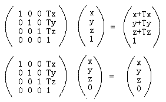

​	从上述矩阵变换可知，平移变换只对于点才有意义，因为普通向量没有位置概念，只有大小和方向。

​	旋转和缩放对于向量和点都有意义，可用类似上面齐次表示来检测。因此，齐次坐标使仿射变换更方便。

## 3 平面

​	平面方程为：$Ax + By + Cz + D = 0$，可由一个**四维向量**来表示。

### 1) 法线和平面点确定平面

​	平面方程中，$(A,B,C)$是平面的方向向量(法线)。

​	现有平面上任意点O$(x_{o},y_{o},z_{o})$，代入平面方程有：$D = -(Ax_{o} + By_{o} + Cz{o})$

​	因此，D的值是平面法向量和平面内任意点点积的负数。

​	所以有如下函数：

```c++
glm::vec4 GetPlane(const glm::vec3 &normal, const glm::vec3 &point)
{
    return glm::vec4(normal, -(glm::dot(normal, point)));
}
```

​	平面内任意点和法向量点积的几何意义如下：


​	$D = -n \cdot p$，**假设平面法向量是过坐标原点延伸出的轴**，那么D为平面在该轴上的距离(这个距离是有方向的)。

​	当**D是正数**，那么平面从原点起，沿着n的反方向移动了**|D|**的长度；

​	当**D是负数**，那么平面从原点起，沿着n向其正方向移动了**|D|**的长度。

### 2) 三个点确定平面

​	输入参数$p_{0}、p_{1}、p_{2}$按逆时针排序，否则法线方向不一致。

```c++
glm::vec4 GetPlane(const glm::vec3 &p0, const glm::vec3 &p1, const glm::vec3 &p2)
{    
    glm::vec3 edge0 = glm::normalize(p1 - p0);
    glm::vec3 edge1 = glm::normalize(p2 - p0);
    glm::vec3 normal = glm::cross(edge0, edge1);
    return GetPlane(normal, p0);
}
```

### 3) 判断点和面的位置关系

​	点和平面存在三个位置关系：① 点在面的上方(法线同侧)；② 点在平面内；③ 点在面的下方(法线异侧)。

​	设平面方程$Ax + By + Cz + D = 0$，且平面上一点O$(x_{o},y_{o},z_{o})$，则有$D = -(Ax_{o} + By_{o} + Cz{o})$。

​	设有点A$(x_{a},y_{a},z_{a})$，需要判断A和平面的位置关系，将A代入平面方程有：

$Ax_{a}+By_{a}+Cz_{a}-(Ax_{o} + By_{o} + Cz{o})$

​	提取出法向量，有：

$A(x_{a}-A_{o})+B(y_{a}-y_{o})+C(z_{a}-z_{o}) = N \cdot \vec{OA}$，O是平面上的点，A是待求点。

$N \cdot \vec{OA}=|N||\vec{OA}|cos\theta$

​	因此，有如下结论：

- 若A在平面上方(即OA和法线夹角小于90)，$ax+by+cz+d > 0$。
- 若A在平面上(即OA和法线夹角等于90)，$ax+by+cz+d = 0$。
- 若A在平面下方(即OA和法线夹角大于90)，$ax+by+cz+d < 0$。

## 4 切向空间球面坐标→笛卡尔坐标


## 5 蒙特卡洛积分

​	蒙特卡洛积分在计算机图形学中非常普遍，它是一种以高效的离散方式对连续的积分求近似的直观方法。

### 1) 大数定律

​	假设要计算一个国家所有公民的平均身高。为了得到结果，你可以测量**每个**公民并对他们的身高求平均，这样会得到你需要的**确切**答案。

​	但是，由于大多数国家人海茫茫，这个方法不现实：需要花费太多精力和时间。

​	另一种方法是选择一个小得多的**完全随机**(无偏)的人口子集，测量他们的身高并对结果求平均。虽然答案并非绝对精确，但会得到一个**相对接近真相的答案**，这个理论被称作**大数定律**。

​	如果从总人口中测量一组较小的真正随机样本的N，结果将相对接近真实答案，并随着样本数 N的增加而愈加接近。

### 2) 蒙特卡洛积分原理

​	蒙特卡罗积分建立在大数定律的基础上，并采用相同的方法来求解积分：不为所有可能的样本值x求解积分，而是简单地**从总体中随机挑选样本N生成采样值并求平均**。随着N的增加，结果越接近精确结果：


​	$pdf$是概率密度函数：特定样本在整个样本集上发生的概率。

​	若样本是**完全随机**的，那么估计是**无偏的**，随着样本数量的增加，最终将收敛到积分的**精确**解。

​	某些样本并不是**完全随机的**，而是集中于特定的值或方向，这些蒙特卡洛估算是**有偏的**。这些蒙特卡洛估算具有更快的收敛速度，但可能永远不会收敛到精确解。

### 3) 重要性采样

​	重要性采样是有偏估计，其① 生成的样本偏向特定的方向。② 收敛速度更快，利于重性能的应用。

​	在PBR中计算IBL的镜面反射部分时，反射的光向量被限制在**镜面波瓣中**，波瓣的大小取决于表面的**粗糙度**。

​	既然镜面波瓣外的任何随机生成的样本与镜面积分无关，因此将**样本集中在镜面波瓣内**是有意义的，但代价是蒙特卡洛估算会产生偏差

​	本质上来说，这就是重要性采样的核心：只在某些区域生成采样向量，该区域围绕微表面**半向量**，受**粗糙度**限制。

# 图形基本算法

## 1 点和射线的距离

​	本小节参考自[https://blog.csdn.net/LIQIANGEASTSUN/article/details/119598965](https://blog.csdn.net/LIQIANGEASTSUN/article/details/119598965)。

​	点和射线有如下四种位置关系：


### 1) 点到射线的垂足坐标

$\vec{PO}= O - P$;

$dot = \vec{PO}\cdot\vec{Ray}$

$D = P + dot*\vec{Ray} * |\vec{PO}|$

### 2) 点到射线的距离

​	两点先验知识：

​	① 向量叉积模长公式：$|\vec{a}\otimes\vec{b}|=|\vec{a}||\vec{b}|sin\theta$。

​	② 平行四边形面积公式：$S=ab*sin\theta = 底 \times 高 = a \times h$，其中a、b是平行四边形的相邻边长度，h为a上的高，都为标量。

​	所以，$S_{平行四边形} = 相邻边叉积的模$。

​	如下图，有射线$\vec{PD}$和点$O$，求$O$到射线的距离：


​	取$\vec{PO}$和单位向量$\vec{PP'}$作平行四边形，那么底边$PP'$的高$OD=|PO|\times sin\theta$。

## 2 射线和三角形求交

### 1) 解析法

​	假设射线和三角形所在平面的交点为p，在平面上任取一点a，有$(p-a)\cdot\vec{n}=0$，可计算求得点p。

​	然后通过叉积法判断点p是否在三角形内部：


​	依次求解$\vec{AP} \otimes \vec{AB}$、$\vec{BP} \otimes \vec{BC}$、$\vec{CP} \otimes \vec{CA}$，若结果向量的方向一致，则在三角形内部。

### 2) moller-Trumbore射线三角相交算法

​	一种快速计算射线与三角形在三个维度上的交点的方法，通过向量与矩阵计算可以快速得出交点与重心坐标，而无需对包含三角形的平面方程进行预计算。算法推导[https://blog.csdn.net/zhanxi1992/article/details/109903792](https://blog.csdn.net/zhanxi1992/article/details/109903792)。

## 3 射线和球求交

### 1) 解析法

​	将射线代入球的解析表达式，解方程，求解出交点坐标。

### 2) 几何法

​	已知射线起点o和方向p，球的圆心为c，球的半径为r。

​	从c作到射线的垂线，求出距离h。若$h<=r$，则射线与球有交点。

## 4 射线和AABB求交

​	下述是Cocos2dx中实现Ray-AABB相交检测的算法：分别与轴对应的面求交点，得到交点后，判断交点是否在范围内。

```c++
bool Ray::intersects(const AABB& aabb) const
{
  Vec3 ptOnPlane; //射线与包围盒某面的交点
  Vec3 min = aabb._min; //aabb包围盒最小点坐标
  Vec3 max = aabb._max; //aabb包围盒最大点坐标
  
  const Vec3& origin = _origin; //射线起始点
  const Vec3& dir = _direction; //方向矢量  
  float t{-1.f};
    
  // [NOTE]射线起点在包围盒内部, 若需返回交点，该步骤可省略
  if(origin >= min && orign <=max) { return true; }
  
  //若射线x轴分量为0，射线不经过包围盒与x轴垂直的两个面
  if (dir.x != 0.f) 
  {
    //解射线方程P=O+D*t
    if (dir.x > 0)//若射线沿x轴正方向偏移
      t = (min.x - origin.x) / dir.x;
    else  //射线沿x轴负方向偏移
      t = (max.x - origin.x) / dir.x;
    
    if (t > 0.f)//t>0时则射线与平面相交, 若t<0, 交点在射线起点的身后
    {
      ptOnPlane = origin + t * dir; //计算交点坐标
      //判断交点是否在当前面内
      if (min.y < ptOnPlane.y && ptOnPlane.y < max.y && min.z < ptOnPlane.z && 
          ptOnPlane.z < max.z)
      {
        return true;
      }
    }
  }
  
  //若射线y轴分量为0，射线不经过包围盒与y轴垂直的两个面
  if (dir.y != 0.f)
  {
    if (dir.y > 0)
      t = (min.y - origin.y) / dir.y;
    else
      t = (max.y - origin.y) / dir.y;
    
    if (t > 0.f)
    {
      ptOnPlane = origin + t * dir;
      if (min.z < ptOnPlane.z && ptOnPlane.z < max.z && min.x < ptOnPlane.x && 
          ptOnPlane.x < max.x)
      {
        return true;
      }
    }
  }
  
  //若射线z轴分量为0，射线不经过包围盒与z轴垂直的两个面
  if (dir.z != 0.f)
  {
    if (dir.z > 0)
      t = (min.z - origin.z) / dir.z;
    else
      t = (max.z - origin.z) / dir.z;
    
    if (t > 0.f)
    {
      ptOnPlane = origin + t * dir;      
      if (min.x < ptOnPlane.x && ptOnPlane.x < max.x && min.y < ptOnPlane.y && 
          ptOnPlane.y < max.y)
      {
        return true;
      }
    }
  }  
  return false;
}
```


## 5 射线和平面求交

​	若射线与平面有共同的点，那么可以将射线公式代入平面公式求得该点到射线起点的距离t：
$(O+\overrightarrow{D}t)\cdot\overrightarrow{n}+d=0$，即：
$t=-\frac{O\cdot\overrightarrow{n}+d}{\overrightarrow{D}\cdot\overrightarrow{n}}$
​	当分母 $\overrightarrow{D}\cdot\overrightarrow{n}=0$ 且分子 $O\cdot\overrightarrow{n}+d\ne0$，表示射线与平面平行，但是平面不包含射线，不相交。
​	当分母 $\overrightarrow{D}\cdot\overrightarrow{n}=0$ 且分子 $O\cdot\overrightarrow{n}+d=0$，表示平面包含射线，相交。
​	当 $t>=0$，表示射线与平面有交点。
​	当 $t<0$，表示射线在平面背面，没有交点。

## 6 判断任意点在凸多边形内部/外部

​	射线法、转角法参考[https://blog.csdn.net/WilliamSun0122/article/details/77994526](https://blog.csdn.net/WilliamSun0122/article/details/77994526)。

### 1) 射线法

​	以被测点Q为端点，向任意方向作射线(一般水平向右作射线)。统计该射线与多边形的交点数。如果为奇数，Q在多边形内；如果为偶数，Q在多边形外。

​	如下图有些特殊情况：


​	情况a)，射线和两条边的共同顶点相交，此时交点只能算一个；

​	情况b)，射线和两条线的最低处共同顶点相交，该点不能算；

​	情况c)，射线和多边形的一边平行，该边应忽略不计。

### 2) 转角法


​	多边形内部的点连接各个顶点，其所形成的角度和在精度范围内应等于360度，如果小于360度或者大于360度，则证明该点不在多边形中。

​	转角法简单，但是由于涉及要使用反三角函数，会耗时，且造成较大的精度误差。

### 3) 转角法优化

​	从P点向右做射线R，如果边从射线R下方跨到上方，那么穿越+1，如果从上方跨到下方，则是-1。最终和为wn环绕数。


​	这种方法不必去计算射线和边的交点，但需要判断点P和边的左右关系，而且对于方向向上和向下的边的判断规则不同。

​	对于方向向上的边，如果穿过射线，那么P是在有向边的左侧；对于方向向下的边，如果穿过射线，那么P在有向边的右侧。


## 7 判断多边形的凹凸性

​	依次顺时针遍历多边形的顶点。若向量的叉积保持一致，则是凸多边形，反之是凹多边形。

​	求$\vec{p_{0}p_{1}}\times\vec{p_{0}p_{2}}$：

```c++
double cross(Point& p1, Point& p2, Point& p0)
{
    return (p1.x - p0.x) * (p2.y - p0.y) - (p1.y - p0.y) * (p2.x - p0.x);
}
```

​	判断是否为凸多边形。若Polygon是顺时针排序，叉乘结果应该小于0；若Polygon是逆指针排序，叉乘结果应该大于0：

```c++
bool isConvexPolygon(QVector<Point> Polygon)
{
    int len = Polygon.size();
    int s = 0, e = len;
    if(e == 2)
        return true;
    while (s <= e-3) {
        if (cross(Polygon[s+1], Polygon[s+2],Polygon[s]) < 0)
            s++;
        else 
            return false;
    }
    return true;
}
```

## 8 空间划分

### 1) BVH

​	BVH概述参考自[https://zhuanlan.zhihu.com/p/32300891](https://zhuanlan.zhihu.com/p/32300891)。

#### 1.1) 核心思想

​	层次包围盒（Bounding Volume Hierarchies）是**对空间对象**的划分，其核心思想如下：

​	① 是用体积略大而**几何特征简单**的包围盒来近似地描述复杂的几何对象，从而只需对包围盒重叠的对象进行进一步的相交测试。

​	② 构造**树状层次结构**，可以越来越逼近对象的几何模型，直到几乎完全获得对象的几何特征。

#### 1.2) 组织结构

​	场景以层次树结构进行组织，包含一个**根节点**（root）、一些**内部节点**（internal nodes），以及一些**叶子节点**（leaves）。

​	树中的所有节点都含有一个包围体，将其**子树中的所有几何体**包围起来。BVH经常用于**视锥裁剪**。


#### 1.3) 构建思路

​	① 计算场景中每一个图元的AABB包围盒、质心（一般取包围盒的中心）并存储到数组中。

​	② 根据不同的划分策略(最长轴、SAH等)构建树状索引结构。

​	③ 将得到二叉树转化更加紧凑的表示形式（无指针，内存连续）。

#### 1.4) 最长轴构建BVH树

​	本小节参考自[https://zhuanlan.zhihu.com/p/475966001?utm_id=0](https://zhuanlan.zhihu.com/p/475966001?utm_id=0)：

```c++
BVHBuildNode* BVHAccel::recursiveBuild(std::vector<Object*> objects)
{
    BVHBuildNode* node = new BVHBuildNode();
    if (objects.size() == 1)//递归结束条件
    { 
        // Create leaf _BVHBuildNode_
        node->bounds = objects[0]->getBounds();
        node->object = objects[0];
        node->left = nullptr;
        node->right = nullptr;
        return node;
    }
    else if (objects.size() == 2)//objects为2时，左右各分一个
    {
        node->left = recursiveBuild(std::vector{objects[0]});
        node->right = recursiveBuild(std::vector{objects[1]});
        node->bounds = Union(node->left->bounds, node->right->bounds);//返回包围盒并集
        return node;
    }
    else 
    {
        Bounds3 centroidBounds;
        for (int i = 0; i < objects.size(); ++i)
            centroidBounds = Union (centroidBounds, objects[i]->getBounds().Centroid());
        int dim = centroidBounds.maxExtent(); 
        switch (dim) 
        {
        case 0: //最宽在x轴
            std::sort(objects.begin(), objects.end(), [](auto f1, auto f2) {
                return f1->getBounds().Centroid().x < f2->getBounds().Centroid().x;
            });
            break;
        case 1: //最宽在y轴
            std::sort(objects.begin(), objects.end(), [](auto f1, auto f2) {
                return f1->getBounds().Centroid().y < f2->getBounds().Centroid().y;
            });
            break;
        case 2: //最宽在z轴
            std::sort(objects.begin(), objects.end(), [](auto f1, auto f2) {
                return f1->getBounds().Centroid().z < f2->getBounds().Centroid().z;
            });
            break;
        }
        auto beginning = objects.begin();
        auto middling = objects.begin() + (objects.size() / 2);
        auto ending = objects.end();

        auto leftshapes = std::vector<Object*>(beginning, middling); //数组切分
        auto rightshapes = std::vector<Object*>(middling, ending);

        assert(objects.size() == (leftshapes.size() + rightshapes.size()));
        //左右开始递归
        node->left = recursiveBuild(leftshapes); 
        node->right = recursiveBuild(rightshapes);
        node->bounds = Union(node->left->bounds, node->right->bounds);
    }
    return node;
}
```

#### 1.5) 基于SAH构建BVH树

​	由于BVH存在着包围盒重叠的问题，若一个空间中物体分布不均匀，比如右边存在大量物体，而左边只有少量物体，此时使用BVH就会得到很差的划分结果。

​	SAH(Surface Area Heuristic)，通过对求交代价和遍历代价进行评估，给出了每一种划分的代价（Cost），寻找代价最小方式进行划分：确定最小重叠面积的轴向。

#### 1.6) 适用场景

​	BVH的构建相对比较耗时间，且对于动态物体的支持比较麻烦。

​	但是射线求交的运行效率会更高，因此常用于离线渲染和光线追踪以及碰撞检测等对性能要求较高的场合。

### 2) 八叉树OcTree

​	空间八叉树是对**场景的划分**。


#### 2.1) 组织结构

**节点结构**

- 每个节点包含一个包围盒用于表示该节点所包含的空间范围。
- 节点可能包含**零个或多个**对象，这些对象是该节点所表示空间范围内的物体。
- 八叉树将空间递归地划分为八个子节点，直到节点包含的对象**数量达到某个限制**，或者**达到最小节点大小**，不再继续划分，成为叶子节点。

**添加对象**

- 当需要向八叉树中添加对象时，从根节点开始递归地查找合适的叶子节点。
- 将对象添加到叶子节点中。如果该节点包含的对象数量超过限制，可以考虑划分该节点。

**查询**

- 对于空间查询，从根节点开始，检查查询范围与每个节点的包围盒是否相交。
- 如果相交，进一步检查该节点的子节点，递归地沿着相交的子节点继续查询，直到达到叶子节点。
- 叶子节点包含在查询范围内的对象。

#### 2.2) 适用场景

​	空间局部性：八叉树有效地利用了物体在三维空间中的局部性，提高了检索效率。

​	动态场景：适用于动态场景，因为对象的添加和删除**只影响八叉树的局部结构**。

## 9 反射向量推导

​	本小节推导的核心概念是：**任何矢量都可表现为法线分量和切线分量的和**。

​	在光照模型中，R是光线方向L相对于表面法线N的反射向量。

​	对于光线方向，有$L = L_{N} + L_{T}$。由于点积$N \cdot L$(标量)表示$L$在法线方向的投影，因此有$L_{N} = (N\cdot L)N$。

​	反射向量R和光线L有**相同的法向分量**，和**相反的切向分量**，因此，可按如下等式求R：

​	$R = L_{N} + R_{T} = L_{N} - L_{T}$，又$L_{T}=L - L_{N}$，

​	所以，$R = 2L_{N} - L = 2(N\cdot L)N - L$。

# 渲染管线

## 1 管线概述

​	高级的渲染步骤是由名为pipeline的**软件架构**所实现的。

​	管线是一连串的**顺序计算阶段**(stage)，每个阶段有其具体目的。

​	管线中的每个阶段通常独立于其他阶段。理想地，所有阶段都能**并行运行**，而一些阶段能**同时操作多个数据项**。


​	通常，游戏引擎的管线中，高级的阶段包含：

① **工具阶段**(脱机)：定义几何和表面材质。

② **资产调节阶段**(脱机)：处理几何和材质数据，生成引擎可用的格式。

③ **应用程序阶段**(CPU)：识别出潜在可见的网格实例，执行碰撞检测、动画、物理模拟、视椎体剔除等任务，把网格和材质提交到图形硬件以供渲染。

④ **几何阶段**(GPU)：执行顶点变换、透视投影、曲面细分、几何着色器、图元装配、裁剪和屏幕映射等。

​	图元组装将输入的顶点组装成指定的图元。图元组装会进行**裁剪**和**背面剔除**相关的优化，以减少进入光栅化的图元的数量。

​	在光栅化之前，还会进行屏幕映射的操作：**透视除法**和**视口变换**。

⑤ **光栅化和像素处理阶段**(GPU)：把三角形**离散化**为片段，并对片段**着色**。片段经过多种测试后，最终和帧缓冲区混合。

​	光栅化是个**离散化**的过程，将三维空间连续的几何转化为离散屏幕像素点的过程。

​	光栅化会确定图元所覆盖的片段，利用顶点属性**插值**得到片段的属性信息，然后送到片段着色器进行颜色计算。

​	**片段是像素的候选者**，只有通过后续的测试(裁切测试、Alpha测试、模板测试、深度测试，片段才会成为最终显示的像素点。

​	下图展示了③~⑤阶段：

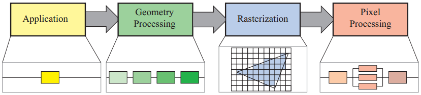

​	下图展示了④~⑤阶段的相关细节：

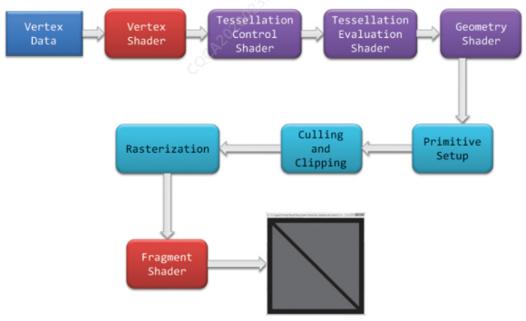

​	下图展示了数据在pipeline中的流转：


## 2 坐标变换

### 1) 坐标变换流程

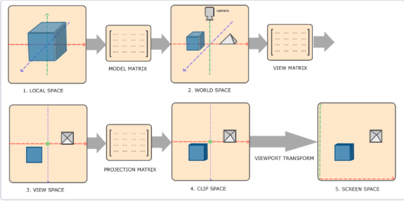

​	$局部坐标\stackrel{(1)模型矩阵}{\longrightarrow}世界坐标 \stackrel{(2)相机矩阵}{\longrightarrow} 视图坐标 \stackrel{(3)投影矩阵}{\longrightarrow} 裁剪坐标 \stackrel{(4)透视除法}{\longrightarrow} 标准设备空间(NDC) \stackrel{(5)视口变换}{\longrightarrow} 窗口坐标$

​	其中，第三步透视变换包含两个步骤：$ 投影矩阵=\left\{ \begin{matrix} 相似变换 \\ X、Y、Z三轴线性插值至[-1,1]\end{matrix} \right.$

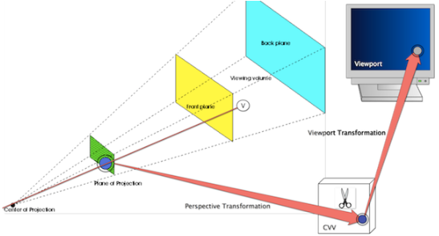

### 2) 坐标变换矩阵

<span id="coordinate_transform"></span>

#### 2.1) 标准正交基

​	正交矩阵的所有列(行)向量构成了一个标准正交基(**Orthonormal Bases**)，在**列主序**的情况下，它的列向量是两两垂直的**单位向量**。

​	标准正交基可以视为对坐标系的描述：在向量$\vec{v}$，在不同坐标基下，有不同的坐标。

​	比如，在标准参考系下，有向量 $\vec{v}$ 。该向量在正交基 $R$ 下，表示为 $\vec{v_{r}}$；在正交基 $Q$ 下，表示为 $\vec{v_{q}}$。其中：$I\vec{v} = R\vec{v_{r}} = Q\vec{v_{q}}$ 。

#### 2.2) 示例

$\begin{pmatrix}1 \\ 2 \\ 6 \end{pmatrix} = \begin{pmatrix}1 & 0 & 0\\ 0 & 1 & 0 \\ 0 & 0 & 1 \end{pmatrix} \begin{pmatrix}1 \\ 2 \\ 6 \end{pmatrix} = \begin{pmatrix}0 & 0 & 1\\ 1 & 0 & 0 \\ 0 & 1 & 0 \end{pmatrix} \begin{pmatrix}2 \\ 6 \\ 1 \end{pmatrix}$

​	上例中，$\begin{pmatrix}1 & 0 & 0\\ 0 & 1 & 0 \\ 0 & 0 & 1 \end{pmatrix}$是正交基$I$，是通用的标准参考系，三轴分别为$\begin{pmatrix}1 \\ 0 \\ 0 \end{pmatrix}$、$\begin{pmatrix}0 \\ 1 \\ 0 \end{pmatrix}$和$\begin{pmatrix}0 \\ 0 \\ 1 \end{pmatrix}$。

​	$\begin{pmatrix}0 & 0 & 1\\ 1 & 0 & 0 \\ 0 & 1 & 0 \end{pmatrix}$是正交基$R$，三轴分别为$\begin{pmatrix}0 \\ 1 \\ 0 \end{pmatrix}$、$\begin{pmatrix}0 \\ 0 \\ 1 \end{pmatrix}$和$\begin{pmatrix}1 \\ 0 \\ 0 \end{pmatrix}$，$\begin{pmatrix}2 \\ 6 \\ 1 \end{pmatrix}$是$\vec{v}$在正交基$R$下的坐标$\vec{v}_{r}$。

#### 2.3) 坐标变换公式

​	根据小节2)中的示例，有$I\vec{v} = R\vec{v}_{r}$，其中$I$是单位矩阵，有：$\vec{v} = R\vec{v}_{r}$。

​	因此，**把坐标从标准空间转换到对应的参考基中**，有：$\vec{v}_{r} = R^{-1}\vec{v}$，其中$\vec{v}$是向量在标准空间的坐标，$R^{-1}$是标准坐标基$R$的逆矩阵。

​	$R$由三个在**标准参考系中两两垂直的单位列向量**求得，所以$R$是正交矩阵。

​	又因正交矩阵，有$R^{-1} = R^{T}$，$R^{T}$代表**转置**。综上：$\vec{v}_{r} = R^{T}\vec{v}$。

## 3 渲染状态

​	渲染状态设置是**全局的**——它们在整个GPU中有效。

​	**改变渲染状态时**，整个GPU管道**必须完成目前的工作**，才能换上新的设置。因此，若不妥善管理，会令性能严重下降。

​	要尽量减少渲染状态的改变次数，最好的解决方案是**按材质来排序几何物体**。

​	下图描述了各种渲染状态改变时，带来的相对消耗：


​	但是，按材质排序几何，会带来overdraw的问题。因此引擎上需要进行一些绘制顺序的设计。

## 4 相机变换

### 1) 关键因素

​	① 相机位置；② 相机视线；③ 相机的上方向(自定义)。

### 2) 相机三轴方向推导


​	**from**指定相机在世界空间的位置；**to**指定相机视线终点在世界空间的位置；**up**指定相机的上方。

​	将from，up，to执行一定的数学计算，就可确定相机空间的三轴的方向。

- **forward向量**(相机+z)

​	forward向量由to指向from，是**视线的反方向**：

```c++
vec3 forward = normalize(from - to);
```

- **right向量**(相机+x)

​	不管forward如何变化，**forward必然和世界空间的up(0, 1, 0)在同一个平面中**，因此可以通过下式求出相机的right：

```c++
vec3 worldUp{0, 1, 0};
vec3 right = normalize(cross(worldUp, forward));
```

- **up向量**(相机+y)	

​	right、up和forward满足右手法则，因此通过矩阵叉乘，就能求得up向量，注意叉乘的顺序：

```c++
vec3 up = normalize(cross(forward, right));
```

### 3) 相机矩阵

​	通过2）小节，在世界空间中，可以得到相机三轴的表示，因此可以求出三轴下的标准坐标基：$R_{cam}=\begin{pmatrix} \vec{right} & \vec{up} & \vec{forward} \end{pmatrix}$。

​	因此有$\vec{v} = R_{cam} \vec{v}_{cam}$。根据 [坐标变换矩阵](#coordinate_transform) ，有$\vec{v}_{cam} = R_{cam}^{T} \vec{v}$。

​	上述只考虑了相机三轴的旋转，还要考虑相机的位置变化。故要执行**以相机位置为原点的逆向移动**，最终相机矩阵如下：

$R = R_{cam}^{T} \cdot T_{cam}^{-1}$


## 5 透视投影

​	世界空间的点经过相机矩阵后，被转换到相机空间。此时，多边形可能会被视椎体裁剪，但在不规则体中裁剪很难，所以裁剪被安排到规则观察体(`Canonical View Volume, CVV`)中(`齐次裁剪空间`)。

​	CVV是一个正方体，其x, y, z的范围都是[-1, 1]，多边形裁剪就是利用这个规则体完成的。综上，透视变换的作用如下：

- 透视变换矩阵把相机空间中的顶点从视锥体中变换到裁剪空间的CVV中(`相似变换`)；
- CVV裁剪完成后进行透视除法。

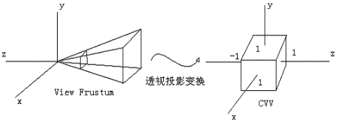

### 1) 投影点坐标

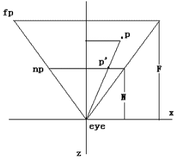

​	上图是右手坐标系中顶点在相机空间中的情形。设p(x,z)是经过相机变换之后的点，视锥体由eye——眼睛位置，np——近裁剪平面，fp——远裁剪平面组成。N是眼睛到近裁剪平面的距离，F是眼睛到远裁剪平面的距离。这里选择**近裁剪面**作为投影面。

​	设p’(x’,z’)是投影之后的点，则有z’ = -N。通过相似三角形性质，有：

$\frac{x'}{x} = \frac{z'}{z}$，其中有$z' = -N$，所以有$\frac{x'}{x} = \frac{-N}{z}$，有$x' = -N\frac{x}{z}$

​	同理有$y' = -N\frac{y}{z}$，因此投影点坐标为 $p'=(-N\frac{x}{z}, -N\frac{y}{z}, -N)$。

​	从上面可以看出，投影的结果z’始终等于-N。实际上，z’对于投影后的p’已经没有意义了，这个信息点已经没用了。

​	但对于3D图形管线来说，为了便于进行后面的片元操作，例如z缓冲消隐算法，有必要把投影前`相机空间中的z`保存下来，方便后面使用。因此，我们利用这个没用的信息点存储z：

$p'=(-N\frac{x}{z}, -N\frac{y}{z}, z)\qquad\qquad\qquad\qquad\qquad\qquad\qquad\qquad\qquad\qquad\qquad(1)$

​	公式(1)其中x, y, z是相机空间点的坐标，N是近平面的距离。

### 2) 用齐次坐标表达投影点

​	公式(1)有点生搬硬套的意思，现开始结合CVV进行思考，把它写得在数学上更优雅，更易于程序处理。如前所述，第3个分量可以是任意值，因此有公式(2)：

$p'=(-N\frac{x}{z}, -N\frac{y}{z}, -\frac{az+b}{z})\qquad\qquad\qquad\qquad\qquad\qquad\qquad\qquad\qquad\qquad(2)$

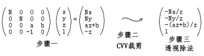其中，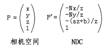

​	步骤一：投影矩阵乘法：首先进行`相似变换`，将点投影到裁剪平面；其次，使用`线性插值`进行`坐标归一化`，使[left, right]、[bottom, far]、[-N, -F]之间的点变为[-1, 1]，方便裁剪；

​	步骤二：CVV中执行裁剪；裁剪时，使用的是齐次坐标，因为透视除法后会丢失一些必要信息，如-z。

​	步骤三：透视除法，将齐次坐标变换为普通坐标。

​	将第三个分量写为$-\frac{az+b}{z}$的原因有如下三个：

- 投影之后的光栅化阶段，要通过顶点的x'、y'对z进行线性插值，求出图元内部各片元的z，进行深度测试；

  数学上，投影后的x'和y'，与z不是线性关系，与`1/z`才是线性关系，而$-\frac{az+b}{z}=-(a+\frac{b}{z})$正是$\frac{1}{z}$的线性关系；

  因此，利用这个$\frac{1}{z}$的线性组合与x'、y'插值，才是`透视正确`的。

- p’的3个代数分量统一除以-z，易于使用齐次坐标变为普通坐标来完成，使得处理更加一致、高效；

- CVV是一个x, y, z的范围为[-1, 1]的规则体，便于进行多边形裁剪。我们可以适当的选择系数a和b，使得这个式子在z = -N的时候值为-1，在z = -F的时候值为1，从而在z方向上构建CVV。

### 3) 投影矩阵

​	投影矩阵需要在x, y, z三个方向上构建CVV，CVV中的齐次左边变为普通坐标后，最终形式为：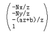

#### 3.1) 在Z方向构建CVV

​	z的范围是[-N, -F]，因此有：

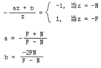

#### 3.2) 在X和Y方向构建CVV

​	$-N\frac{x}{z}$是投影平面上的点，范围是[left, right]，$x'$是标准化后的点，范围是[-1, 1]。

​	二者是**同一个值的不同形式**，$x'$是最终的目标值，$-N\frac{x}{z}$是推导过程的`中间值`，用于理解。因此有：

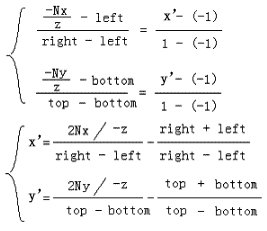

#### 3.3) 标准化后的投影点坐标

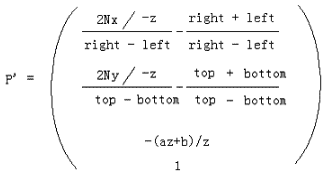

#### 3.4) 坐标反推投影矩阵

​	首先，做透视除法的逆处理：每个分量乘以-z，得到：

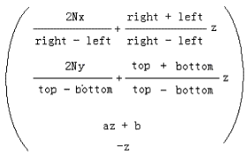，又有：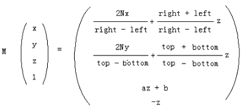

​	可以反求得到投影矩阵M：

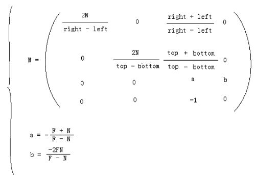

​	综上，投影矩阵最后一行是：$\begin{pmatrix}0 & 0 & -1 & 0\end{pmatrix}$，而不是$\begin{pmatrix}0 & 0 & 0 & 1\end{pmatrix}$，可知透视变换**不是仿射变换**，它是非线性的。

​	进入CVV的点在[-1, 1]中，从而造成了**投影失真现象**。

​	投影失真的解决方法就是之后的`视口变换`：把归一化的顶点按照和`投影面上相同的比例`变换到视口中，从而解除透视投影变换带来的失真现象。

## 6 正交投影

​	本小节参考自[https://zhuanlan.zhihu.com/p/122411512](https://zhuanlan.zhihu.com/p/122411512)。

​	正交投影矩阵的视锥体是一个长方体\[l, r]、\[b, t]、\[n, f]，在投影变换的过程中，需要把这个长方体转换到一个正方体\[-1, 1]、\[-1, 1]、\[-1, 1]中，如下图所示：


- 将点移动到以长方体为中心为原点的坐标系中：

​	矩阵$M_{translation} = \begin{pmatrix}1 & 0 & 0 & -(l+r)/2 \\ 0 & 1 & 0 & -(b+t)/2 \\ 0 & 0 & 1 & -(n+f)/2 \\ 0 & 0 & 0 & 1 \end{pmatrix}$。

- 将点缩放到\[-1,1]：

​	矩阵$M_{scale} = \begin{pmatrix} 2/(r-l) & 0 & 0 & 0 \\ 0 & 2/{t-b} & 0 & 0 \\ 0 & 0 & 2/(n-f) & 0 \\ 0 & 0 & 0 & 1 \end{pmatrix}$

- 完整的正交矩阵：

$M_{ortho} = M_{scale}\ast M_{translation}$。

​	综上，正交矩阵实际做了两个工作：① 平移；② 缩放。

## 7 遮挡和深度缓存

### 画家算法&&深度缓存

​	**画家算法**：把三角形按**从后往前**的顺序依次渲染，避免过渡绘制。但是三角形相互穿插时，该方法不适用，如下所示。


​	由于画家算法的不足，**深度缓冲z-buffer**应运而生。

​	深度缓存是全屏缓存，每个像素含16、24或32位的深度数据。

​	每个片段含有一个z坐标，作为深度。在渲染同一个像素时，引擎会比较新的片段深度和深度缓存里的现存深度。

​	若新片段深度较小，其颜色和深度就会写进帧缓存；否则就丢弃。

### 深度冲突

​	当渲染两个非常接近的平行表面时，引擎必须能区分这两个平面的深度。若深度缓冲有**无限的精度**，这不会造成问题。

​	但是深度缓冲含有有限的精度，两个足够接近的平面，其深度可能成为**相同的离散值**。若这样的情况发生，较远的平面就会刺穿较近的平面，造成**深度冲突**。

​	深度缓冲的深度是裁剪空间的深度，其**并非均匀分布于**近平面和远平面之间，因为该深度是**相机空间z坐标的倒数**。

​	由于$1/z$曲线的形状，深度缓冲的大部分精度集中于离摄像机近的地方。


​	其中，$p_{V_{z}}$是相机空间深度，$p_{H_{z}}$是裁剪空间深度。在离相机距离不同时，相同的相机空间深度变化量，对应不同的$\triangle p_{H_{z}}$。

### w-buffer

​	**w-buffer**：为了解决深度精度不均匀的问题，我们希望在深度缓冲里存储**相机空间的z坐标**(其随相机距离线性变化)。

​	因此，在shader中一般要对**深度取倒数**，再利用它对顶点属性插值。

## 8 early-z

​	像素处理阶段，片元被着色后(fragmet shader)，通过深度测试，才转换为像素，显示在屏幕上。

​	因此，被着色后的片元有可能被舍弃，这就引起了**过渡绘制(OverDraw)**。early z就是为了优化过渡绘制。

### 1) early-z时机

​	early-z是GPU硬件层的优化，在**光栅化后**和**片元着色前**添加early-z阶段。

​	early-z执行的操作和late-z完全一样，但early-z的优化效果**不稳定**。

#### 1.1) early-z被关闭

​	① 手动**写入深度值**；② **开启alpha test**；③ **执行丢弃像素操作**。

​	若执行上述操作，GPU就会关闭early-z，直到下一次clear z-buffer。

​	上述操作在**片元着色和late-z之间执行**，会修改z-buffer中的值，导致early-z的结果不正确。

#### 1.2) early-z不稳定

​	若按由近及远的顺序绘制，early-z可以完美避免过度绘制；

​	若由远及近绘制，early-z不起任何作用。

### 2) z-culling

​	z-culling是GPU硬件层的优化。

#### 2.1) z-culling和early-z的区别

​	early-z以pixel-quad为单位，**逐像素**比较；

​	z-culling以tile为单位，按tile**整体**进行比较。其中，tile即tile based rendering(TBR)中的概念。

#### 2.2) z-culling比较方式

​	获取当前tile的深度最值：$Z^{tile}_{min}$、$Z^{tile}_{max}$；

​	获取tile所属的深度缓冲区的最值：$Z_{min}$、$Z_{max}$；

​	若$Z^{tile}_{max} < Z_{min}$，则tile全部可见，保留整个tile，并在late-z阶段省去读缓冲的操作，直接进行写buffer；

​	若$Z^{tile}_{min} > Z_{max}$，则tile全部不可见，丢弃整个tile；

​	对于其他情况，则交给后续的late-z判断。

​	z-culling所需要的比对数据储存在on-chip缓存中的某个固定区域，特点即是容量小但速度快。

​	由于在z-culling阶段，对深度缓存是只读的，所以**不会**因为① 手动写入深度值；② 开启alpha test；③ 执行丢弃像素操作，导致z-buffer修改，导致测试失效。因此z-culling弥补了early-z的第一个缺点。

## 9 z-prepass

​	z-perpass是软件层面的技术。z-prepass主要应用于不透明物体，并**渲染场景两次**：

- 第一次绘制

​	仅使用vertex shader，快速产生深度缓冲。

​	为了减少深度缓冲的写入次数，不透明物体可按**从近至远**的顺序绘制。

​	执行完该pass，后续的drawcall可**避免overdraw**。

- 第二次绘制

​	关闭深度缓冲，设置**深度比较函数**为相等，用完整的颜色填充帧缓冲。可按几何物体的**材质排序**，用最少的状态改变渲染颜色，使管道吞吐量最大化。

​	综上，按z-prepass完成了不透明物体的渲染后，可按从远至近的顺序渲染半透明物体，从而得到正确的alpha混合。

​	z-prepass一般用于forward rendering中。在延迟渲染中，z-prepass可用来优化pre-geometry阶段。

## 10 3d拾取

### 1) 屏幕上的点转换到视口坐标

​	屏幕坐标原点在屏幕左上角，x向右，y向下；

​	视口坐标原点在左下角，x向右，向上。

### 2) 视口中的点转换到投影平面上

​	投影平面的点被实施视口变换(线性插值)后，被变换到视口中。在这里，我们要实施一个逆变换。

$\frac{X_{vp} - Left_{vp}}{Right_{vp} - Left{vp}} = \frac{X_{p1} -(-1)}{1-(-1)}$

$\frac{Y_{vp} - Left_{vp}}{Right_{vp} - Left{vp}} = \frac{Y_{p1} -(-1)}{1-(-1)}$

​	综上，屏幕点击的位置被转换到了投影平面上，有：$P_{1}(X_{p1},Y_{p1},-N)$。

​	此时，该点是处于CVV中的，需要通过再次一次线性插值，把其转换到[left, right]、[bottom, top]中，得到$P_{2}(X_{p2},Y_{p2},-N)$：

$\frac{X_{p1} -(-1)}{1-(-1)} = \frac{X_{p2}-Left_{prj}}{Right_{prj}-Left{prj}}$

$\frac{Y_{p1} -(-1)}{1-(-1)} = \frac{Y_{p2}-Bottom_{prj}}{Top_{prj}-Bottom{prj}}$

### 3) 向三维空间拓展

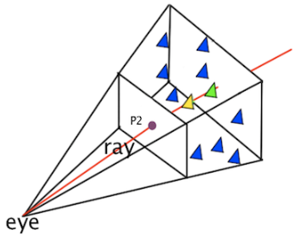

​	使用射线ray，把2维空间的点拓展到3维中。

​	图中的模型处于相机空间中。射线起点为eye的位置，射线的方向朝近平面上的$P_{2}$延伸，得到射线ray；

​	通过ray和三维空间的三角面求交，来完成拾取。

## 11 场景图Scene Graph

​	游戏世界可以达到很大的规模，但大多数几何物体都在摄像机视椎体之外。

​	需要设计数据结构管理场景中所有的几何物体，能迅速**丢弃**大量不在视椎体范围内的几何，且能帮助对场景的几何体**排序**。

​	这样的数据结构被称作**场景图(scene graph)**。多数这类数据结构采用**空间划分**的思路，把三维空间以某形式划分为区域，使不与视椎体相交的区域能迅速被丢弃。

## 12 几种剔除技术Culling

- 视锥剔除Frustum Culling

​	最直接的剔除技术。在CPU侧，object通过和摄像机的frustum求交，把frustum之外的object忽略。

- 遮挡剔除Occlusion Culling

​	剔除被其他对象遮挡的对象。例如，墙后的家具将不会被渲染。该技术适用于包含大量室内场景或狭小空间的场景。

​	一般在CPU侧完成计算，可以有效的减少overdraw。

- 细节层次剔除LOD Culling

​	LOD Culling根据物体离摄像机的距离，动态降低对象的复杂度。

- 层级剔除Layer Culling

​	对每种物体标记其对应的layer，并有选择性的隐藏某个layer下的物体。

​	多用于调试或批量隐藏某一类的物体。

- 距离剔除Distance Culling

​	根据与摄像机的距离，隐藏对象。适用于开放世界游戏，远处的对象不需要渲染。

- 背面剔除Back Face Culling
- GPU遮挡剔除GPU Occlusion Culling

​	Unity6中的高级功能，通过GPU在运行时处理遮挡剔除。

## 13 伽马校正

### 1) 视觉响应的非线性

​	阴极射线管(CRT)显示屏往往有**非线性**的亮度响应曲线：

​	送往CRT的**RGB**以**线性递增**，但屏幕显示结果从**人眼感知**上是**非线性的**。

​	视觉上，较暗的区域显得比理论上还暗。

### 2) 数学建模

​	CRT显示屏的伽马响应曲线可按如下建模：

$V_{out} = V_{in}^{\gamma}$，其中$V_{in}$是线性送入的RGB。

​	综上，要校正此情况，颜色被送入CRT显示屏前，需要进行一个**逆变换**。

### 3) gamma校正

​	通常CRT显示屏的伽马值为$\gamma_{CRT} = 2.2$，因此伽马校正值为$\gamma_{corr} = 1 / 2.2 = 0.455$。

​	下图中，gamma correction曲线为gamma**编码曲线**，CRT gamma曲线为**解码曲线**。


### 4) 纹理和gamma校正

​	纹理贴图所使用的位图通常**已经进行了gamma校正**。

​	高质量的渲染引擎需要考虑这种情况，在渲染前，对纹理进行**gamma解码**。最终，在常见渲染完成后，**再进行gamma编码**。

# PBR

## 1 PBR核心理论

​	基于物理的渲染(Physically Based Rendering，PBR)是指使用基于**物理原理**和**微平面理论**建模的着色/光照模型。

​	PBR的**渲染范畴**由基于物理的**材质**、基于物理的**光照**和基于物理适配的**摄像机**这三部分构成。


### 1) 基础概念

- 微平面理论（Microfacet Theory）

  微平面理论是将物体表面建模成做无数微观尺度上有**随机朝向**的**理想镜面反射**的**小平面**（microfacet）的理论。

  在实际的PBR 工作流中，这种物体表面的不规则性用**粗糙度贴图**或者**高光度贴图**来表示。

- 能量守恒（Energy Conservation）

  出射光线的能量永远不能超过入射光线的能量。

  随着粗糙度的上升**镜面反射区域的面积**会增加，作为平衡，镜面反射区域的**平均亮度**则会下降。

- 菲涅尔反射（Fresnel Reflectance）

  光线以**不同角度入射**会有**不同的反射率**。相同的入射角度，不同的物质也会有不同的反射率。

  万物皆有菲涅尔反射。**F0**是 0 度角入射的菲涅尔反射值。大多数非金属的F0范围是0.02~0.04，大多数金属的F0范围是0.7~1.0。

- 线性空间（Linear Space）

  光照计算必须在线性空间完成，shader中输入的gamma空间的贴图比如漫反射贴图需要被转成线性空间。

  在具体操作时需要根据不同引擎和渲染器的不同做不同的操作。

  **描述物体表面属性的贴图**如粗糙度，高光贴图，金属贴图等**必须保证是线性空间**。

- 色调映射（Tone Mapping）

  将宽范围的照明级别拟合到屏幕有限色域内的过程。

  因为基于HDR渲染出来的亮度值会超过显示器能够显示最大亮度，所以需要使用色调映射，将光照结果从HDR转换为显示器能够正常显示的LDR。

- 物质的光学特性（Substance Optical Properties）

  现实世界中有不同类型的物质可分为三大类：绝缘体（Insulators），半导体（semi-conductors）和导体（conductors）。

  在渲染和游戏领域，我们一般只对其中的两个感兴趣：导体（金属）和绝缘体（电解质，非金属）。

  其中非金属具有单色/灰色镜面反射颜色；金属具有彩色的镜面反射颜色。

  即非金属的F0是一个float，而金属的F0是一个float3，如下图：

  

### 2) 光与非光学平坦表面的交互原理

#### 2.1) 反射

​	光在与非光学平坦表面（non-optical-flat-surface）的交互时，非光学平坦表面表现得像一个**微小的光学平面的大集合**。

​	表面上的每个点都会以略微**不同的方向**对入射光反射，而最终的表面外观是许多具有不同表面取向的点的聚合结果。


​	下述图片中，在肉眼可见的尺度上，都是光滑的，但粗糙度在**微观**上存在差异：

​	顶部图所示的表面相对光滑，表面取向仅略有变化，导致反射光方向的微小变化，从而产生更清晰的反射。

​	底部图所示的的表面较粗糙，表面上的不同点具有广泛变化的方向取向，导致反射光方向的高度变化，并因此导致模糊的反射。


​	出于**着色的目的**，通常用统计方法处理这种微观几何现象，将表面视为：每个点接收入射光后，会在**多个方向**上反射和折射。


#### 2.2) 折射

​	对于金属，折射光会被立刻吸收；对于非金属(电介质或绝缘体)，一旦光在内部折射，会表现出**吸收**和**散射**两种行为。


#### 2.3) 漫反射和次表面反射

​	本小节参考自[漫反射和次表面反射](https://zhuanlan.zhihu.com/p/515825802)。

​	漫反射是图像的**低频信息**(变化率慢)。图像的**边缘**是高频信息，其灰度变化率快，是图像的大致概貌和轮廓，是图像的近似信息(参考自[图像的低频，中频，高频信息含义](https://blog.csdn.net/jinking01/article/details/120042602))。

​	漫反射和次表面散射其实是**相同物理现象**，本质都是**折射光**的**次表面散射**的结果，**它们的区别在于尺度**。如果**散射距离**已经大到能够产生明显的现象，就以次表面散射来称呼。

- 次表面散射简述

​	假设红色轮廓的绿色圆圈是**单个像素**的着色区域。右侧的入射光，大部分从表面**反射**，另一部分光折射入表面。

​	光在介质中遇到粒子，**在粒子间散射**。其中某些波长的光被吸收，形成材质特有的反照率颜色。

​	未被完全吸收的光会以**随机方向折射出表面**，这就是漫反射和次表面反射形成的**本质**。

- 漫反射

​	散射的次表面光**集中出现在单个像素区域内**。在渲染时，只考虑照射到该单一像素的光，估算返回的光量，模拟效果。这就是对漫反射的抽象。


- 次表面反射

​	通常次表面反射仅在**半透明**的材质中出现，运行散射光比典型的材质反射得更远，如下图所示。

​	散射光**不再出现在单个像素区域内**，而是出现在可能被**相邻像素覆盖的区域中**。

​	此时散射光已经跨越了一个像素，不再只考虑入射到单像素的光，而需要**考虑来自其他像素的光照**，以便模拟光散射出表面的效果。


- 总结

​	漫反射和次表面反射是相同的物理现象：折射光的次表面散射结果。当散射区域集中在单个像素内时，次表面散射近似为漫反射。

#### 2.4) 不同微表面粗糙度对次表面散射的影响

​	本小节参考自[Disney BSDF 深度解析](https://zhuanlan.zhihu.com/p/407007915)相应章节。

## 2 渲染方程

​	渲染方程在理论上给出了一个完美的结果。各种各样的渲染技术，是这个理想结果的近似。

### 1) 辐射度量学概念

#### 1.1) 辐射通量

​	**辐射通量**/**辐射功率** $\Phi$ (Radiant Power或Radiant Flux)：表示**单位时间**从表面**发射**或**到达**表面的总能量流量，单位为瓦(W，1W = 1 J/s)

​	比如，可以说光源发射出50瓦的辐射功率，或者有20瓦的辐射功率入射到桌子上。

#### 1.2) 立体角

​	立体角(Solid Angle)是弧度在三维空间的延伸。

​	二维中，弧度表示为：$\theta = \frac{l}{r}$，其中$l$是弧度对应的弧长，$r$是圆的半径。

​	三维中，立体角是**有体积的方向**：观察者站在圆心，望向物体的方向，物体在单位圆表面投影的面积的值，就是立体角。如下所示：


#### 1.3) 辐射强度

​	辐射强度 $I$ (Radiant Intensity)：单位立体角上的辐射通量 / **power per solid angle**，即$I = \frac{d\Phi}{d\omega}$，其几何意义：光源在任意方向上的亮度。


#### 1.4) 辐照度

​	辐照度(Irradiance)：单位面积的辐射通量 / **power per unit area**，即表面被四面八方的光照射的总量，是**被辐射**的意思。

​	接受光线的**有效方向**必须和**物体表面垂直**，若不垂直，需要通过**投影**计算出有效光照。

#### 1.5) 辐射度

​	辐射度(Radiance)：表面在单位立体角、单位投影面积上发射、反射、接受的光的功率，即power per solid angle per area。

​	辐射度描述如何在光**传播过程中**，度量其能量。计算如下：$L(p,\omega)=\frac{d^{2}\Phi(p,\omega)}{d\omega dAcos\theta}$。$d\omega$表示立体角，$dAcos\theta$表示投影面积。


### 2) 渲染方程 / 反射方程


​	渲染方程描述**光能在场景中流转的方程**，它基于**能量守恒定律**，在理论上给出了一个完美的光能求解结果。		

​	渲染方程**物理意义**：在某个视点看向特定表面，看到的①**出射光**$\omega_{o}$ / 辐照度(Irradiance)由表面的②**BRDF**和表面接收的**③各方向入射光的Radiance**求和得到。

​	各个参数如下：

- 辐射度Radiance：$L_{i}(p,\omega_{i})$。计算时，当表面积足够小时，$p$视作点。当立体角足够小时，$\omega$视作向量。
- 表面法线和光线夹角：$n\cdot\omega_{i}$。
- BRDF：$f_{r}(p, \omega_{i},\omega_{o})$，表示表面$p$在入射方向$\omega_{i}$和出射方向$\omega_{o}$的反射率，BRDF类似于权重，它基于表面材质的属性。
- $L_{o}(p,\omega_{o})$：是**辐照度**，即该表面$p$接受所在半球所有方向的光照后，在$\omega_{o}$方向上产生的辐射量。

​	由于渲染方程没有解析解，因此使用**数值解**来求其积分：**黎曼求和方程**，伪代码如下：

```c++
int steps = 100;
int sum = 0.f;
vec3 P  = ...;
vec3 Wo = ...;
vec3 N  = ...;
float dW = 1.f / steps;
for(int i = 0; i < steps; i++)
{
    vec3 Wi = NextIncomingLightDir(i);
    sum += Fr(P, Wi, Wo) * L(P, Wi) * dot(N, Wi) * dW;
}
```

## 3 BxDF

​	BxDF一般而言是对BRDF、BTDF、BSDF、BSSRDF等几种双向分布函数的一个**统一的表示**。

​	其中，BSDF可以看做BRDF和BTDF更一般的形式，而且BSDF = BRDF + BTDF。

​	在上述这些BxDF中，BRDF最为简单，也最为常用。

​	因为游戏和电影中的大多数物体都是不透明的，用BRDF就完全足够。而BSDF、BTDF、BSSRDF往往更多用于**半透明材质**和**次表面散射材质**。

## 4 Disney Principled BRDF

### 1) Disney Principled BRDF基本概念

​	迪士尼BRDF核心理念：**着色模型是艺术导向（Art Directable）的，而不一定要是完全物理正确（physically correct）**，能让美术用少量、直观的参数，以及标准化的工作流，快速实现涉及大量不同材质的真实感的渲染工作。

​	有如下参数(参考自[Disney Principled BRDF实现笔记](https://zhuanlan.zhihu.com/p/57771965))，所有参数的值/分量都在**[0, 1]**之中：

- **baseColor**：材质的基本颜色，通常为常数或由纹理提供。

- **subsurface**：控制材质的漫反射成分向次表面散射靠拢的程度。漫反射和次表面反射物理本质相同，那么就可以使用一个参数——subsurface在二者之间过渡。Disney BRDF会**分别**计算漫反射和次表面反射，再使用subsurface在二者间插值。

- **metallic**：金属度(0 = 电介质，1 = 金属)。这是两种**不同模型之间的线性混合**。**金属模型没有漫反射成分**，还具有等于基础色的着色入射镜面反射。

- **specular**：高光度，控制材质非金属部分高光的明亮程度。

- **specularTint**：对美术控制的让步，高光颜色向基本颜色靠拢的程度。

- **roughness**：粗糙度，控制漫反射和镜面反射。

- **anisotropic**：各向异性程度。用于控制**镜面反射高光的纵横比**，材质反射得非对称程度。(0 = 各向同性，1 = 最大各向异性)

- **sheen**：光泽度，模拟纺织物等布料的边缘明亮效果。

  用几乎垂直于法线的方向(掠射方向)去观察布料(如丝绸)时，它们会显得比普通的漫反射更明亮一些。这就是sheen的模拟的现象。

- **sheenTint**：光泽颜色，sheen分量的颜色向基本颜色靠拢的程度。

- **clearcoat**：清漆强度，额外的高光项。

  诸如车漆、木质地板等材料可通过一个**两层模型**来渲染：上面是一层透明材料，通常比较光滑；下面则是漫反射或金属等其他材料。

  如果要仔细地渲染这一模型，需要考虑两层间的多次反射和折射，并用fresnel公式分配每次反射/折射的比例。

  Disney BRDF采用简单粗暴的方案：加上一个额外的高光，即清漆(clearcoat)项。

- **clearcoatGloss**：控制清漆的光滑程度。


### 2) BRDF的几何意义

​	BRDF(Bidirectional Reflectance Distribution Function)：双向反射分布函数，描述物体表面**如何反射光线**的方程。

​	BRDF的输入：入射方向$\omega_{i}$、出射方向$\omega_{o}$、表面法向$n$和表面粗糙度$\alpha$。

​	BRDF的输出：输出一个**权重**，表示当前材质下，入射光线$\omega_{i}$对角度为$\omega_{o}$的出射光线的影响。

​	若表面是**完美光滑**的，那么与$\omega_{i}$对称的出射角度的BRDF应该为1，其余角度的BRDF为0。

​	本质上，Disney Principled BRDF模型是金属和非金属的**混合型模型**，最终结果是**基于金属度(metallic)在金属BRDF和非金属BRDF之间进行线性插值**：


<div align="center">Disney BRDF模型是金属和非金属基于金属度(metallic)的线性混合模型</div>

​	这套渲染理念统一了金属和非金属的材质表述，仅通过少量的参数来涵盖自然界中绝大多数的材质，得到非常逼真的渲染品质。因此，在PBR的金属/粗糙度工作流中，固有色(baseColor)贴图才会同时包含金属和非金属的材质数据：① 金属的反射率值；② 非金属的漫反射颜色。

### 3) Disney Principled BRDF的着色模型

​	Disney采用了通用的microfacet Cook-Torrance BRDF着色模型，其是实践中**使用最广泛**的模型，如下所示：


​	其中：

- diffuse为漫反射项；
- $\frac{D(\theta_{h})F(\theta_{d})G(\theta_{l}, \theta_{v})}{4cos\theta_{l}cos\theta_{v}}$为镜面反射项；
- D是微平面分布函数，主要负责镜面反射波峰的形状；
- F是菲涅尔反射系数；
- G是几何衰减 / 阴影项。

​	其中，**折射光线比例**$k_{d}$：用于产生漫反射，漫反射的本质是**折射光次表面的散射**。

​	**反射光线比例**$k_{s}$：用于产生高光。

#### 3.1) 漫反射项Disney Diffuse

​	Disney表示，Lambert漫反射模型在边缘上通常太暗，而因此尝试添加菲涅尔因子以使其在物理上更合理，但会导致其更暗。

​	所以，根据对Merl 100材质库的观察，Disney开发了一种用于漫反射的新的经验模型，以在光滑表面的漫反射菲涅尔阴影和粗糙表面之间进行平滑过渡。

​	Disney使用了Schlick Fresnel近似，并修改掠射逆反射(grazing retroreflection response)以达到其特定值由粗糙度值确定，而不是简单为0：


​	其中，$F_{D90} = 0.5 + 2 roughness cos^{2}\theta_{d}$，Disney Diffuse的代码实现如下：

```glsl
// [Burley 2012, "Physically-Based Shading at Disney"]
float3 Diffuse_Burley_Disney( float3 DiffuseColor, float Roughness, float NoV, float NoL, float VoH )
{
	float FD90 = 0.5 + 2 * VoH * VoH * Roughness;
	float FdV = 1 + (FD90 - 1) * Pow5( 1 - NoV );
	float FdL = 1 + (FD90 - 1) * Pow5( 1 - NoL );
	return DiffuseColor * ( (1 / PI) * FdV * FdL );
}
```

#### 3.2) 高光项

##### 3.3.1) 前置知识

- 正确的法线方向	

​	每个表面点将来自给定进入方向的光反射到单个出射方向，该出射方向取决于微观几何法线（microgeometry normal）**m** 的方向。

​	在计算BRDF项时，指定光方向 **l(或$\omega_{i}$)** 和视图方向 **v(或$\omega_{o}$)** 。这意味着，对于所有小平面，只有可以**将 l 反射到 v 的那些小平面**，才有助于BRDF。其他方向有正有负，积分之后，相互抵消。这些有助于BRDF的小平面法线，就是**有效的/正确的**法线方向。

​	如下图所示，正确的 $m$ 正好位于 $l$ 和 $v$ 的中间，只有当 $m = h$ 时，表面的点才会把 $l$ 反射到 $v$ 上，其他点对BRDF没有贡献。


- 被遮蔽的光

​	不是所有能被反射到 $v$ 的光都会对BRDF做贡献。这些光的一部分可能会因为 $l$ 方向的遮挡(**图1**)、 $v$ 方向的遮挡(**图2**)，从镜面反射中抹除。

​	阴影区没有接收 $l$ 的直射光，但接受了其他表面区域的反射光。不过microfacet理论忽略了这些相互反射(**图3**)。


##### 3.3.2) 法线分布项(Specular D)

​	$D(\theta_{h})$描述微表面**正确朝向**的法线的**分布概率**。**正确朝向**指能够将来自 $l$ 的光反射到观察方向 $v$ 的法线方向。

​	流行的模型中，GGX拥有最长的尾部。而GGX其实与Blinn (1977)推崇的Trowbridge-Reitz(TR)(1975)分布等同。

​	然而，对于许多材质而言，即便是GGX分布，仍然没有足够长的尾部。

​	Trowbridge-Reitz(TR)的公式为：


​	其中：c为缩放常数(scaling constant)；$\alpha$为粗糙度参数，值在0~1之间，0表完全平滑的分布，1表示完全粗糙偶均匀的分布。

​	来自Berry(1923)的分布函数和Trowbridge-Reitz分布具有非常相似的形式，但指数为1而不是2，从而导致了更长的尾部：


​	通过Trowbridge-Reitz和Berry的形式的对比，Disney发现其具有相似的形式，只是幂次不同。

​	于是，Disney将Trowbridge-Reitz进行了N次幂的推广，并将其取名为Generalized-Trowbridge-Reitz，GTR：


​	上述中，$\gamma=1$时，GTG即Berry分布；$\gamma=2$时，GTG即Trowbridge-Reitz分布。

​	以下为各种$\gamma$值的GTR分布曲线与$\theta_{h}$的关系图示：


​	另外，Disney Principled BRDF中使用了两个固定的镜面反射波瓣(specular lobe)，且都使用GTR模型，可以总结如下：

- **主波瓣（primary lobe）**

- - 使用γ= 2的GTR（即GGX分布）
  - 代表基础底层材质（Base Material）的反射
  - 可为各项异性（anisotropic） 或各项同性（isotropic）的金属或非金属

- **次级波瓣（secondary lobe）**

- - 使用γ= 1的GTR（即Berry分布）
  - 代表基础材质上的清漆层（ClearCoat Layer）的反射
  - 一般为各项同性（isotropic）的非金属材质，即清漆层（ClearCoat Layer）

​	以下是γ= 1和γ= 2时GTR分布的Shader实现代码：

```glsl
// Generalized-Trowbridge-Reitz distribution
float D_GTR1(float alpha, float dotNH)
{
    float a2 = alpha * alpha;
    float cos2th = dotNH * dotNH;
    float den = (1.0 + (a2 - 1.0) * cos2th);

    return (a2 - 1.0) / (PI * log(a2) * den);
}

float D_GTR2(float alpha, float dotNH)
{
    float a2 = alpha * alpha;
    float cos2th = dotNH * dotNH;
    float den = (1.0 + (a2 - 1.0) * cos2th);

    return a2 / (PI * den * den);
}
```

​	以及各项异性的版本：

```glsl
float D_GTR2_aniso(float dotHX, float dotHY, float dotNH, float ax, float ay)
{
    float deno = dotHX * dotHX / (ax * ax) + dotHY * dotHY / (ay * ay) + dotNH * dotNH;
    return 1.0 / (PI * ax * ay * deno * deno);
}
```

##### 3.3.3) 菲涅尔项前置知识

- 菲涅尔效应

​	影响菲涅尔效应的关键参数在于**每个微平面的法向量**和**入射光线的角度**。在**宏观层面**看到的菲涅尔效应实际上是**微观层面**微平面菲涅尔效应的**平均值**。

​	光线垂直物体表面入射时，反射弱，只表现了其**最基本**的反射特性：基础反射率$F_{0}$**(Base Reflectivity)**。

​	光线非垂直时，**入射角**越大，**反射角**越大，**视线夹角**越小(反射角取余)，反射越明显。因此，当视线越小，反射会逐渐增强。由下图所示，**反射越弱的地方，越模糊**。


- 不同材质的菲涅尔效应不同

​	**导体**(如金属)的菲涅尔效应一般很**弱**，主要是因为导体本身的反射率就已经很强。

​	例如铝，其反射率在所有角度下几乎都保持86%以上，因此反射率在角度变化时变化不明显，导致菲涅尔效应弱。

​	**绝缘体材质**的菲涅尔效应就很明显，比如折射率为1.5的玻璃，在表面法向量方向的反射率仅为4%，但当视线与表面法向量夹角很大的时候，反射率可以接近100%。

- 菲尼尔项的几何意义

​	菲涅尔方程描述的是**被反射的光线**所占的百分比，这个比例会随着**观察的角度**不同而不同。

​	利用该反射比率和**能量守恒原则**，可以得出光线被折射的部分以及光线剩余的能量。

- 真实世界材质的渲染属性总结

​	可通过$F_{0}$来区分金属、电介质和半导体。

| 金属   | 也被称为导体(conductors)，具有很高的$F_{0}$：几乎总是0.5或更高；<br>一些金属具有在可见光谱范围内变化的光学特性，导致这些金属有有色的$F_{0}$(RGB三通道)；<br>金属会**立即吸收任何折射光线**，不会有任何次表面散射或透明感；<br>黄金是最亮的金属之一，具有一个不寻常的$F_{0}$：R通道略高于1，且具有特别低的B通道(低于0.5)。 |
| ------ | ------------------------------------------------------------ |
| 电介质 | 也被称为**绝缘体**(Insulators)；<br>PBR工作流一般不考虑半导体，所以电介质也被称为非金属；<br>日常生活中大多数材质都是电介质，如玻璃、皮肤、木头、混凝土等；<br>电介质的$F_{0}$通常为**0.06或更低**；<br>水也是电介质，但水的导电性是由于水中的杂质造成，水本身不导电。 |
| 半导体 | 半导体的导电性介于绝缘体和导体之间，其菲涅尔反射率也位于最亮的绝缘体和最暗的导体之间；<br>出于实用性，PBR工作流一般**不考虑半导体**，即避免再**0.2~0.45之间**的$F_{0}$。 |

##### 3.3.4) 菲涅尔项(Specular F): Schlick Fresnel

​	Disney表示Schlick Fresnel近似已经足够精确，且比完整的菲涅尔方程简单得多。

​	而由于其他因素，Schlick Fresne近似引入的误差明显小于其他因素产生的误差，其公式如下：


​	其中：

- 常数$F_{0}$表示垂直入射时的镜面反射率；
- $\theta_{d}$为半矢量h和视线v之间的夹角。

​	实现代码：

```glsl
// [Schlick 1994, "An Inexpensive BRDF Model for Physically-Based Rendering"]
float3 F_Schlick(float HdotV, float3 F0)
{
    return F0 + (1 - F0) * pow(1 - HdotV , 5.0));
}
```

##### 3.3.5) 几何项(Specular G)：Smith-GGX

​	几何项描述微平面自成阴影的属性，也可理解为当m = h时，未被遮蔽的表面点的百分比。

​	对于主镜面波瓣(primary specular lobe)，Disney参考了 Walter的近似方法，使用Smith GGX导出的G项，并将粗糙度参数进行**重映射**以减少光泽表面的极端增益，即将α 从[0, 1]重映射到[0.5, 1]，α的值为(0.5 + roughness/2)^2。从而使几何项的粗糙度变化更加平滑，更便于美术人员的使用。

​	以下为Smith GGX的几何项的表达式：


​	对于对清漆层进行处理的次级波瓣(secondary lobe)，Disney没有使用Smith G推导，而是直接使用固定粗糙度为0.25的GGX的 G项，便可以得到合理且很好的视觉效果。

​	代码实现如下：

```glsl
// Smith GGX G项，各项同性版本
float smithG_GGX(float NdotV, float alphaG)
{
    float a = alphaG * alphaG;
    float b = NdotV * NdotV;
    return 1 / (NdotV + sqrt(a + b - a * b));
}

// Smith GGX G项，各项异性版本
// Derived G function for GGX
float smithG_GGX_aniso(float dotVN, float dotVX, float dotVY, float ax, float ay)
{
	return 1.0 / (dotVN + sqrt(pow(dotVX * ax, 2.0) + pow(dotVY * ay, 2.0) + pow(dotVN, 2.0)));
}

// GGX清漆几何项
// G GGX function for clearcoat
float G_GGX(float dotVN, float alphag)
{
	float a = alphag * alphag;
	float b = dotVN * dotVN;
	return 1.0 / (dotVN + sqrt(a + b - a * b));
}
```

## 5 IBL

​	基于图像的光照(Image based lighting)将环境视为一个大光源，本质是使用环境立方体贴图 (Cubemap) ，将立方体贴图的每个像素视为光源，在渲染方程中直接使用它：用方向向量$\omega_{i}$ 对立方体贴图采样，从而获取该方向上的**场景辐照度**。

### 1) 分解IBL

​	渲染方程如下：

​	把BRDF展开有：

​	由于漫反射系数$k_{d}$和高光系数$k_{s}$是独立的，因此可拆分为：

​	综上，积分可拆解为**漫反射**和**镜面反射**部分。

### 2) 漫反射辐照度

​	漫反射辐照度中，$k_{d}、c、\pi$都是常数，因此有：

​	上述积分是依赖于$\omega_{i}$的，因此可**预计算**出一个新的立方体贴图，该立方体贴图的采样参数是$\omega_{o}$。

​	在每个$\omega_{o}$上，通过卷积求得其所在半球$\Omega$上漫反射积分的结果，作为$\omega_{o}$的辐照度，如下所示：


​	下图是漫反射辐照度的计算结果，辐照度图看起来像环境的平均颜色或光照图：


#### 2.1) 将HDR转换为CubeMap

​	PBR 的大部分输入基于实际物理属性和测量，为入射光值找到其[物理等效值(流明)](https://zh.wikipedia.org/wiki/流明)是很重要的。

​	如果这些参数不在HDR渲染环境中工作，那么就无法指定每个光的相对强度。因此需要将光照的高动态范围(High dynamic range, HDR)存储到环境贴图中。

##### 2.1.1) 加载HDR

​	HDR的格式组成，可参考<a href="####2.2) HDR">HDR小节</a>。std_image.h已经封装了对.hdr的加载：自动将HDR值映射到浮点数数组中，每个颜色3通道，每个通道32位。

##### 2.1.2) 等距柱状图投影到立方体贴图

​	渲染一个单位立方体，从内部将等距柱状图投影到立方体的每个面，并将立方体的六个面的图像构造成立方体贴图，着色器如下：

```glsl
##vertex shader

#version 330 core
layout (location = 0) in vec3 aPos;

out vec3 localPos;

uniform mat4 projection;
uniform mat4 view;

void main()
{
    localPos = aPos;  
    gl_Position =  projection * view * vec4(localPos, 1.0);
}

##fragment
#version 330 core
out vec4 FragColor;
in vec3 localPos;

uniform sampler2D equirectangularMap;

const vec2 invAtan = vec2(0.1591, 0.3183);
vec2 SampleSphericalMap(vec3 v)
{
    vec2 uv = vec2(atan(v.z, v.x), asin(v.y));
    uv *= invAtan;
    uv += 0.5;
    return uv;
}

void main()
{       
    vec2 uv = SampleSphericalMap(normalize(localPos)); // make sure to normalize localPos
    vec3 color = texture(equirectangularMap, uv).rgb;

    FragColor = vec4(color, 1.0);
}
```

#### 2.2) 制作辐照度贴图(卷积)

​	得到了HDR环境贴图后，在$\omega_{i}$采样，可以获得此方向上的辐射度$L(p, \omega_{i})(radiance)$。

​	通过对半球$\Omega$所有输入方向采样辐射度，可求得**一个输出方向**$\omega_{o}$的辐照度：


​	**半球朝向**决定了捕捉辐照度的位置，即决定了$\omega_{o}$。**预计算**每个可能朝向的辐照度，就能得到辐照度贴图。

​	通过片段的表面法向量$N$，确定了片段所在半球的朝向。所以片段表面接收的环境光辐照度为：

```glsl
vec3 irradiance = texture(irradianceMap, N);
```

##### 2.2.1) 制作辐照度贴图伪代码

​	在片段着色器中：

```glsl
#version 330 core
out vec4 FragColor;
in vec3 localPos;

uniform samplerCube environmentMap;// .hdr转换得到的环境立方体贴图, 包含每个方向的radiance
const float PI = 3.14159265359;
void main() {           
    vec3 normal = normalize(localPos);// localPos是Cube的顶点坐标 
    vec3 irradiance = vec3(0.0);
    [...] // convolution code
    FragColor = vec4(irradiance, 1.0);// 输出每个方向的辐照度
}
```

##### 2.2.2) 辐照度积分

​	反射方程的积分是通过立体角$\omega$展开的，为了避免对立体角求积分，将立体角转换为球坐标$\theta$和$\phi$。


​	航向角$\phi$在$0-2\pi$之间，倾斜角$\theta$在$0-\frac{\pi}{2}$之间，积分方程变为如下：


​	其中，$sin(\theta)d\theta d\phi$等效于$d\omega_{i}$，$cos(\theta)$等效于$n\cdot \omega_{i}$。

​	因此，可以在半球$\Omega$内，分别给每个球坐标轴指定离散样本$n_{1}$和$n_{2}$，求其**黎曼和**：


​	综上，求单个$\omega_{o}$的辐照度的代码如下，其中的坐标转换，可参考<a href="#4 切向空间球面坐标→笛卡尔坐标">切向空间中，球坐标转笛卡尔坐标</a>这里

```glsl
vec3 irradiance = vec3(0.0);  

vec3 up    = vec3(0.0, 1.0, 0.0);
vec3 right = cross(up, normal);// normal是坐标系的+z
up         = cross(normal, right);

float sampleDelta = 0.025;
float nrSamples = 0.0; 
for(float phi = 0.0; phi < 2.0 * PI; phi += sampleDelta)
{
    for(float theta = 0.0; theta < 0.5 * PI; theta += sampleDelta)
    {
        // spherical to cartesian (in tangent space)
        vec3 tangentSample = vec3(sin(theta) * cos(phi),  
                                  sin(theta) * sin(phi), 
                                  cos(theta));
        // tangent space to world
        vec3 sampleVec = tangentSample.x * right + tangentSample.y * up + 
                         tangentSample.z * N; 

        irradiance += texture(environmentMap, sampleVec).rgb * cos(theta) * sin(theta);
        nrSamples++;
    }
}
irradiance = PI * irradiance * (1.0 / float(nrSamples));
```

#### 2.3) 渲染漫反射辐照度

```glsl
// 使用菲涅耳公式来计算表面的间接反射率(未考虑粗糙度)
vec3 kS = fresnelSchlick(max(dot(N, V), 0.0), F0);
// 得出折射率或称漫反射率
vec3 kD = 1.0 - kS;
// 获取片段的辐照度
vec3 irradiance = texture(irradianceMap, N).rgb;
vec3 diffuse    = irradiance * albedo;
vec3 ambient    = (kD * diffuse) * ao; 
```

​	考虑粗糙度，计算间接反射率：

```glsl
vec3 kS = fresnelSchlickRoughness(max(dot(N, V), 0.0), F0, roughness); 
vec3 kD = 1.0 - kS;
vec3 irradiance = texture(irradianceMap, N).rgb;
vec3 diffuse    = irradiance * albedo;
vec3 ambient    = (kD * diffuse) * ao; 
```

### 3) 镜面反射IBL


​	镜面反射的积分，不仅取决于$\omega_{i}$，还取决于$\omega_{o}$，无法用两个方向向量采样预计算的立方体图。

#### 3.1) 分割求和近似法


​	**Epic Games** 提出了**分割求和近似法**，其将预计算分成**两个单独的部分求解**，再将两部分组合起来得到预计算结果。

#### 3.2) 预滤波环境贴图(Pre-Filtered Environment Map)

##### 3.2.1) 原理概述

###### 1) 积分方程


​	卷积的第一部分被称为**预滤波环境贴图**，它类似于辐照度图，是预先计算的环境卷积贴图，但**考虑了粗糙度**。

###### 2) 粗糙度和mipmap

​	随着粗糙度的增加，参与环境贴图卷积的采样向量会**更分散**，导致反射更模糊，所以对于卷积的每个粗糙度级别，将按顺序把模糊后的结果存储在预滤波贴图的**mipmap**中，如下所示：


###### 3) 视线方向假设

​	Cook-Torrance BRDF 的法线分布函数(NDF)将法线和视角方向作为输入。

​	由于在卷积环境贴图时不知道视线方向，因此Epic Games假设**视线方向**(也是**镜面反射方向**)总是等于输出采样方向$\omega_{o}$，所以有如下：

```glsl
vec3 N = normalize(w_o);
vec3 R = N;
vec3 V = R;
```

​	这样，预过滤的环境卷积就不需要关心视线方向了。

​	但是从**掠射角**观察表面的镜面反射时，得到的掠角镜面反射效果不是很好，通常认为这是一个体面的妥协。

###### 4) 反射波瓣

​	辐照度贴图对半球进行均匀采样，但**均匀采样不适合**镜面反射效果，因为镜面反射依赖于表面粗糙度。

​	因为粗糙度的影响，反射光可能会比较松散，也可能会比较紧密，但一定围绕反射向量$r$，这就引入了**镜面波瓣**。


​	随着粗糙度的增加，镜面波瓣的大小增加；随着入射光方向不同，形状会发生变化。因此，镜面波瓣高度依赖于材质。大部分光线会被反射到波瓣内，其余方向会被浪费掉，因此涉及到**重要性采样**。蒙特卡洛积分和重要性采样参考<a href="#5 蒙特卡洛积分">蒙特卡洛积分</a>小节。

###### 5) 低差异序列


​	低差异序列在高维空间中的分布更加均匀，且还有许多利于渲染程序的性质。

​	上图中，左边是伪随机数组成的二维点集，右边是低差异序列组成的二维点集，可以看到低差异序列对**整个空间覆盖更加完整**，表现了其分布的均匀性。

​	Hammersley序列是一种低差异序列，该序列是把十进制数字的二进制表示镜像翻转到小数点右边而得。

​	在着色器中，可以获得Hammersley序列：

```glsl
vec2 Hammersley(uint i, uint N)
{
    return vec2(float(i)/float(N), RadicalInverse_VdC(i));
} 
// -------------------------------------------------------
float RadicalInverse_VdC(uint bits) 
{
    bits = (bits << 16u) | (bits >> 16u);
    bits = ((bits & 0x55555555u) << 1u) | ((bits & 0xAAAAAAAAu) >> 1u);
    bits = ((bits & 0x33333333u) << 2u) | ((bits & 0xCCCCCCCCu) >> 2u);
    bits = ((bits & 0x0F0F0F0Fu) << 4u) | ((bits & 0xF0F0F0F0u) >> 4u);
    bits = ((bits & 0x00FF00FFu) << 8u) | ((bits & 0xFF00FF00u) >> 8u);
    return float(bits) * 2.3283064365386963e-10; // / 0x100000000
}
```

##### 3.2.2) GGX重要性采样

​	有别于均匀或纯随机地在积分半球 $\Omega$产生采样向量，重要性采样会根据**粗糙度**，偏向微表面的半向量的宏观反射方向。采样过程如下：

① 开始一个大循环，生成一个随机序列值：

```glsl
const uint SAMPLE_COUNT = 4096u;
for(uint i = 0u; i < SAMPLE_COUNT; ++i)
{
    vec2 Xi = Hammersley(i, SAMPLE_COUNT);// Xi的两个分类属于[0, 1]之间  
}
```

② 用该序列值在切线空间中生成样本向量，并转换到世界空间：

```glsl
vec3 ImportanceSampleGGX(vec2 Xi, vec3 N, float roughness)
{
    // Epic Games使用了平方粗糙度以获得更好的视觉效果
    float a = roughness * roughness;
	// 用产生的随机序列Xi构建切向空间的球面坐标位置: phi方位角, theta倾斜角
    float phi = 2.0 * PI * Xi.x; 
    float cosTheta = sqrt((1.0 - Xi.y) / (1.0 + (a * a - 1.0) * Xi.y));
    float sinTheta = sqrt(1.0 - cosTheta * cosTheta);

    // 切线空间的球坐标转换到笛卡尔坐标, 可参考[数学基础]/[4 切向空间球面坐标→笛卡尔坐标]
    vec3 H;
    H.x = cos(phi) * sinTheta;
    H.y = sin(phi) * sinTheta;
    H.z = cosTheta;

    // 构建切向空间的三轴坐标, 用于坐标转换. 
    // N:axis-z, tangent:axis-right, bitangent:axis-up
    vec3 up        = abs(N.z) < 0.999 ? vec3(0.0, 0.0, 1.0) : vec3(1.0, 0.0, 0.0);    
    vec3 tangent   = normalize(cross(up, N));
    vec3 bitangent = cross(N, tangent);
	// 坐标转换, 将随机序列转换到世界空间
    vec3 sampleVec = tangent * H.x + bitangent * H.y + N * H.z;
    return normalize(sampleVec);
}
```

③ 使用样本向量对场景的辐射度采样。

```glsl
#version 330 core
out vec4 FragColor;
in vec3 localPos;

uniform samplerCube environmentMap;
// 根据不同mipmap等级, roughness不同
// 初始等级为0, mip数值越大, 等级越低, 越模糊
uniform float roughness;

const float PI = 3.14159265359;

float RadicalInverse_VdC(uint bits);
vec2 Hammersley(uint i, uint N);
vec3 ImportanceSampleGGX(vec2 Xi, vec3 N, float roughness);

void main()
{       
    // 假设视角方向总是等于输出采样方向, 也就是镜面反射方向
    vec3 N = normalize(localPos);    
    vec3 R = N;
    vec3 V = R;

    const uint SAMPLE_COUNT = 1024u;
    float totalWeight = 0.0;   
    vec3 prefilteredColor = vec3(0.0); 
    
    for(uint i = 0u; i < SAMPLE_COUNT; ++i)
    {
        vec2 Xi = Hammersley(i, SAMPLE_COUNT);//生成随机序列
        vec3 H  = ImportanceSampleGGX(Xi, N, roughness);//通过随机序列生成半向量
        vec3 L  = normalize(2.0 * dot(V, H) * H - V);//根据半向量和视角方向, 反算入射光向量

        float NdotL = max(dot(N, L), 0.0);
        if(NdotL > 0.0)
        {
            prefilteredColor += texture(environmentMap, L).rgb * NdotL;
            totalWeight      += NdotL;
        }
    }
    // 对最终结果影响较小(NdotL较小)的采样最终权重也较小
    prefilteredColor = prefilteredColor / totalWeight;
    FragColor = vec4(prefilteredColor, 1.0);
}
```

#### 3.3) BRDF积分贴图

##### 3.3.1) 原理概述

，其中

​	这部分等同于在纯白的环境光或者辐射度恒定为$L_{i}=1.0$的设置下，在$n\cdot \omega_{o}$、表面粗糙度、菲涅尔系数$F_{0}$上计算镜面BRDF求积分。	

​	对3个变量做卷积有点复杂，不过可以把$F_{0}$移出镜面BRDF方程，推导过程忽略，得到最终方程为：


​	Epic Games将预计算好的BRDF对每个**粗糙度和入射角的组合**的响应结果存储在一张 2D 查找纹理(LUT)上。

​	以BRDF的输入$n\cdot \omega_{i}$作为横坐标，以粗糙度作为纵坐标，并将卷积结果存储在纹理中：菲涅耳响应的系数(R 通道)和偏差值(G 通道)。

##### 3.3.2) 卷积计算

```glsl
void main() 
{
    vec2 integratedBRDF = IntegrateBRDF(TexCoords.x, TexCoords.y);
    FragColor = integratedBRDF;
}
// ----------------------------------------------------------------------------
vec2 IntegrateBRDF(float NdotV, float roughness)
{
    vec3 V;
    V.x = sqrt(1.0 - NdotV * NdotV);
    V.y = 0.0;
    V.z = NdotV;

    float A = 0.0;
    float B = 0.0;

    vec3 N = vec3(0.0, 0.0, 1.0);

    const uint SAMPLE_COUNT = 1024u;
    for(uint i = 0u; i < SAMPLE_COUNT; ++i)
    {
        vec2 Xi = Hammersley(i, SAMPLE_COUNT);
        vec3 H  = ImportanceSampleGGX(Xi, N, roughness);
        vec3 L  = normalize(2.0 * dot(V, H) * H - V);

        float NdotL = max(L.z, 0.0);
        float NdotH = max(H.z, 0.0);
        float VdotH = max(dot(V, H), 0.0);

        if(NdotL > 0.0)
        {
            float G = GeometrySmith(N, V, L, roughness);
            float G_Vis = (G * VdotH) / (NdotH * NdotV);
            float Fc = pow(1.0 - VdotH, 5.0);

            A += (1.0 - Fc) * G_Vis;
            B += Fc * G_Vis;
        }
    }
    A /= float(SAMPLE_COUNT);
    B /= float(SAMPLE_COUNT);
    return vec2(A, B);
}
```

## 6 反射探针

​	反射探针像一个捕捉周围各个方向的球形视图的**摄像机**。将捕捉的图像将存储为cubemap，提供给具有反射材质的对象使用。

# 渲染特性

## 纹理

### 1 纹理环绕

​	设置纹理坐标采样超出范围时，采取什么行为(重复/镜像重复/插值到边缘等)。

### 2 纹理过滤

​	纹理过滤方式实质就是采样方式。决定如何将纹理像素映射到纹理坐标，分为临近过滤和线性过滤。

**临近过滤**

​	OpenGL默认纹理过滤方式：选择**中心点**距离纹理坐标最近的那个像素用于采样。


**线性过滤**

​	基于纹理坐标附近的纹素，计算出一个插值。一个纹素的中心距离纹理坐标越近，其对最终颜色的贡献越大。


​	临近过滤会产生颗粒状的图案，线性过滤会产生更平滑的效果。

### 3 纹素密度和mipmap

​	本小节参考自[游戏引擎架构10.1.2.5纹素密度和多级渐变纹理]()和[https://blog.csdn.net/qq_42428486/article/details/118856697](https://blog.csdn.net/qq_42428486/article/details/118856697)。

#### 1) 纹素密度

​	当渲染一个满屏的四边形时，为该四边形贴上一张纹理，其尺寸刚好配合屏幕的分辨率。

​	此时一个纹素刚好对应一个屏幕像素，称**纹素密度(texel density，即纹素和像素之比)**为1。

​	**纹素密度不是常量**，它会随物体相对**摄像机的距离**而改变。其会影响内存使用，也影响**视觉品质**。	

​	在**近距离**观察时，图元在屏幕上的面积变大，纹素密度远小于1，**一个纹素会对应多个像素**，纹素明显比屏幕像素大，就会观察到纹素的边缘(**锯齿**)，破坏视觉品质。

​	在**远距离**观察时，图元在屏幕上的面积变小，纹素密度远大于1，多个纹素会对应一个像素，从而产生**莫尔波纹**：这是由于没有**均匀采样**造成的。

​	若四边形在屏幕显示为20\*20，将400\*400的纹素映射在20\*20的像素内，一颗像素要映射20\*20的纹素。若使用Nearest纹理过滤，那么其他396个纹理像素就没有被参考了，这显然是不对的。


​	理想情况下，希望无论离摄像机远近，都能维持纹素密度接近1。因此**多级渐变纹理(mipmap)**应运而生。

​	当使用多级渐变纹理时，**图形硬件**会按照三角形和相机的距离，选择合适的渐变纹理级数。若纹理占据像素40x40的面积，那么硬件可能会选取64x64的纹理级数；若纹理占据像素10x10的面积，那么硬件可能会选取16x16的纹理级数。

#### 2) mipmap原理

​	将纹理划分为不同大小分辨率的纹理图集，每次缩小1/2划分；

​	根据待渲染物体离相机的距离，对不同级别的纹理进行采样；

​	对**远处**的物体，采用**低分辨率**的纹理，对于**近处**的物体，采用**高分辨率**的纹理。

#### 3) mipmap的构建

​	预先创建原纹理大小2分之一的多级渐远纹理。在次级纹理其构建时，会使用线性过滤，使次级纹理得到平滑的过度效果。

​	如原始纹理为$400\times400$，第0级。次级纹理为$200\times200$，第1级。第1级纹理构建时，是使用第0级进行线性过滤得到。


#### 4) mipmap优缺点

**优点**

​	一是，质量高，避免了锯齿和摩尔纹；

​	二是，性能好，避免远距离物体采样texture cache命中率不高的问题。

**缺点**

​	占用显存。

### 4 纹理压缩

#### 1) 原生纹理格式的性能瓶颈

​	原生纹理格式在低端硬件设备或者说移动平台下，有两个问题需要解决：

- 内存

​	如RGBA8888格式，一个像素占4字节，分辨率512x512的图片内存就占用：512x512x4 byte = 1048576 byte =1 M。一般手游占用内存大概300M，峰值也不该超过600M，这种内存消耗在低端设备上根本无法接受。

- 数据传输带宽(bandwidth)

​	带宽是发热的元凶，在渲染3D场景时，会有大量的贴图被传输到GPU，不经限制的话总线带宽很快就会成为瓶颈，严重的还会影响渲染性能。

#### 2) 理解压缩纹理格式

​	本小节参考自：[你所需要了解的几种纹理压缩格式原理](https://zhuanlan.zhihu.com/p/237940807)。

​	综上，需要一种内存占用既小又能被GPU读取的格式——压缩纹理格式。

​	纹理压缩对应的算法是以某种形式的固定速率有损向量量化(lossy vector quantization )将固定大小的**像素块**编码进固定大小的**字节块**中。

​	**有损**：对于渲染来说，有损压缩是可以接受的，一般选择压缩格式时需要在纹理质量和文件大小上寻求一个平衡。

​	**固定速率压缩**：GPU需要能够高效的随机访问像素，这意味着**对任意像素**，**解码速度**不该有太大的变化。因此，常见的贴图压缩算法都是有损压缩。

​	**向量量化(Vector quantization, VQ)**：一种量化技术，将一组大量的点(向量)分成具有近似相同数量的最接近它们的点的组。每个组用它的质心点表示，因此存在数据误差，适用于有损压缩。放到纹理压缩中，可理解为将**4x4块像素的颜色以2个基色来表示**。

​	**编码和解码速度**：编码速度慢一般没关系，因为通常纹理压缩只需要打包时进行，对于用户运行时体验完全没有影响。但解码速度必须足够快，而且基本上不能影响到渲染性能。

​	尽管jpg、png的压缩率很高，但并不适合纹理：主要问题是**不支持像素的随机访问**。GPU渲染时只使用需要的纹理部分，不可能为了访问某个像素去解码整张纹理。

​	常见的纹理压缩格式有：ETC、DXT、PVRTC、ASTC等等。

#### 3) 使用压缩纹理

- OpenGL支持上传压缩纹理，通过**glCompressedTexImage2D**指定压缩纹理格式，上传压缩纹理数据至CPU。
- 压缩纹理在GPU中未被使用时，仍是**被压缩状态**。一旦纹理被采样，压缩的数据就会被**即时解码**。若纹理格式是被硬件支持，解码过程是**硬件加速**的，几乎不影响渲染。
- 压缩纹理不是color-renderable：即不能作为渲染目标附着到fbo。因为向压缩纹理写数据被要求有即时的数据压缩操作，但是大部分压缩纹理算法是有损的，不支持改变部分数据。

### 5 虚拟纹理

## 半透明渲染

​	本小节参考自[游戏中的透明渲染](https://zhuanlan.zhihu.com/p/149982810)。

### 1 over混合

​	over混合是**最普遍**的半透明渲染方式，其混合原理如下：

$c_{o} = \alpha c_{s} + (1-\alpha)c_{d} = lerp(c_{s},c_{d},\alpha)$。

​	$\alpha$是透明物体的透明度。$c_{s}$是透明物体的颜色，叫做源颜色或前景色。$c_{d}$是混合之前的颜色，叫目标色或背景色。

​	使用over混合，需先渲染所有不透明物体，再将半透明物体按照**从远到近的距离**进行渲染。

​	另一种和over混合相似的是**under混合**。

### 2 顺序无关的透明渲染/OIT

@todo

### 3 使用半透明材质的要点

- OverDraw

​	因为半透明材质需要从远处到近处多次渲染，而不透明物体渲染每个像素只需要渲染一次。

​	如果某个位置放了多层半透明材质，就需要渲染多次半透明材质，造成**OverDraw**的问题，使性能下降。在手机上，因为手机的TBDR架构，这种性能下降会更加明显。

​	一般我们按照Opacity->AlphaCut->Transparent的顺序来渲染场景，这也是手机上渲染性能优化的一个要点。

- Deffered Rendering

​	在延迟渲染中，半透明材质无法实现Deffered Rendering的，只能通过前向渲染来实现半透明部分。

## 抗锯齿技术

### 1 走样产生的原因


​	屏幕空间的**三角形坐标**理论上是**连续的**，而屏幕上的像素是**离散的**，光栅化是将连续的顶点离散化的过程。

​	每个像素有自己的**中心点**，三角形的顶点属性会被**插值**到中心点上。

​	像素会利用中心点进行**coverage sample**，判断自身是否被三角形遮盖，只有**被覆盖的像素**才会执行片段着色器(使用像素中心点的顶点属性)。

​	因此，在对图像边缘进行coverage sample时，由于屏幕**像素总量的限制**，有些边缘的像素能够被渲染出来，而有些则不会，从而形成了**走样(aliasing)**。


### 2 SSAA(Super Sampling AA)

​	以4xSSAA为例，假设最终屏幕输出的分辨率是800x600。

​	4xSSAA会先渲染到一个分辨率1600x1200的buffer上，然后再直接把这个放大4倍的buffer**下采样**致800x600。

​	这种做法在数学上是最完美的抗锯齿。但是劣势也很明显，光栅化和着色的计算负荷都比原来多了4倍，**render target**的大小也涨了4倍。

### 3 MSAA(Multi-Sampling AA)

#### 1) 实现原理

​	MSAA在进行coverage sample时，会使用**多个采样点**来判断三角形的遮蔽性。下图是4xMSAA，它会使用4个采样点来判断遮蔽性。

​	在片段着色阶段，仍然使用像素中心点执行**一次着色**。最后，在向color buffer写入颜色时，会根据**遮蔽点/采样点比例和着色结果**写入最终颜色。


#### 2) MSAA对其他阶段的影响

​	MSAA开启后，不仅是颜色值会受到影响，**深度**和**模板**测试也能够使用多个采样点。

​	对深度测试来说，每个顶点的深度值会在运行深度测试之前被插值到各个子样本中。

​	对模板测试来说，我们对每个子样本，而不是每个像素，存储一个模板值。

​	当然，这意味着深度和模板缓冲的大小会乘以子采样点的个数。

​	NV的CSAA，它把coverage sample和depth，stencil test分开了，就不会有上述特性。

#### 3) 适用场景

​	MSAA适用于前向渲染，与延迟渲染不兼容。

​	延迟渲染把场景提前光栅化到GBuffer上去了，GBuffer丢弃了几何信息，无法使用多个采样点进行coverage sample。

​	下述论文介绍了延迟渲染下的MSAA：[Multisample anti-aliasing in deffered rendering](https://diglib.eg.org/bitstream/handle/10.2312/egs20201008/021-024.pdf)。

### 4 FXAA

​	本小节参考自[主流抗锯齿方案详解（三）FXAA](https://zhuanlan.zhihu.com/p/431384101)。

​	快速近似抗锯齿FXAA(**fast approximate antialiasing**)是一种通过平滑像素进行后处理的技术，适用于前向/延迟渲染。

​	大部分情况下，需要抗锯齿的部分，其实都在物体**边缘**或者**高光变化**的部分。

​	通过后处理的方式，**检测**出图像块之间的**边缘**，然后根据边缘信息对**边缘两侧的图像进行混合处理**，达到抗锯齿的效果。这类基于后处理的抗锯齿方式也叫做**形变抗锯齿/Morphological antialiasing**。


​	XAA 3.11 版本是将近十年前的版本了，其包含两个子版本：

​	**FXAA Quality**：注重抗锯齿质量，相对消耗性能。现代手机的性能都比较高，目前手机上的游戏使用 FXAA Quality版本较多。

​	**FXAA Console**：注重抗锯齿速度，相对性能友好。主要面向于 PS3，抗锯齿质量不高，得到的图像非常的模糊。

#### 1) FXAA Quality

- 边界判断：确定是否需要混合

​	FXAA 通过确定水平和垂直方向上像素点的**亮度差**，来计算对比值。

​	若对比度超过阈值，认为需要进行抗锯齿处理。

​	亮度的求解公式为：$L = 0.213 * R + 0.715 * G + 0.072 * B$。


```c++
// 求N、W、E、S、M的亮度
.......
float MaxLuma = max(N_Lu, E_Lu, W_Lu, S_Lu, M_Lu);
float MinLuma = min(N_Lu, E_Lu, W_Lu, S_Lu, M_Lu);
// 周围5个像素点，最大亮度和最小亮度的差，作为对比度
float Contrast =  MaxLuma - MinLuma;
if(Contrast >= max(_MinThreshold, MaxLuma * _Threshold))
{
	// do something    
}
```

- 计算基于亮度的混合系数


​	

​	为了使混合系数更加精确，需要对对角线上的四个点进行采样并计算亮度值。对角像素距离中心像素比较远，所以计算平均亮度值时的权重会略微低一些。

​	现通过计算目标像素和周围像素点的**平均亮度的差值**，来确定将来进行颜色混合时的权重。

```c++
// 求N、W、E、S、M的亮度
.......
// 按照相应权重，将周围像素点亮度相加
float Filter = 2 * (N_Lu + E_Lu + S_Lu + W_Lu) + NE_Lu + NW_Lu + SE_Lu + SW_Lu;
Filter = Filter / 12;

// 计算出基于亮度的混合系数
Filter = abs(Filter -  M_Lu);
Filter = saturate(Filter / Contrast); //saturate将val夹取到 [0,1]区间

// 使输出结果更加平滑
float PixelBlend = smoothstep(0, 1, Filter);
PixelBlend = PixelBlend * PixelBlend;
```

- 计算混合方向


​	如果水平方向的亮度变化较大，锯齿边界就是垂直的，沿水平方向进行混合；

​	如果垂直方向的亮度变化较大，锯齿边界是水平的，按垂直方向进行混合。

```c++
// 计算垂直方向的亮度变化幅度
float Vertical = abs(N + S - 2 * M) * 2+ abs(NE + SE - 2 * E) + abs(NW + SW - 2 * W);
// 计算水平方向亮度变化幅度
float Horizontal = abs(E + W - 2 * M) * 2 + abs(NE + NW - 2 * N) + abs(SE + SW - 2 * S);
// 若垂直方向亮度差大于水平方向亮度差, 锯齿是水平的, 按垂直方向混合
bool bBlendHorizontal = Vertical > Horizontal;
// 根据边界方向，先算出后面搜索时的步长
float2 PixelStep = bBlendHorizontal ? 
                   float2(0, _MainTex_TexelSize.y) : float2(_MainTex_TexelSize.x, 0);
```

​	确定混合的正负方向，规定向上为正，向右为正：

```c++
float Positive = abs((IsHorizontal ? N : E) - M);
float Negative = abs((IsHorizontal ? S : W) - M);
if(Positive < Negative) PixelStep = -PixelStep;
```

- 混合	

根据之前计算的混合系数和方向，取得待混合的像素值，并最终完成混合。

```c++
float4 Result = tex2D(_MainTex, UV + PixelStep * PixelBlend);
```

- 优化边界混合系数

​	上述流程中，**斜向的锯齿**，效果不太好。

​	这是因为只根据目标像素点周围**3X3**的像素点进行采样分析，并且假设锯齿边界是**完全垂直**或者**水平的**。

​	很多时候，锯齿边界是带有角度的。因此，要得到得到正确的混合系数，就需要将**采样范围扩展**到3X3像素块之外，求出锯齿边界的**倾斜角度**。如下图所示，优化流程参考前述链接。


#### 2) FXAA Console

​	FXAA Quality需要的采样次数比较多，FXAA Console每个点只需要**五次采样**。

​	Console版本寻找**当前像素点亮度变化的梯度值**，作为**锯齿线的法线方向**。采样点如下，注意，采样中间点和NW、NE、SW和SE四个角点，且**偏移值为半个像素**。


- 计算阈值，判断是否需要进行抗锯齿

```c++
float MaxLuma = max(NW, NE, SW, SE);
float MinLuma = min(NW, NE, SW, SE);
float Contrast =  max(MaxLuma, M) -  min(MinLuma, M);
if(Contrast >= max(_MinThreshold, MaxLuma * _Threshold))
{
    ......
}
```

- 计算亮度变化梯度

​	即计算出**亮度变化最快的方向**，作为锯齿边界的**法线方向**，从而得到锯齿边界的**切线方向**。


​	上图中，红色箭头即法线方向，绿色箭头即切线方向。

- 沿切线方向采样，平均后作为抗锯齿结果

```c++
float4 N1 = tex2D(_MainTex, UV + Dir1);
float4 P1 = tex2D(_MainTex, UV - Dir1);
float4 Result = (N1 + P1) * 0.5f;
```

​	这种方式对于斜向的锯齿比较友好，但是对于水平和垂直方向的锯齿，却不是很友好。

- 延伸采样方向

​	将偏移距离延伸至更远处，采样到越远的地方。

​	具体的做法就是取Dir向量分量的最小值的倒数，将Dir1进行缩放。如果Dir的最小分量的值越小，就能采样到越远的地方。

```c++
float DirAbsMinTimesC = min(abs(Dir.x), abs(Dir.y)) * _Sharpness;
// 将偏移距离进行放大，锯齿越接近水平或垂直方向，放大的系数也就越大
float2 Dir2 = clamp(Dir1 / DirAbsMinTimesC, -2, 2) * 2;
```

​	_Sharpness是控制锐利程度的参数值，一般取8。

​	为了防止 Dir2 采样到亮度变化较大的区域，产生噪点，再对 Dir2 采样到的亮度值进行一次判断，如果得到的结果超过了周围最小最大的亮度范围，则丢弃新的采样的结果：

```c++
float4 N2 = tex2D(_MainTex, UV + Dir2 * _MainTex_TexelSize.xy);
float4 P2 = tex2D(_MainTex, UV - Dir2 * _MainTex_TexelSize.xy);
float4 Result2 = Result * 0.5f + (N2 + P2) * 0.25f;
// 判断下结果是否在合适的范围内
if(Luminance(Result2.xyz) > MinLuma && Luminance(Result2.xyz) < MaxLuma) {
    Result = Result2;
}
```

 	Console 版本每个像素点最多只需要进行9次采样，比 Quality 版本要少很多，当然得到的效果也差很多，整体看起来会比较模糊。

## ShadowMap

### 1 基本概念

#### 1) 深度贴图的格式、精度和分辨率

- OpenGL中DepthMap格式可以为`GL_DEPTH_COMPONENT24`、`GL_DEPTH_COMPONENT32`等等，数值格式为`float`；增加深度通道的位数可以提高精度，解决深度冲突；

  分辨率通常使用`1024 x 1024`；

- 点经过视图变换、投影变换、透视除法后，z值大小在near和far之间的数会被转换到`-1~1`中；在Viewport变换中，默认情况下，把`-1~1`转换到`0~1`；

- 接近 near 平面，z值越密；距离越远，z值越稀，这样距离照相机越近精度越高。

#### 2) 深度的非线性

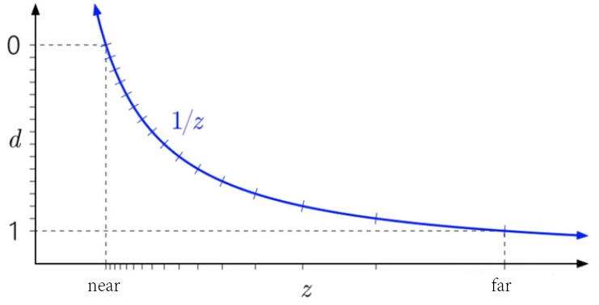

​	z：模型点经过模型、视图变换后，在相机空间中的z值；

​	d：z经过透视变换、透视除法后在ndc空间的深度值。

##### 2.1) z -> d为何非线性

- 实用性：计算机存储精度有限，离摄像机越远的物体，信息越少，对画面的贡献也越少，没必要为其提供高精度。所以深度值在靠近近平面精度越高，越远精度越低，是合理的设定。

- 数学上：投影面上等距的多个点，在三维空间中不是等距的；

  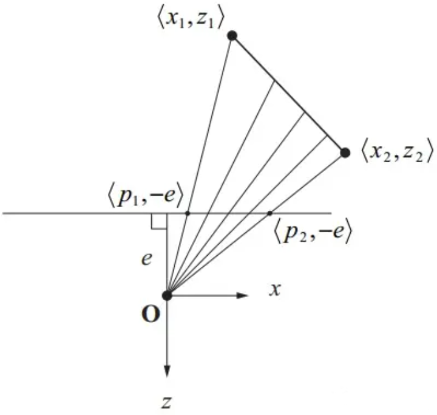

  上图中三维空间点$(x_{1},z_{1})$和$(x_{2},z_{2})$投影到z为-e的平面上得到两点$(p_{1},-e)$和$(p_{2},-e)$。在投影点间取几个等距点还原，可以看到还原的三维点并不等距。

##### 2.2) 线性化深度

$z_{linear}=\frac{z-n}{f-n}$

$z=\frac{2nf}{f+n-(2d-1)*(f-n)}$

​	d：深度图中取出的数据；n、f：近平面和远平面的距离；

#### 3) 深度值和顶点属性插值

​	在使用光栅化的图形学方法中，法线，颜色，纹理坐标这些属性通常是绑定在图元的顶点上。

​	3D空间中，这些属性值在图元上是线性变化的。但当3D顶点被透视投影到2D屏幕之后，如果在2D投影面上对属性值进行线性插值，会有问题，如下图所示：

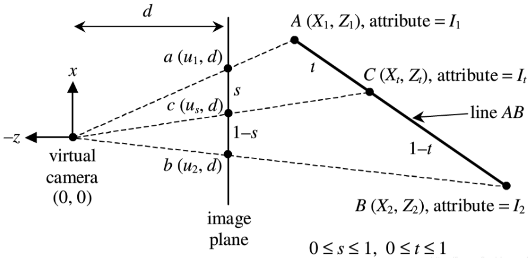

​	图中将A和B是带属性的两个顶点；

​	将A和B通过camera投影到距离为d的平面上，得到投影点a和b。注意本图中camera的视线方向为+z，通常可自定义视线为+z或-z。

​	$c(u_{s}, d)$是a和b在二维平面上的线性插值点：$c = a + s \ast (b-a)$。

​	通过下式，可以由投影平面上的插值点，得到三维空间中透视正确的插值：

$\frac{1}{Z_{s}} = \frac{1}{Z_{1}}(1-s) + \frac{1}{Z_{2}}s$

​	综上，**深度值的倒数是线性相关的**，具体推导参考：[https://blog.csdn.net/n5/article/details/100148540](https://blog.csdn.net/n5/article/details/100148540)。

​	有了透视正确的顶点位置后，由于顶点属性和位置在3维空间中是线性相关的，因此也可利用上式求出顶点属性的正确插值。

#### 4) 深度冲突

​	DepthBuffer是非线性的，因此在远离摄像机的地方，由于精度不足，可能造成深度冲突。

​	有如下种解决方案：

- 增大深度缓冲数据位数(一般不采用，为解决深度冲突而增大显存不明智)；
- 修改摄像机的近远平面，让其范围更小，范围变小后数据能够表示的精度自然就上升；
- 略微在场景中移动物体坐标，错开那些靠的很近的物体(实用，基本能解决问题)；
- Offset语法【**待理解**】

### 2 ShadowMap的缺陷

#### 1) 阴影失真(Shadow Acne)

##### 1.1) 阴影失真原因

​	原因：阴影贴图的分辨率过小，导致多个点顶点采样到同一个阴影贴图纹理。


​	如图所示，a、b、c、d四个点都采样同一个阴影纹理，其深度为10。

​	a、d距离光源的距离为9.8，b、c与光源的距离是10.2。

​	理论上a、b、c、d四个点都应该被点亮，但是由于上述的采样关系，a、d被点亮，b、c被认为在阴影中，从而产生了阴影失真。

##### 1.2) Shadow Bias

​	在判定阴影的时候，添加一个偏移，在消除阴影失真。

```c++
float bias = max(0.05 * (1.0 - dot(normal, lightDir)), 0.005);  
float shadow = currentDepth - bias > closestDepth  ? 1.0 : 0.0; 
```

##### 1.3) Shadow Bias产生Peter Panning

​	在深度贴图渲染阶段，使用正面剔除来消除Peter Panning：


​	伪代码如下：

```c++
glCullFace(GL_FRONT);
RenderSceneToDepthMap();
glCullFace(GL_BACK); // don't forget to reset original culling face
```

#### 2) 阴影边缘过硬：PCF柔化

​	PCF(Percentage-Closer Filtering)通过采样周围的纹素，柔滑过硬的边缘。

​	伪代码如下：

```c++
float shadow = 0.0;
vec2 texelSize = 1.0 / textureSize(shadowMap, 0);
for(int x = -1; x <= 1; ++x)
{
    for(int y = -1; y <= 1; ++y)
    {
        float pcfDepth = texture(shadowMap, projCoords.xy + vec2(x, y) * texelSize).r; 
        shadow += currentDepth - bias > pcfDepth ? 1.0 : 0.0;        
    }    
}
shadow /= 9.0;
```

​	PCF在实现上很简单，是目前最泛用的软阴影和阴影抗锯齿的解决方案，但仍然存在许多问题：

1. 计算过程中需要采样多次，带宽的开销不小，尤其是在移动平台
2. 如果采样次数少，模糊程度就不够，采样次数多，性能消耗又大，需要折中取平衡
3. 因为每一次阴影计算只能得到01两种值，所以预先对Shadowmap进行过滤是没有意义的
4. 计算阴影的时间复杂度是k*n，其中k是采样次数，n是片段数量

### 3 级联阴影映射(Cascaded Shadow Map)

​	本小节主要参考[https://zhuanlan.zhihu.com/p/388459633?utm_id=0](https://zhuanlan.zhihu.com/p/388459633?utm_id=0)，Nvidia的论文看[这里](https://developer.download.nvidia.cn/SDK/10.5/opengl/src/cascaded_shadow_maps/doc/cascaded_shadow_maps.pdf)。

- ShadowMap的缺点

​	大场景中，阴影**边缘**的**锯齿严重**。

​	深度是非线性的(与$\frac{1}{z}$呈线性相关)，由于阴影贴图的分辨率有限，远处物体对阴影贴图采样时，**多个不同的顶点对同一个像素采样**，导致生成锯齿。

- CSM解决锯齿问题

​	为了解决锯齿问题，我们使用多张阴影贴图。

​	离相机近的地方使用精细的阴影贴图，离相机远的地方使用粗糙的阴影贴图，这样不仅优化了阴影效果，还保证了渲染效率。

#### 1) CSM流程

- 摄像机视锥体分割；
- 子视锥体包围盒计算；
- 光源投影矩阵计算；
- ShadowMap贴图渲染。

#### 2) 视锥体分割


### 4 点光源阴影贴图

#### 1) CubeMap(万向阴影贴图)

##### 1.1) 写入深度图

- 顶点着色器：将mesh转换到世界空间中，作为几何着色器的输入；

- 几何着色器：将单个图元的顶点，通过`6个`light space矩阵，转换到以光源为原点透视空间中，作为光栅化输入。

  同时，将世界坐标中的顶点作为属性，传入到片元着色器。

- 片元着色器：光栅化上述不同光照空间的图元后，片元着色器中根据几何着色器传入的world position和常量光源位置，计算距离，写入不同面的深度缓冲。

##### 1.2) CubeMap采样

```glsl
vec3 sampleVec = fragPos - lightPos; 
float closestDepth = texture(depthMap, sampleVec).r;
```

​	上述用于采样的向量是以光源为坐标原点的方向向量；

​	深度缓冲是以光源为中心写入的，因此可以采样到包围光源所有方向的深度值。

##### 1.3) 多个点光源

###### 1.3.1) 阴影贴图

​	使用**CubeMapArray**作为阴影贴图。

​	结合几何着色器，一个mesh使用一个drawcall，就可更新所有点光源的阴影贴图。

###### 1.3.2) 着色

​	在延迟渲染中，使用for循环遍历所有点光源，叠加点光源的光照效果。

​	通过每个点光源的索引，在CubeMapArray找到对应的阴影贴图，绘制阴影。

###### 1.3.3) 优化

- 不是每帧都需要更新阴影贴图，如场景是禁止的时候。
- 引擎中，每个光源都有CastShadow属性。若一个光源不CastShadow，那么它就不需要更新阴影贴图，也不需要在着色时参与阴影计算。

#### 2) 双抛物面环境映射

​	参考这里[详解双抛物面环境映射](https://zhuanlan.zhihu.com/p/40784734)。

### 5 阴影贴图图集(Shadow Map Atlas)

​	参考这里[DOOM (2016) - Graphics Study](https://www.adriancourreges.com/blog/2016/09/09/doom-2016-graphics-study/)。

## LightMap

### 静态LightMap

​	本小节参考自：[Light烘培原理](https://blog.csdn.net/zjull/article/details/50924429)。

​	LightMap**预计算**物体的Diffuse光照信息，并保存到纹理上，实时绘制时不再进行光照计算。

​	LightMap只能存储Diffuse信息，因为观察位置是实时改变的。

- 优势

(1) 省去光照计算，提高绘制速度。

(2) 对于过度复杂的光照(如光线追踪等)，实时计算不现实。若预计算好保存到纹理上，可提升模型的光影效果。

(3) lightmap可以二次处理，如模糊使阴影更加柔和。

- 缺点

(1) 模型额外多了一层纹理，增加了资源的管理成本。

(2) 若光源方向改变，静态lightmap是无法变换的。静态阴影，没法直接影响到动态模型。

- 静态lightmap简单原理

​	在顶点着色器中，将原本转换到裁剪空间的顶点，输出到纹理坐标系中，片元着色器仍然执行常规的光照计算：

```c++
//Output.Position = PrjMat * ViewMat * ModelMat * Input.Position;  
// transform to projection space  
Output.Position.xy = Input.Texcoord * float2(2, -2) + float2(-1, 1);  
Output.Position.w  = 1;
```

## 骨骼动画

### 1 基本原理

​	本小节参考自：[浅谈骨骼动画技术原理系列](https://zhuanlan.zhihu.com/p/431446337)。

#### 1) 主要概念

​	骨骼动画：在 mesh 中放置若干骨骼，**骨骼的运动带动 mesh 的运动**。动画师只需要操作骨骼，就可以带动 mesh 完成动画的编辑。

​	皮肤(skin)：与骨骼对应的mesh。

​	关节(joint)：一段段骨骼之间相互连接，连接处称为关节。

​	关节模型：关节之间通过线段相连，形成一个树状结构，即关节模型。


#### 2) 工业界制作流程

一，骨骼与标准姿势(T-pose)的**绑定与蒙皮**(binding, skinning)；

二，动画师操作骨骼，制作**关键帧**(keyframe)；

三，关键帧之间的**插值**形成整个动画。

​	绑定与蒙皮：对于标准姿势，创建一套骨骼用来对应 mesh 上的顶点。

​	关键帧：这是制作动画的常用方法，通过指定关键的动作来表示动画。

​	插值：对于非关键帧的动画，通过插值来生成。

​	**在关键帧编辑骨骼姿态，在非关键帧插值骨骼姿态，在所有帧上进行蒙皮**。

#### 3) 骨骼动画涉及的主要坐标系

**世界坐标系**：关节模型的**树根**的坐标代表了对应的物体在世界坐标系下的坐标。

**关节坐标系**：以某个**关节为原点**的坐标系，代表了树上某一节点的局部空间。

**骨架(物体)坐标系**：**树根坐标为原点**的坐标系，实际是树根节点的**关节坐标系**。

#### 4) 骨骼动画涉及的坐标变换

- 绑定姿态：美术在建模软件中定义的骨骼**默认姿态**，绑定空间可理解为**模型本地空间**。

- Offset Matrix：将顶点从绑定空间转换到某个**关节的局部坐标空间**，即转换到关节坐标系。

- Local Transform(局部变换)：父关节坐标系下的局部变换，用于**编辑某个子关节**。

- Global Transform(全局变换)：在最简单的情况下，已知一个关节的局部变换，**连乘**它的所有父关节的局部变换矩阵，就能得到该关节的**全局变换矩阵|组合变换矩阵**(Global Transform)。

- Mesh Transform(蒙皮变换矩阵)：Mesh Transform = Global Transform x OffsetMatrix。顶点应用了蒙皮矩阵后，就确定了其在绑定空间下的最终位置。

### 2 关节模型

#### 1) 关节控制原理

​	通过控制**每个关节**的坐标，控制整个**骨架的姿态**，进而控制的角色模型。

​	关节树上的每个关节节点存储的不是它的绝对坐标，而是**相对父节点的坐标**，更精确的，是关节坐标系下**相对父节点的坐标变换矩阵**。

​	**相对变换**可以带来如下便利性：

- 一个关节的移动，可以带动整个子树。比如运动胳膊肘的时候，整个小臂也跟着动了。

- 简化动画的表示：通过依赖关系，如果需要确定整个角色的坐标，只需要确定根节点的坐标。

- 更易于进行动画数据压缩、动作融合等。

#### 2) 关节中的数据


​	每个关节所在骨骼的长度：对应了当前关节坐标系到父关节坐标系的**平移变换**。

​	每个关节所在骨骼相对父关节的旋转角度：对应了当前关节坐标系到父关节坐标系的**旋转变换**。

​	关节模型的根节点的坐标：这对应了骨架坐标系到世界坐标系的**平移变换**。

### 3 正向动力学(Forward Kinematics)

​	正向运动学解决的问题：**给定关节模型和每个节点相对父节点的变换矩阵，计算关节坐标到世界坐标的变换矩阵**。

​	参考<a href="#2) 关节中的数据">关节中的数据</a>小节中的图片。

​	$p_{0}$是关节数的根节点。每个节点对应的旋转矩阵为 $R_{i}$ 、平移矩阵 $T_{i}$ 以及关节空间原点$O$。

​	需要注意的是，这里的$R_{i}$、$T_{i}$ 实际是正向矩阵的逆矩阵，正向矩阵指：把关节从 $p_{0}$ 移动到 $p_{1}$ 所使用的矩阵，矩阵变换的内容可参考：[相机矩阵推导](https://blog.csdn.net/lyzirving/article/details/125817816)。

​	$p_{1}$在本关节空间坐标是 $O$ ，将其转换到父关节坐标中有：$R_{1}T_{1}O$ ；

​	$p_{2}$在本关节空间坐标是 $O$ ，将其转换到根关节坐标中有：$R_{1}T_{1}R_{2}T_{2}O$ ；

​	$p_{3}$在本关节空间坐标是 $O$ ，将其转换到根关节坐标中有：$R_{1}T_{1}R_{2}T_{2}R_{3}T_{3}O$ ；

​	综上，$p_{i}$转换到骨骼空间(根关节空间)为：$R_{1}T_{1}R_{2}T_{2}...R_{i-1}T_{i-1}R_{i}T_{i}O$ 。

​	骨骼空间实际为模型本地坐标，还需将其转换到世界空间中，因此，**关节空间至世界空间的变换**如下：

$M_{i-to-world} = R_{root}T_{root}R_{1}T_{1}R_{2}T_{2}...R_{i-1}T_{i-1}R_{i}T_{i} \times p$ 

​	综上，完成了正向动力学的推导。在遍历节点树时，可以求得每个关节空间的$M_{i-to-world}$矩阵。

​	注意，在动画插值的时候，平移、缩放矩阵能够插值，但是旋转矩阵不行，因此，骨骼动画中存储的都是**四元数**。

### 4 逆向动力学(Inverse Kinematics)

### 5 CPU蒙皮 vs GPU蒙皮

#### 1) CPU蒙皮

- 概念

​	CPU蒙皮(CPU Skinning)是一种在CPU上进行骨骼动画的技术。

​	其在CPU上计算变换矩阵，并对顶点应用变换。最后将变换后的顶点数据传递给GPU进行渲染。

- CPU蒙皮的优势

① 广泛的设备兼容性。

② 精确逻辑处理，比如可以根据距离对Skinning进行LOD，如近距离角色每秒30帧Skinning，远距离角色每秒15帧Skinning。也比如，鼠标可以精确判断是否选中了角色。

③ 多Pass渲染时只需要一次Skinning。

- CPU蒙皮的劣势

① 单个动画有大量计算。

② 多个物体进行动画，每个物体的顶点都需要在CPU计算，消耗很大。

- CPU蒙皮的改进

① 多线程Skinning。

#### 2) GPU蒙皮

​	GPU蒙皮(GPU Skinning)是在CPU上计算蒙皮矩阵，然后将矩阵上传，在GPU侧进行蒙皮。

- GPU蒙皮存在的问题

① 一些GPU常量寄存器不足，实现GPU Skinning需要额外的处理。

② 有些场合不适合GPU Skinning，比如需要精确判断鼠标是否选中角色、子弹是否精确命中角色。

③ 多Pass的时候需要重复做，也会带来一定的性能开销。

④ 动画之间无法blend。

- GPU蒙皮的改进

① 使用纹理存储矩阵列表。但因为存储了浮点数，需使用rbgahalf的格式，所以每个像素占64字节。因此每个动画所占用的贴图空间也比较大。

② 使用transform feedback，解决多pass重复计算的问题。

# 渲染性能

## 常规性能问题思路


### 1 Draw Call

​	① 把数据加载到显存中：把网格和纹理等数据从硬盘加载到显存中；
​	② 设置渲染状态；
​	③ 调用Draw Call：准备好上述工作后，CPU就调用一个渲染命令(Draw Call)来告诉GPU执行渲染。

### 2 批处理

#### 1) 静态批处理


​	静态批处理是将共享共同材质的模型的顶点、索引存放至统一的vertex buffer和index buffer。

​	这些数据**统一上传**，但还是按模型的数量**多次调用Draw call**，分别绘制每个子模型。

​	静态批处理节约了**binding切换**、**绘制状态设置**的消耗，但可能会增大vertex buffer(若使用重复模型，会把相同的顶点拷贝到v-buffer中)。

#### 2) 动态批处理

​	对于**正在视野中**的符合条件的动态对象在一个Draw call内绘制，所以**会降低Draw Calls**的数量。

​	其原理是：将所有**共享同一材质**的模型的顶点信息变换到世界空间中，然后通过一次Draw call绘制多个模型，达到合批的目的。模型顶点变换的操作是由CPU完成的，所以这会带来一些CPU的性能消耗。


### 3 Instancing

​	在使用**相同材质、相同Mesh**的情况下，使用**Uniform Buffer**将所有实例渲染所需的属性，如位置、缩放、uv偏移、等信息保存在显存中，然后使用**一次DrawCall**将**一个模型**送入管线，使用GPU Instancing来执行批量绘制。

​	在管线中对每个实例，抽取其对应的属性信息，进行渲染。

​	GPU Instancing可以**规避合并Mesh导致的内存与性能上升**的问题，但场景中所有符合该合批条件的实例的属性信息每帧都必须更新到Uniform Buffer中。

### 4 剔除技术

​	光栅化管线中，存在几个剔除阶段。

- 几何阶段视锥体剔除

​	在几何阶段后期，图元装配后，光栅化执行前，会执行**视锥体剔除、背面剔除**，这是由管线(硬件)实现的。

​	虽然被剔除的面不会执行后续的管线流程，但是它们仍然会参加几何阶段的前部分流程：顶点着色器、曲面细分、几何着色器等，因此，仍然会浪费部分GPU资源。

- early-z

​	early-z在光栅化后，片元着色器执行前。同几何阶段视锥体剔除一样，被裁剪的面仍然会浪费前部分的GPU资源；

- 像素处理阶段

​	像素处理阶段包含模板测试、深度测试等像素剔除操作，是在整个管线的尾端。故仍然会浪费前部分的GPU资源。

#### 1) CPU视锥体剔除

## 使用自定义内存块

### 1 原因

​	通过malloc()/free()或C++的全局new/delete运算符动态分配内存——又称作堆分配——通常是很慢的，有如下原因：

- 用户态/内核态切换

​	在操作系统上，malloc()/free()必然会从用户态切换到内核态，处理请求，再切换至原来的程序。这些上下文切换(context-switch)可能会耗费非常多的时间。

- 内存碎片(memory fragmentation)

​	当分配一块内存时，一块合适的连续内存会被标记为“使用中”。当内存释放时，其会与相邻的自由内存合并。

​	随着时间推移，鉴于随机次序分配及释放不同尺寸的内存块，自由内存区域之间便会出现许多洞，如下所示：


​	**内存碎片的问题**在于：即便有足够的自由内存，分配请求仍然可能会失败，因为分配的内存必须是**连续的**。

​	支持**虚拟内存**的操作系统上，内存碎片并非大问题。虚拟内存把不连续的物理内存——每块成为**内存页**(page)——映射至虚拟地址空间，使内存对于应用程序来说，看上去是连续的。当物理内存不足时，许久没有使用的内存页就会被**写入磁盘**，让后该块内存的映射被标记为自由内存。

- 缓存一致性

​	CPU存取**主系统**的内存是**缓慢**的操作，通常需要几千个处理周期才能完成。CPU存取**CPU寄存器**，只需数十个周期，有时甚至只需一个周期。为了降低读写主内存的平均时间，现代CPU会采用**高速的内存缓存**(cache)。

​	缓存是特殊的内存，CPU读/写缓存的速度比主内存快得多。内存缓存的基本概念如下：

​	当首次读取某区域的主内存时，该**内存小块**会载入高速缓存中，这个内存块的单位称为**缓存线**(cache line)。

​	若后续再读取内存，且该内存在缓存中，那么数据直接从缓存载入寄存器，从而提高了速度。若不再缓存中，则必须从主存中取数据，这就是**缓存命中失败**(cache miss)。

​	随着技术发展，缓存直接置于CPU芯片上。这样产生了两种缓存：在芯片上的一级缓存(L1)、在主板上的二级缓存(L2)，如下所示：


​	由于L2的出现，现在存取内存需要经过两级缓存——数据从主内存到L2，再从L2到L1，最后才到CPU。主内存比L2缓慢，L2比L1缓慢。

- 避免cache miss

① 数据编排进连续的内存中，尺寸越小越好，且要顺序访问。

② 对于**指令缓存**，主要是**编译器**和**链接器**决定了内存布局，如下：

单个函数的机器码几乎总是置于连续内存中；

编译器和链接器按函数在编译单元(.cpp)中**出现的顺序**排列内存布局；

​	综上规则有：高效能代码体积越小越好，且避免在代码段落中调用函数。

### 2 自定义分配器

- 堆栈分配器

​	使用指针指向堆栈的顶端，指针以下的内存时已分配，以上的内存是未分配。

​	堆栈分配器不能以任意次序释放内存，必须已分配时的**相反顺序**释放。

​	可以用**回滚指针**将内存回滚到标记的位置。


- 双端堆栈分配器

​	一块内存给两个堆栈分配器使用，一个从内存块的底端向上分配，另一个从内存块的顶端向下分配。


- 池分配器

​	分配一大块内存，大小刚好是元素尺寸的倍数。池分配器对应一个自由链表，刚分配内存时，池内所有元素都在自由链表上。

​	分配一个内存，就从自由链表中取出一个元素。释放一块内存，就把元素归还给链表。

## 帧同步和状态同步

## vs、fs开销大，如何优化

## PBR 材质贴图多，纹理槽位不够应该怎么处理

- 合并多个属性到一个通道，比如roughness和metallic可以存在 8 bit 纹理的高低4 bit上。
- 虚拟纹理，将小贴图合并成大贴图，按需调入。

# ECS

## 1 ECS架构

​	ECS，Entity Component System：

- Entity：指向数据的handle。
- Component：数据，按**类型**分块放到内存中。
- System：处理数据的业务逻辑。读取数据，处理数据，再把数据写回去。

## 2 Unity的ECS实现

### 1) 基础结构

- **Archetype**：World中含有相同类型Component的所有Entity集合。
- **Chunk**：归一化的内存块，存储某一种Archetype的所有实现。


- **Structural Change Operation**：

  若Entity实例e包含Component A和B，其被存储在Chunk **Archetype_A_B**中。

  若为e添加了Component C，那么该Entity的**存储位置**会被转移：从Chunk **Archetype_A_B**转移到Chunk **Archetype_A_B_C**。

  这就是**Structural Change Operation**。

  常见的Structural Change Operation包含：create entity、destroy entity、addComponent、removeComponent。

### 2) Chunk

- Chunk内存分布

  下图是Archetype_A_B_C对应的Chunk分布：

  该Chunk包含**四个数组**：Entity ID、Component A、B和C，数组长度被限制到了128。当前，该Chunk存储了3个Entity

  

- add和remove Entity

  若**移除**了Chunk中某个slot，数组尾部的Entity会被**移动**，来填充当前的slot。

  若向Chunk**插入**新的Entity，EntityMgr会寻找Chunk中**首个空闲的slot**，作为插入的位置。

- Entity查找

​	为了快速索引Entity，EntityMgr需要存储Entity的元数据数组。

​	metadata通常包含① Chunk指针；② Entity在Chunk内部的索引。


- Entity的版本信息(**version number**)

  当一个slot对应的entity被destoy，若该slot又被重用，其version number就应该加一，用于区分之前该slot上的entity。

## 3 ECS的优势


- ECS是面向数据编程，是对机器友好的；面向对象是对人类友好的。

- ECS思考如何存储、处理、流转数据。

- 缓存友好，读写快

  下图展示CPU会从多级缓存和内存中读取数据**缓存行**，以及面向对象的内存分布：

  

  OOP的GameObjects在内存中是零散的，想要取出所有黄色的数据，是很困难的。

  在DOP中，所有黄色数据，都在一个内存数组中。

  有如下例子：在oop中，Transform定义如左图；在ecs架构下，Transform被拆分成右图：

  

- 数据方便并行处理。

- 数据可以按SOA的方式存储，利于SIMD优化。

# 硬件相关

## 1 显卡容量/频率/位宽/带宽

​	本小节参考自 [一文看懂显卡的显存容量/频率/位宽/带宽](https://www.51cto.com/article/756978.html)。

- 显存

​	显存就是显示存储，指的是显卡的内存，也被称为帧缓存。显存存储的是显示芯片**将要处理的数据**和**已经渲染的画面**。

​	一般1080P游戏需要6GB的显存，2K分辨率的游戏需要8GB的显存，4K分辨率的游戏则需要12GB以上的显存。

​	虽然显存不足会导致画面延迟和帧数受限，但**过高的显存却不会带来增益**。

- 显示频率

​	显存频率指的是显存工作的频率，单位是MHz。

​	显存频率决定了数据在**显存上存取的速度**，显存频率越高，就可以更快地存取数据。

​	这里要注意，**显存频率**和**核心频率**是两个概念，显存频率指的是显存的工作频率，而核显频率是GPU核心的频率，两者虽然单位一样，但是不能混淆。

- 显存位宽

​	显存位宽是指显存在**一个时钟周期内**能够传输数据的**位数**，单位是bit。显存位宽越大，瞬间传输的数据量就越大。

- 显存带宽

​	显存带宽指的是显示芯片与显存之间的数据传输速率，单位是GB/s。显存带宽是由显存频率，显存位宽决定的，具体见第二小节。

## 2 带宽Band Width

​	本小节参考自[使用CUDA计算GPU的理论显存带宽](https://blog.csdn.net/A_water_/article/details/132757850)。

​	**显存带宽**是指**显存和GPU计算单元之间的数据传输速率**。显存带宽越大，意味着数据传输越快，那么GPU整体的计算速度也会越快。

​	所以该指标可以作为我们评估核函数运行速度的评价指标。


​	显存带宽的计算公式如下：

```c++
理论显存带宽 = 显存频率（Hz） * 显存位宽（bit） / 8 * 2    
// 这里除以8是因为位宽的单位是bit，我们要转成 byte
// * 2 是因为 DDR（double data rate）
```

​	有如下示例：

```c++
GPU型号: NVIDIA GeForce RTX 3050 4GB Laptop GPU
显存频率：7001000 kHz
显存位宽：64 bit

理论显存带宽 = (7001000 * 1000)Hz * (64 / 8)byte * 2 = 112016000000 byte/s ≈ 112 GB/s
```

## 3 GPU和CPU数据交互

​	本小节参考自[GPU 与 CPU 的数据交互](https://blog.csdn.net/M120674/article/details/129099511)和 [计算机中，PCI是什么](https://blog.csdn.net/y601500359/article/details/140945731)。

