## 数学基础

### 1 叉乘

#### 1) 叉乘的定义

​	向量叉乘的结果由两个属性定义：

- 模长：$|\vec{a} \times \vec{b}| = |\vec{a}| \cdot |\vec{b}| \cdot sin\theta$，其中$\theta$是两个向量的夹角，$0 \leq \theta \leq 180$。
- 方向：$\vec{c}= \vec{a} \times \vec{b}$的方向与$\vec{a}$和$\vec{b}$所在平面垂直，且遵守`右手法则`：当右手的手指从$\vec{a}$以不超过180°的角度旋转到$\vec{b}$时，竖起的大拇指方向则是$\vec{c}$的方向。

#### 2) 补充性质

​	二维平面上，有向量$\vec{P}=(x_{1},y_{1})$和向量$\vec{Q}=(x_{2},y_{2})$，则有$\vec{P}\times\vec{Q}=(x_{1}y_{2} - x_{2}y_{1})$。

​	若$\vec{P}\times\vec{Q} > 0$，$\vec{P}$在$\vec{Q}$的顺时针方向(右侧)；

​	若$\vec{P}\times\vec{Q} < 0$，$\vec{P}$在$\vec{Q}$的逆时针方向(左侧)；

​	若$\vec{P}\times\vec{Q} = 0$，$\vec{P}$和$\vec{Q}$在同一条直线上，可能同向，也可能异向。

## 矩阵

### 1 齐次坐标

​	向量：$\vec{v} = \begin{pmatrix}a\\b\\c\\0\end{pmatrix}$		点：$p = \begin{pmatrix}a\\b\\c\\1\end{pmatrix}$

​	用4个代数分量表示3D几何概念的方式是一种齐次坐标表示。

​	齐次坐标表示是计算机图形学的重要手段之一，它既能够用来明确**区分向量和点**，同时也**更易于进行仿射(线性)几何变换**。

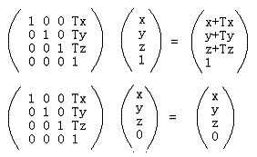

​	从上述矩阵变换可知，平移变换只对于点才有意义，因为普通向量没有位置概念，只有大小和方向。

​	旋转和缩放对于向量和点都有意义，可用类似上面齐次表示来检测。因此，齐次坐标使仿射变换更方便。

### 2 渲染管线

​	图形渲染管线：原始图形数据途经输送管道，经过各种变化处理最终出现在屏幕的过程。

​	在概念上可以分为四个阶段：**应用程序阶段**、**几何阶段**、**光栅化阶段**和**像素处理阶段**。

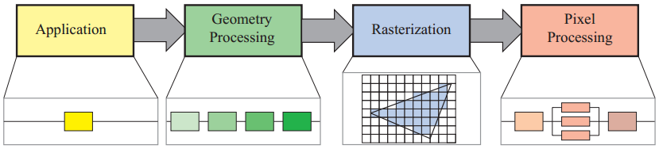

​	应用阶段通常是在CPU端进行处理，包括碰撞检测、动画物理模拟以及视椎体剔除等任务，这个阶段会将数据送到渲染管线中；

​	顶点着色器、投影变换、曲线细分、几何着色器、图元装配、裁剪、屏幕映射；

​	光栅化将图元离散化片段的过程；

​	像素处理阶段包括像素着色和混合的功能。如下图所示：

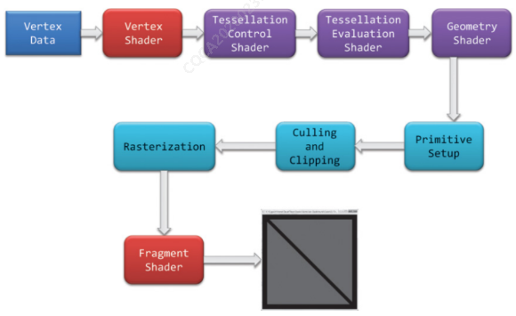

#### 1) 管线概述

- **图元组装**

​	图元组装将输入的顶点组装成指定的图元。

​	图元组装阶段会进行**裁剪**和**背面剔除**相关的优化，以减少进入光栅化的图元的数量，加速渲染过程。

​	在光栅化之前，还会进行屏幕映射的操作：**透视除法**和**视口变换**。

- **光栅化**

​	经过图元组装以及屏幕映射后，物体坐标被变换到了**窗口坐标**。

​	光栅化是个**离散化**的过程，将3D连续的物体转化为离散屏幕像素点的过程。

​	光栅化会确定图元所覆盖的片段，利用顶点属性**插值**得到片段的属性信息，然后送到片段着色器进行颜色计算。

​	注意，**片段是像素的候选者**，只有通过后续的测试，片段才会成为最终显示的像素点。

- **片段着色器**

​	片段着色器用来决定屏幕上像素的最终颜色，可能会进行大量效果计算(光照和阴影)。

- **测试混合**

​	管线的**最后一个阶段**是测试混合阶段。测试包括裁切测试、Alpha测试、模板测试和深度测试(**late-z**)。

​	没有经过测试的片段会被丢弃，不需要进行混合阶段；经过测试的片段会**进入混合阶段**。

​	注意，绘制半透明物体最好遵循**画家算法(painter algorithm)**，将物体排序，**由远及近**进行绘制。因为半透明物体的绘制顺序会影响混合的结果。	

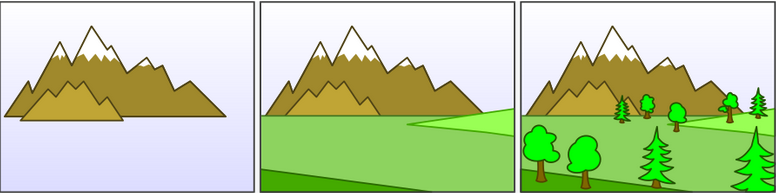

#### 2) 对late-Z的优化

​	像素处理阶段，片元被着色后(fragmet shader)，通过深度测试，才转换为像素，显示在屏幕上。

​	因此，被着色后的片元有可能被舍弃，这就引起了**过渡绘制(OverDraw)**。

​	下述几个方案都是为了优化过渡绘制，提升效率。

##### 2.1) early-z

​	early-z是GPU硬件层的优化，在**光栅化后**和**片元着色前**添加early-z阶段。

​	early-z执行的操作和late-z完全一样，但early-z的优化效果**不稳定**。

###### 2.1.1) early-z被关闭

​	① 手动**写入深度值**；② **开启alpha test**；③ **执行丢弃像素操作**。

​	若执行上述操作，GPU就会关闭early-z，直到下一次clear z-buffer。

​	这些操作在**片元着色和late-z之间执行**，会修改z-buffer中的值，导致early-z的结果不正确。

###### 2.1.2) early-z不稳定

​	若按由近及远的顺序绘制，early-z可以完美避免过度绘制；

​	若由远及近绘制，early-z不起任何作用。

##### 2.2) z-culling

​	z-culling是GPU硬件层的优化。

###### 2.2.1) z-culling和early-z的区别

​	early-z以pixel-quad为单位，**逐像素**比较；

​	z-culling以tile为单位，按tile**整体**进行比较。其中，tile即tile based rendering(TBR)中的概念。

###### 2.2.2) z-culling比较方式

​	获取当前tile的深度最值：$Z^{tile}_{min}$、$Z^{tile}_{max}$；

​	获取tile所属的深度缓冲区的最值：$Z_{min}$、$Z_{max}$；

​	若$Z^{tile}_{max} < Z_{min}$，则tile全部可见，保留整个tile，并在late-z阶段省去读缓冲的操作，直接进行写buffer；

​	若$Z^{tile}_{min} > Z_{max}$，则tile全部不可见，丢弃整个tile；

​	对于其他情况，则交给后续的late-z判断。

​	z-culling所需要的比对数据储存在on-chip缓存中的某个固定区域，特点即是容量小但速度快。

​	由于在z-culling阶段，对深度缓存是只读的，所以**不会**因为① 手动写入深度值；② 开启alpha test；③ 执行丢弃像素操作，导致z-buffer修改，导致测试失效。因此z-culling弥补了early-z的第一个缺点。

##### 2.3) z-prepass

​	z-perpass是软件层的技术，主要配合early-z使用，优化early-z的第二个缺点：不稳定。

​	z-prepass思路类似延迟渲染：使用**两个pass**，第一个pass渲染时**只写入深度**；第二个pass关闭深度写入，设置深度比较函数为“**相等**”。

​	z-prepass**必须配合early-z使用**。若和late-z配合使用，那么无用的片元仍然会经历片元着色，造成大量计算的浪费。

### 3 坐标变换流程


​	$局部坐标\stackrel{(1)模型矩阵}{\longrightarrow}世界坐标 \stackrel{(2)相机矩阵}{\longrightarrow} 视图坐标 \stackrel{(3)投影矩阵}{\longrightarrow} 裁剪坐标 \stackrel{(4)透视除法}{\longrightarrow} 标准设备空间(NDC) \stackrel{(5)视口变换}{\longrightarrow} 窗口坐标$

​	其中，第三步透视变换包含两个步骤：$ 投影矩阵=\left\{ \begin{matrix} 相似变换 \\ X、Y、Z三轴线性插值至[-1,1]\end{matrix} \right.$

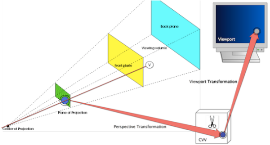

### 4 相机变换

### 5 透视变换

​	世界空间的点经过相机矩阵后，被转换到相机空间。此时，多边形可能会被视椎体裁剪，但在不规则体中裁剪很难，所以裁剪被安排到规则观察体(`Canonical View Volume, CVV`)中(`齐次裁剪空间`)。

​	CVV是一个正方体，其x, y, z的范围都是[-1, 1]，多边形裁剪就是利用这个规则体完成的。综上，透视变换的作用如下：

- 透视变换矩阵把相机空间中的顶点从视锥体中变换到裁剪空间的CVV中(`相似变换`)；
- CVV裁剪完成后进行透视除法。

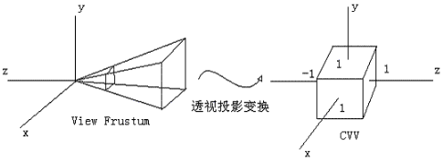

#### 1) 投影点坐标

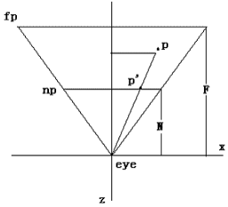

​	上图是右手坐标系中顶点在相机空间中的情形。设p(x,z)是经过相机变换之后的点，视锥体由eye——眼睛位置，np——近裁剪平面，fp——远裁剪平面组成。N是眼睛到近裁剪平面的距离，F是眼睛到远裁剪平面的距离。这里选择**近裁剪面**作为投影面。

​	设p’(x’,z’)是投影之后的点，则有z’ = -N。通过相似三角形性质，有：

$\frac{x'}{x} = \frac{z'}{z}$，其中有$z' = -N$，所以有$\frac{x'}{x} = \frac{-N}{z}$，有$x' = -N\frac{x}{z}$

​	同理有$y' = -N\frac{y}{z}$，因此投影点坐标为 $p'=(-N\frac{x}{z}, -N\frac{y}{z}, -N)$。

​	从上面可以看出，投影的结果z’始终等于-N。实际上，z’对于投影后的p’已经没有意义了，这个信息点已经没用了。

​	但对于3D图形管线来说，为了便于进行后面的片元操作，例如z缓冲消隐算法，有必要把投影前`相机空间中的z`保存下来，方便后面使用。因此，我们利用这个没用的信息点存储z：

$p'=(-N\frac{x}{z}, -N\frac{y}{z}, z)\qquad\qquad\qquad\qquad\qquad\qquad\qquad\qquad\qquad\qquad\qquad(1)$

​	公式(1)其中x, y, z是相机空间点的坐标，N是近平面的距离。

#### 2) 用齐次坐标表达投影点

​	公式(1)有点生搬硬套的意思，现开始结合CVV进行思考，把它写得在数学上更优雅，更易于程序处理。如前所述，第3个分量可以是任意值，因此有公式(2)：

$p'=(-N\frac{x}{z}, -N\frac{y}{z}, -\frac{az+b}{z})\qquad\qquad\qquad\qquad\qquad\qquad\qquad\qquad\qquad\qquad(2)$

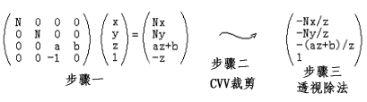其中，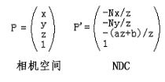

​	步骤一：投影矩阵乘法：首先进行`相似变换`，将点投影到裁剪平面；其次，使用`线性插值`进行`坐标归一化`，使[left, right]、[bottom, far]、[-N, -F]之间的点变为[-1, 1]，方便裁剪；

​	步骤二：CVV中执行裁剪；裁剪时，使用的是齐次坐标，因为透视除法后会丢失一些必要信息，如-z。

​	步骤三：透视除法，将齐次坐标变换为普通坐标。

​	将第三个分量写为$-\frac{az+b}{z}$的原因有如下三个：

- 投影之后的光栅化阶段，要通过顶点的x'、y'对z进行线性插值，求出图元内部各片元的z，进行深度测试；

  数学上，投影后的x'和y'，与z不是线性关系，与`1/z`才是线性关系，而$-\frac{az+b}{z}=-(a+\frac{b}{z})$正是$\frac{1}{z}$的线性关系；

  因此，利用这个$\frac{1}{z}$的线性组合与x'、y'插值，才是`透视正确`的。

- p’的3个代数分量统一除以-z，易于使用齐次坐标变为普通坐标来完成，使得处理更加一致、高效；

- CVV是一个x, y, z的范围为[-1, 1]的规则体，便于进行多边形裁剪。我们可以适当的选择系数a和b，使得这个式子在z = -N的时候值为-1，在z = -F的时候值为1，从而在z方向上构建CVV。

#### 3) 投影矩阵

​	投影矩阵需要在x, y, z三个方向上构建CVV，CVV中的齐次左边变为普通坐标后，最终形式为：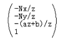

##### 3.1) 在Z方向构建CVV

​	z的范围是[-N, -F]，因此有：

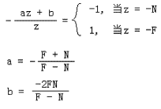

##### 3.2) 在X和Y方向构建CVV

​	$-N\frac{x}{z}$是投影平面上的点，范围是[left, right]，$x'$是标准化后的点，范围是[-1, 1]。

​	二者是**同一个值的不同形式**，$x'$是最终的目标值，$-N\frac{x}{z}$是推导过程的`中间值`，用于理解。因此有：

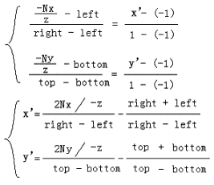

##### 3.3) 标准化后的投影点坐标

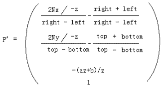

##### 3.4) 坐标反推投影矩阵

​	首先，做透视除法的逆处理：每个分量乘以-z，得到：

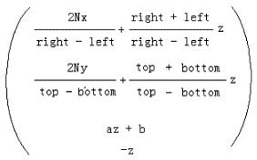，又有：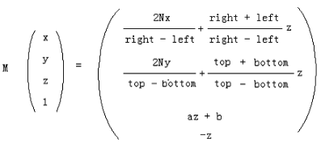

​	可以反求得到投影矩阵M：

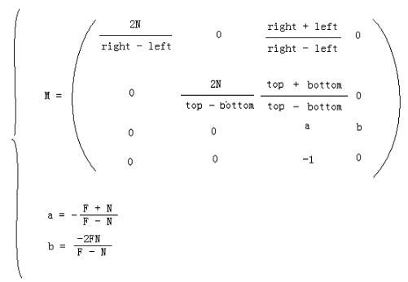

​	综上，投影矩阵最后一行是：$\begin{pmatrix}0 & 0 & -1 & 0\end{pmatrix}$，而不是$\begin{pmatrix}0 & 0 & 0 & 1\end{pmatrix}$，可知透视变换**不是仿射变换**，它是非线性的。

​	进入CVV的点在[-1, 1]中，从而造成了**投影失真现象**。

​	投影失真的解决方法就是之后的`视口变换`：把归一化的顶点按照和`投影面上相同的比例`变换到视口中，从而解除透视投影变换带来的失真现象。

### 6 3d拾取

#### 1) 屏幕上的点转换到视口坐标

​	屏幕坐标原点在屏幕左上角，x向右，y向下；

​	视口坐标原点在左下角，x向右，向上。

#### 2) 视口中的点转换到投影平面上

​	投影平面的点被实施视口变换(线性插值)后，被变换到视口中。在这里，我们要实施一个逆变换。

$\frac{X_{vp} - Left_{vp}}{Right_{vp} - Left{vp}} = \frac{X_{p1} -(-1)}{1-(-1)}$

$\frac{Y_{vp} - Left_{vp}}{Right_{vp} - Left{vp}} = \frac{Y_{p1} -(-1)}{1-(-1)}$

​	综上，屏幕点击的位置被转换到了投影平面上，有：$P_{1}(X_{p1},Y_{p1},-N)$。

​	此时，该点是处于CVV中的，需要通过再次一次线性插值，把其转换到[left, right]、[bottom, top]中，得到$P_{2}(X_{p2},Y_{p2},-N)$：

$\frac{X_{p1} -(-1)}{1-(-1)} = \frac{X_{p2}-Left_{prj}}{Right_{prj}-Left{prj}}$

$\frac{Y_{p1} -(-1)}{1-(-1)} = \frac{Y_{p2}-Bottom_{prj}}{Top_{prj}-Bottom{prj}}$

#### 3) 向三维空间拓展

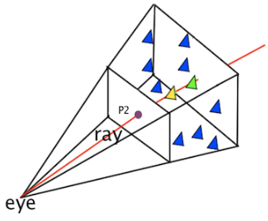

​	使用射线ray，把2维空间的点拓展到3维中。

​	图中的模型处于相机空间中。射线起点为eye的位置，射线的方向朝近平面上的$P_{2}$延伸，得到射线ray；

​	通过ray和三维空间的三角面求交，来完成拾取。

## PBR

### 1 PBR核心理论

​	基于物理的渲染(Physically Based Rendering，PBR)是指使用基于**物理原理**和**微平面理论**建模的着色/光照模型。

​	PBR的**渲染范畴**由基于物理的**材质**、基于物理的**光照**和基于物理适配的**摄像机**这三部分构成。


#### 1) 基础概念

- 微平面理论（Microfacet Theory）

  微平面理论是将物体表面建模成做无数微观尺度上有**随机朝向**的**理想镜面反射**的**小平面**（microfacet）的理论。

  在实际的PBR 工作流中，这种物体表面的不规则性用**粗糙度贴图**或者**高光度贴图**来表示。

- 能量守恒（Energy Conservation）

  出射光线的能量永远不能超过入射光线的能量。

  随着粗糙度的上升**镜面反射区域的面积**会增加，作为平衡，镜面反射区域的**平均亮度**则会下降。

- 菲涅尔反射（Fresnel Reflectance）

  光线以**不同角度入射**会有**不同的反射率**。相同的入射角度，不同的物质也会有不同的反射率。

  万物皆有菲涅尔反射。**F0**是 0 度角入射的菲涅尔反射值。大多数非金属的F0范围是0.02~0.04，大多数金属的F0范围是0.7~1.0。

- 线性空间（Linear Space）

  光照计算必须在线性空间完成，shader中输入的gamma空间的贴图比如漫反射贴图需要被转成线性空间。

  在具体操作时需要根据不同引擎和渲染器的不同做不同的操作。

  **描述物体表面属性的贴图**如粗糙度，高光贴图，金属贴图等**必须保证是线性空间**。

- 色调映射（Tone Mapping）

  将宽范围的照明级别拟合到屏幕有限色域内的过程。

  因为基于HDR渲染出来的亮度值会超过显示器能够显示最大亮度，所以需要使用色调映射，将光照结果从HDR转换为显示器能够正常显示的LDR。

- 物质的光学特性（Substance Optical Properties）

  现实世界中有不同类型的物质可分为三大类：绝缘体（Insulators），半导体（semi-conductors）和导体（conductors）。

  在渲染和游戏领域，我们一般只对其中的两个感兴趣：导体（金属）和绝缘体（电解质，非金属）。

  其中非金属具有单色/灰色镜面反射颜色；金属具有彩色的镜面反射颜色。

  即非金属的F0是一个float，而金属的F0是一个float3，如下图：

  

#### 2) 光与非光学平坦表面的交互原理

##### 2.1) 反射

​	光在与非光学平坦表面（non-optical-flat-surface）的交互时，非光学平坦表面表现得像一个**微小的光学平面的大集合**。

​	表面上的每个点都会以略微**不同的方向**对入射光反射，而最终的表面外观是许多具有不同表面取向的点的聚合结果。


​	下述图片中，在肉眼可见的尺度上，都是光滑的，但粗糙度在**微观**上存在差异：

​	顶部图所示的表面相对光滑，表面取向仅略有变化，导致反射光方向的微小变化，从而产生更清晰的反射。

​	底部图所示的的表面较粗糙，表面上的不同点具有广泛变化的方向取向，导致反射光方向的高度变化，并因此导致模糊的反射。


​	出于**着色的目的**，通常用统计方法处理这种微观几何现象，将表面视为：每个点接收入射光后，会在**多个方向**上反射和折射。


##### 2.2) 折射

​	对于金属，折射光会被立刻吸收；对于非金属(电介质或绝缘体)，一旦光在内部折射，会表现出**吸收**和**散射**两种行为。


##### 2.3) 漫反射和次表面反射本质相同

​	漫反射和次表面散射其实是相同物理现象，本质都是**折射光**的**次表面散射**的结果。

​	它们的区别是相对于观察尺度的散射距离：散射距离相较于像素来说微不足道，次表面散射便可以近似为漫反射。

### 2 渲染方程

​	渲染方程在理论上给出了一个完美的结果。各种各样的渲染技术，是这个理想结果的近似。

#### 1) 辐射度量学概念

##### 1.1) 辐射通量

​	**辐射通量**/**辐射功率** $\Phi$ (Radiant Power或Radiant Flux)：表示**单位时间**从表面**发射**或**到达**表面的总能量流量，单位为瓦(W，1W = 1 J/s)

​	比如，可以说光源发射出50瓦的辐射功率，或者有20瓦的辐射功率入射到桌子上。

##### 1.2) 立体角

​	立体角(Solid Angle)是弧度在三维空间的延伸。

​	二维中，弧度表示为：$\theta = \frac{l}{r}$，其中$l$是弧度对应的弧长，$r$是圆的半径。

​	三维中，立体角是**有体积的方向**：观察者站在圆心，望向物体的方向，物体在单位圆表面投影的面积的值，就是立体角。如下所示：


##### 1.3) 辐射强度

​	辐射强度 $I$ (Radiant Intensity)：单位立体角上的辐射通量 / **power per solid angle**，即$I = \frac{d\Phi}{d\omega}$，其几何意义：光源在任意方向上的亮度。


##### 1.4) 辐照度

​	辐照度(Irradiance)：单位面积的辐射通量 / **power per unit area**，即表面被四面八方的光照射的总量，是**被辐射**的意思。

​	接受光线的**有效方向**必须和**物体表面垂直**，若不垂直，需要通过**投影**计算出有效光照。

##### 1.5) 辐射度

​	辐射度(Radiance)：表面在单位立体角、单位投影面积上发射、反射、接受的光的功率，即power per solid angle per area。

​	辐射度描述如何在光**传播过程中**，度量其能量。计算如下：$L(p,\omega)=\frac{d^{2}\Phi(p,\omega)}{d\omega dAcos\theta}$。$d\omega$表示立体角，$dAcos\theta$表示投影面积。


#### 2) 渲染方程 / 反射方程


​	渲染方程描述**光能在场景中流转的方程**，它基于**能量守恒定律**，在理论上给出了一个完美的光能求解结果。		

​	渲染方程**物理意义**：在某个视点看向特定表面，看到的①**出射光**$\omega_{o}$ / 辐照度(Irradiance)由表面的②**BRDF**和表面接收的**③各方向入射光的Radiance**求和得到。

​	各个参数如下：

- 辐射度Radiance：$L_{i}(p,\omega_{i})$。计算时，当表面积足够小时，$p$视作点。当立体角足够小时，$\omega$视作向量。
- 表面法线和光线夹角：$n\cdot\omega_{i}$。
- BRDF：$f_{r}(p, \omega_{i},\omega_{o})$，表示表面$p$在入射方向$\omega_{i}$和出射方向$\omega_{o}$的反射率，BRDF类似于权重，它基于表面材质的属性。
- $L_{o}(p,\omega_{o})$：是**辐照度**，即该表面$p$接受所在半球所有方向的光照后，在$\omega_{o}$方向上产生的辐射量。

​	由于渲染方程没有解析解，因此使用**数值解**来求其积分：**黎曼求和方程**，伪代码如下：

```c++
int steps = 100;
int sum = 0.f;
vec3 P  = ...;
vec3 Wo = ...;
vec3 N  = ...;
float dW = 1.f / steps;
for(int i = 0; i < steps; i++)
{
    vec3 Wi = NextIncomingLightDir(i);
    sum += Fr(P, Wi, Wo) * L(P, Wi) * dot(N, Wi) * dW;
}
```

### 3 BxDF

​	BxDF一般而言是对BRDF、BTDF、BSDF、BSSRDF等几种双向分布函数的一个**统一的表示**。

​	其中，BSDF可以看做BRDF和BTDF更一般的形式，而且BSDF = BRDF + BTDF。

​	在上述这些BxDF中，BRDF最为简单，也最为常用。

​	因为游戏和电影中的大多数物体都是不透明的，用BRDF就完全足够。而BSDF、BTDF、BSSRDF往往更多用于**半透明材质**和**次表面散射材质**。

### 4 BRDF

#### 1) Disney Principled BRDF 核心理念

​	**着色模型是艺术导向（Art Directable）的，而不一定要是完全物理正确（physically correct）**，能让美术同学用非常直观的少量参数，以及非常标准化的工作流，快速实现涉及大量不同材质的真实感的渲染工作。

​	核心理念如下：

1. 应使用直观的参数，而不是物理类的晦涩参数。
2. 参数应尽可能少。
3. 参数在其合理范围内应该为0到1。
4. 允许参数在有意义时超出正常的合理范围。
5. 所有参数组合应尽可能健壮和合理。

#### 2) Disney Principled BRDF 参数

- **baseColor（基础色）**：表面颜色，通常由纹理贴图提供。

- **subsurface（次表面）**：使用次表面近似控制漫反射形状。
- **metallic（金属度）**：金属（0 = 电介质，1 = 金属）。这是两种不同模型之间的线性混合。金属模型没有漫反射成分，并且还具有等于基础色的着色入射镜面反射。
- **specular（镜面反射强度）**：入射镜面反射量。用于取代折射率。
- **specularTint（镜面反射颜色）**：对美术控制的让步，用于对基础色（base color）的入射镜面反射进行颜色控制。掠射镜面反射仍然是非彩色的。
- **roughness（粗糙度）**：表面粗糙度，控制漫反射和镜面反射。
- **anisotropic（各向异性强度）**：各向异性程度。用于控制镜面反射高光的纵横比。（0 =各向同性，1 =最大各向异性）
- **sheen（光泽度）**：一种额外的掠射分量（grazing component），主要用于布料。
- **sheenTint（光泽颜色）**：对sheen（光泽度）的颜色控制。
- **clearcoat（清漆强度）**：有特殊用途的第二个镜面波瓣（specular lobe）。
- **clearcoatGloss（清漆光泽度）**：控制透明涂层光泽度，0 =“缎面（satin）”外观，1 =“光泽（gloss）”外观。

#### 3) BRDF的几何意义

​	BRDF(Bidirectional Reflectance Distribution Function)：双向反射分布函数，描述物体表面**如何反射光线**的方程。

​	BRDF的输入：入射方向$\omega_{i}$、出射方向$\omega_{o}$、表面法向$n$和表面粗糙度$\alpha$。

​	BRDF的输出：输出一个**权重**，表示当前材质下，入射光线$\omega_{i}$对角度为$\omega_{o}$的出射光线的影响。

​	若表面是**完美光滑**的，那么与$\omega_{i}$对称的出射角度的BRDF应该为1，其余角度的BRDF为0。

#### 4) 最广泛使用的模型：Cook-Torrance BRDF

​	Microfacet Cook-Torrance BRDF是实践中**使用最广泛**的模型，实际上也是人们可以想到的**最简单**的微平面模型。

​	它仅对几何光学系统中的单层微表面上的单个散射进行建模，**没有考虑多次散射**，**分层材质**，以及**衍射**。


##### 4.1) 折射光、反射光比例

​	**折射光线比例**$k_{d}$：用于产生漫反射，漫反射的本质是**折射光次表面的散射**。

​	**反射光线比例**$k_{s}$：用于产生高光。

##### 4.2) 漫反射模型

​	Diffuse BRDF可分为传统型和基于物理型两大类。其中，传统型主要是上述提及的Lambert。

​	其他模型渲染效果更好，但更消耗算力。Epic Games已证明，对于实时渲染，传统的Lambert模型已经足够。

​	$f_{lambert}=\frac{c}{\pi}$，其中$c$是$albedo$或表面颜色(纹理)。

##### 4.3) 高光模型

###### 4.3.1) 正确的法线方向	

​	每个表面点将来自给定进入方向的光反射到单个出射方向，该出射方向取决于微观几何法线（microgeometry normal）**m** 的方向。

​	在计算BRDF项时，指定光方向 **l(或$\omega_{i}$)** 和视图方向 **v(或$\omega_{o}$)** 。这意味着，对于所有小平面，只有可以**将 l 反射到 v 的那些小平面**，才有助于BRDF。其他方向有正有负，积分之后，相互抵消。

​	这些有助于BRDF的小平面法线，就是**有效的/正确的**法线方向。

​	如下图所示，正确的 $m$ 正好位于 $l$ 和 $v$ 的中间，只有当 $m = h$ 时，表面的点才会把 $l$ 反射到 $v$ 上，其他点对BRDF没有贡献。


###### 4.3.2) 被遮蔽的光

​	不是所有能被反射到 $v$ 的光都会对BRDF做贡献。这些光的一部分可能会因为 $l$ 方向或 $v$ 方向的遮挡，从镜面反射中抹除。


<center> l方向的遮挡——阴影</center>


<center> v方向的遮挡——掩蔽</center>

​	在阴影区没有接收 $l$ 的直射光，但它接受了其他表面区域的反射光。但microfacet理论忽略了这些相互反射。


<center>忽略了其他表面的相互反射</center>

###### 4.3.3) 公式解读

​	$f_{cook-torrance}=\frac{D(h)F(v,h)G(l,v,h)}{4(l\cdot n)(v \cdot n)}$。

​	$D(h)$：法线分布函数(Normal Distribution Function)，描述微表面**正确朝向**的法线的分布概率。**正确朝向**指能够将来自 $l$ 的光反射到观察方向 $v$ 的法线方向。

​	$F(v, h)$：菲涅尔方程(Fresnel)，描述不同的表面角下**反射的光线的占比**。随着观察角度增大并接近掠射角(贴地角)，反射会逐渐增强。

​	$G(l, v, h)$：几何函数，描述微平面自成阴影的属性，即当m = h时，未被遮蔽的表面点的百分比。

​	分母$4(l\cdot n)(v \cdot n)$：校正因子（correctionfactor），作为微观几何的局部空间和整个宏观表面的局部空间之间变换的微平面量的校正。

## 算法应用

### 1 点和射线的距离

​	本小节参考自[这里](https://blog.csdn.net/LIQIANGEASTSUN/article/details/119598965)。

​	点和射线有如下四种位置关系：


#### 1) 点到射线的垂足坐标

$\vec{PO}=0 - P$;

$dot = \vec{PO}\cdot\vec{Ray}$

$D = P + dot*\vec{Ray}$

#### 2) 点到射线的距离

​	两点先验知识：

​	① 向量叉积模长公式：$|\vec{a}\otimes\vec{b}|=|\vec{a}||\vec{b}|sin\theta$。

​	② 平行四边形面积公式：$S=ab*sin\theta = 底 \times 高 = a \times h$，其中a、b是平行四边形的相邻边长度，h为a上的高，都为标量。

​	所以，$S_{平行四边形} = 相邻边叉积的模$。

​	如下图，有射线$\vec{PD}$和点$O$，求$O$到射线的距离：


​	取$\vec{PO}$和单位向量$\vec{PP'}$作平行四边形，那么底边$PP'$的高$OD=|PO|\times sin\theta$。

### 2 射线和三角形求交

#### 1) 解析法

​	假设射线和三角形所在平面的交点为p，在平面上任取一点a，有$(p-a)\cdot\vec{n}=0$，可计算求得点p。

​	然后通过叉积法判断点p是否在三角形内部：


​	依次求解$\vec{AP} \otimes \vec{AB}$、$\vec{BP} \otimes \vec{BC}$、$\vec{CP} \otimes \vec{CA}$，若结果向量的方向一致，则在三角形内部。

#### 2) moller-Trumbore射线三角相交算法

​	一种快速计算射线与三角形在三个维度上的交点的方法，通过向量与矩阵计算可以快速得出交点与重心坐标，而无需对包含三角形的平面方程进行预计算。算法推导[这里](https://blog.csdn.net/zhanxi1992/article/details/109903792)。

### 3 射线和球求交

#### 1) 解析法

​	将射线代入球的解析表达式，解方程，求解出交点坐标。

#### 2) 几何法

​	已知射线起点o和方向p，球的圆心为c，球的半径为r。

​	从c作到射线的垂线，求出距离h。若$h<=r$，则射线与球有交点。

### 4 判断任意点在凸多边形内部/外部

​	射线法、转角法参考[此处](https://blog.csdn.net/WilliamSun0122/article/details/77994526)。

#### 1) 射线法

​	以被测点Q为端点，向任意方向作射线(一般水平向右作射线)。统计该射线与多边形的交点数。如果为奇数，Q在多边形内；如果为偶数，Q在多边形外。

​	如下图有些特殊情况：


​	情况a)，射线和两条边的共同顶点相交，此时交点只能算一个；

​	情况b)，射线和两条线的最低处共同顶点相交，该点不能算；

​	情况c)，射线和多边形的一边平行，该边应忽略不计。

#### 2) 转角法


​	多边形内部的点连接各个顶点，其所形成的角度和在精度范围内应等于360度，如果小于360度或者大于360度，则证明该点不在多边形中。

​	转角法简单，但是由于涉及要使用反三角函数，会耗时，且造成较大的精度误差。

#### 3) 转角法优化

​	从P点向右做射线R，如果边从射线R下方跨到上方，那么穿越+1，如果从上方跨到下方，则是-1。最终和为wn环绕数。


​	这种方法不必去计算射线和边的交点，但需要判断点P和边的左右关系，而且对于方向向上和向下的边的判断规则不同。

​	对于方向向上的边，如果穿过射线，那么P是在有向边的左侧；对于方向向下的边，如果穿过射线，那么P在有向边的右侧。


### 5 判断多边形的凹凸性

​	依次顺时针遍历多边形的顶点。若向量的叉积保持一致，则是凸多边形，反之是凹多边形。

​	求$\vec{p_{0}p_{1}}\times\vec{p_{0}p_{2}}$：

```c++
double cross(Point& p1, Point& p2, Point& p0)
{
    return (p1.x - p0.x) * (p2.y - p0.y) - (p1.y - p0.y) * (p2.x - p0.x);
}
```

​	判断是否为凸多边形。若Polygon是顺时针排序，叉乘结果应该小于0；若Polygon是逆指针排序，叉乘结果应该大于0：

```c++
bool isConvexPolygon(QVector<Point> Polygon)
{
    int len = Polygon.size();
    int s = 0, e = len;
    if(e == 2)
        return true;
    while (s <= e-3) {
        if (cross(Polygon[s+1], Polygon[s+2],Polygon[s]) < 0)
            s++;
        else 
            return false;
    }
    return true;
}
```

## 纹理

### 1 纹理环绕

​	设置纹理坐标采样超出范围时，采取什么行为(重复/镜像重复/插值到边缘等)。

### 2 纹理过滤

​	纹理过滤方式实质就是采样方式。决定如何将纹理像素映射到纹理坐标，分为临近过滤和线性过滤。

**临近过滤**

​	OpenGL默认纹理过滤方式：选择**中心点**距离纹理坐标最近的那个像素用于采样。


**线性过滤**

​	基于纹理坐标附近的纹素，计算出一个插值。一个纹素的中心距离纹理坐标越近，其对最终颜色的贡献越大。


​	临近过滤会产生颗粒状的图案，线性过滤会产生更平滑的效果。

### 3 mipmap

​	本小节参考自[这里](https://blog.csdn.net/qq_42428486/article/details/118856697)。

#### 1) 背景

​	场景内，同一个物体，**在远处所占用的片段少，在近处占用的片段多**。

​	有如下示例：

​	此时你在500米远的山上，想要狙击敌人，在不开镜的情况下只能看到人影。

​	假设敌人在屏幕显示为20\*20，400\*400的纹理像素映射在20\*20的像素内，一颗像素需要映射20\*20的纹理像素；

​	这种情况下若直接进行纹理过滤，那么其他396个纹理像素就没有被参考了，这显然是不对的。

​	最终，在屏幕上可能会产生**锯齿**或**摩尔纹**。

​	上述是因为没有均匀采样造成，若对于远处的小物体，对其纹理上所有纹素进行过滤，显示效果会不错。但GPU是承受不了这么大负载的，帧率会降低。

#### 2) 原理

​	将纹理划分为不同大小分辨率的纹理图集，每次缩小1/2划分；

​	根据待渲染物体离相机的距离，对不同级别的纹理进行采样；

​	对**远处**的物体，采用**低分辨率**的纹理，对于**近处**的物体，采用**高分辨率**的纹理。

#### 3) mipmap的构建

​	预先创建原纹理大小2分之一的多级渐远纹理。在次级纹理其构建时，会使用线性过滤，使次级纹理得到平滑的过度效果。

​	如原始纹理为$400\times400$，第0级。次级纹理为$200\times200$，第1级。第1级纹理构建时，是使用第0级进行线性过滤得到。


#### 4) mipmap优缺点

**优点**

​	一是，质量高，避免了锯齿和摩尔纹；

​	二是，性能好，避免远距离物体采样texture cache命中率不高的问题。

**缺点**

​	占用显存。

## 抗锯齿技术

## ShadowMap

### 1 DepthMap

#### 1) DepthMap格式、精度和分辨率

- OpenGL中DepthMap格式可以为`GL_DEPTH_COMPONENT24`、`GL_DEPTH_COMPONENT32`等等，数值格式为`float`；增加深度通道的位数可以提高精度，解决深度冲突；

  分辨率通常使用`1024 x 1024`；

- 点经过视图变换、投影变换、透视除法后，z值大小在near和far之间的数会被转换到`-1~1`中；在Viewport变换中，默认情况下，把`-1~1`转换到`0~1`；

- 接近 near 平面，z值越密；距离越远，z值越稀，这样距离照相机越近精度越高。

#### 2) 深度的非线性

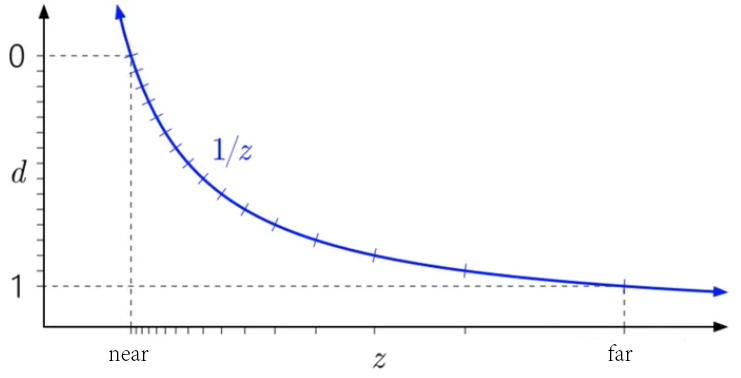

​	z：模型点经过模型、视图变换后，在相机空间中的z值；

​	d：z经过透视变换、透视除法后在ndc空间的深度值。

##### 2.1) z -> d为何非线性

- 实用性：计算机存储精度有限，离摄像机越远的物体，信息越少，对画面的贡献也越少，没必要为其提供高精度。所以深度值在靠近近平面精度越高，越远精度越低，是合理的设定。

- 数学上：投影面上等距的多个点，在三维空间中不是等距的；

  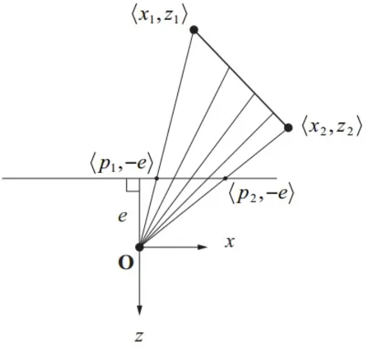

  上图中三维空间点$(x_{1},z_{1})$和$(x_{2},z_{2})$投影到z为-e的平面上得到两点$(p_{1},-e)$和$(p_{2},-e)$。在投影点间取几个等距点还原，可以看到还原的三维点并不等距。

##### 2.2) 线性化深度

$z_{linear}=\frac{z-n}{f-n}$

$z=\frac{2nf}{f+n-(2d-1)*(f-n)}$

​	d：深度图中取出的数据；n、f：近平面和远平面的距离；

#### 3) 深度值和顶点属性插值

​	在使用光栅化的图形学方法中，法线，颜色，纹理坐标这些属性通常是绑定在图元的顶点上。

​	3D空间中，这些属性值在图元上是线性变化的。但当3D顶点被透视投影到2D屏幕之后，如果在2D投影面上对属性值进行线性插值，会有问题，如下图所示：

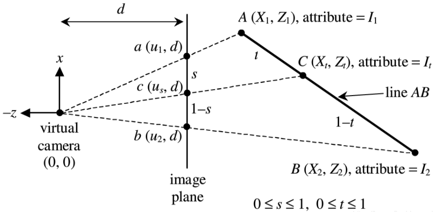

​	图中将A和B是带属性的两个顶点；

​	将A和B通过camera投影到距离为d的平面上，得到投影点a和b。注意本图中camera的视线方向为+z，通常可自定义视线为+z或-z。

​	$c(u_{s}, d)$是a和b在二维平面上的线性插值点：$c = a + s \ast (b-a)$。

​	通过下式，可以由投影平面上的插值点，得到三维空间中透视正确的插值：

$\frac{1}{Z_{s}} = \frac{1}{Z_{1}}(1-s) + \frac{1}{Z_{2}}s$

​	综上，**深度值的倒数是线性相关的**，具体推导参考：[图形学基础之透视校正插值](https://blog.csdn.net/n5/article/details/100148540)。

​	有了透视正确的顶点位置后，由于顶点属性和位置在3维空间中是线性相关的，因此也可利用上式求出顶点属性的正确插值。

#### 4) 深度冲突

​	DepthBuffer是非线性的，因此在远离摄像机的地方，由于精度不足，可能造成深度冲突。

​	有如下种解决方案：

- 增大深度缓冲数据位数(一般不采用，为解决深度冲突而增大显存不明智)；
- 修改摄像机的近远平面，让其范围更小，范围变小后数据能够表示的精度自然就上升；
- 略微在场景中移动物体坐标，错开那些靠的很近的物体(实用，基本能解决问题)；
- Offset语法【**待理解**】

#### 5) 平行光的视图矩阵、投影矩阵

```c++
distLightCam.setPosition(lightEnv.DirectionalLight.Position);
distLightCam.setLookAt(lightEnv.DirectionalLight.Dest);	
distLightCam.setOrtho(-10.f, 10.f, -10.f, 10.f);
distLightCam.setNearFar(camera.near(), camera.far());
```

### 2 点光源CubeMap

#### 1) 写入深度图

- 顶点着色器：将mesh转换到世界空间中，作为几何着色器的输入；

- 几何着色器：将单个图元的顶点，通过`6个`light space矩阵，转换到以光源为原点透视空间中，作为光栅化输入。

  同时，将世界坐标中的顶点作为属性，传入到片元着色器。

- 片元着色器：光栅化上述不同光照空间的图元后，片元着色器中根据几何着色器传入的world position和常量光源位置，计算距离，写入不同面的深度缓冲。

#### 2) CubeMap采样

```glsl
vec3 sampleVec = fragPos - lightPos; 
float closestDepth = texture(depthMap, sampleVec).r;
```

​	上述用于采样的向量是以光源为坐标原点的方向向量；

​	深度缓冲是以光源为中心写入的，因此可以采样到包围光源所有方向的深度值。

## 骨骼动画

### 1 基础概念

- Bind Pose(绑定姿态)：美术在建模软件中定义的骨骼**默认姿态**，绑定空间可以理解为**模型本地空间**。

- Offset Matrix：将顶点从绑定空间转换到某个关节的骨骼空间(**Bone Space**)，也可称为**局部空间**。

- Local Transform(局部变换)：Local Transform是父节点Bone Space下的变化矩阵，通常用于**编辑某个子关节**。

- Global Transform(全局变换)：在最简单的情况下，已知一个关节的局部变换，**连乘**它的所有父骨骼的局部变换矩阵，就能得到该关节的**全局变换矩阵|组合变换矩阵**(Global Transform)。**根节点的父节点处于模型空间中**。

- Mesh Transform(蒙皮变换矩阵)：Mesh Transform = Global Transform x OffsetMatrix。顶点应用了蒙皮矩阵后，就确定了其在绑定空间下的最终位置。

## 渲染性能

### 1 顶点属性太多，槽位不够

### 2 模型面数太多如何优化

### 3 vs、fs开销大，如何优化

### 4 PBR 材质贴图多，纹理槽位不够应该怎么处理

- 合并多个属性到一个通道，比如roughness和metallic可以存在 8 bit 纹理的高低4 bit上。
- 虚拟纹理，将小贴图合并成大贴图，按需调入。
