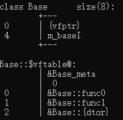

# VisualStudio

## HotKeys

- Edit.GoToAll: Ctrl + P
- Edit.FindinFiles: Ctrl + Alt + F
- Window.ShowEzMDIFileList: Ctrl + Alt + Down Arrow (**default**)
- View.NavigateBackward: Ctrl + -             (**default**)
- View.NavigateForward: Ctrl + Shift + -   (**default**)
- Edit.WordNext: Ctrl + Right Arrow         (**default**)
- WordPrevious: Ctrl + Left Arrow            (**default**)
- 列编辑: Alt + Shift
- 显示打开的文件：Ctrl + tab

## 查看类布局

​	开始菜单中打开**Developer Command Prompt for VS2022**

​	输入如下指令：

```shell
cl /d1 reportSingleClassLayoutClassName "absolutepath/XXX.cpp"
```

​	如下所示：


​	得到输出：



# Linux指令

- 切换到根目录：cd /
- 打印当前路径：pwd
