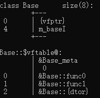

# VisualStudio

## 查看类布局

​	开始菜单中打开**Developer Command Prompt for VS2022**

​	输入如下指令：

```shell
cl /d1 reportSingleClassLayoutClassName "absolutepath/XXX.cpp"
```

​	如下所示：


​	得到输出：



# VMware Workstation

## 共享文件的两种实现方式

​	参考[这里](https://zhuanlan.zhihu.com/p/42203768)。


